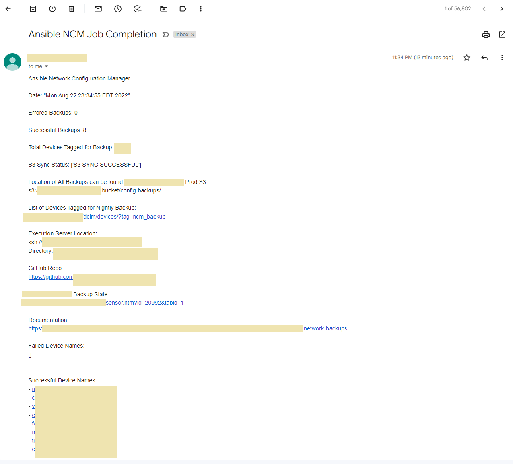
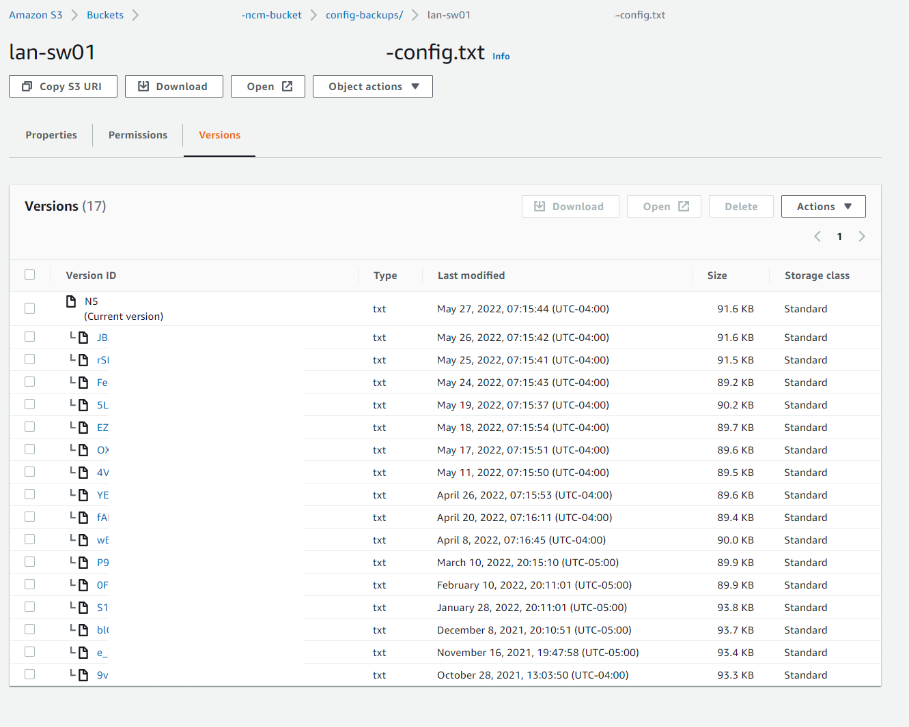

+++
author = "Kaon Thana"
title = "Ansible Configuration Backup Manager"
date = "2022-08-23"
description = "Create a vendor agnostic network backup utility with Ansible and AWS S3"
categories = [
    "ansible",
    "netdevops",
    "cloud",
    "netbox"
]

aliases = ["ansible-config-backups"]
image = "ansible-network-config-front.png"
+++

**There are many commericial tools** that can perform configuration backups of network gear (for example Solarwinds NCM). However, we can build an alternative tool using **Ansible** + a versioned Amazon AWS S3 Bucket + a daily scheduler. 

## Overview

In this guide, I will detail how we can build such a tool and meet the following **requirments**:
* Dynamic Inventory
* Vendor neutral system
* Version Controlled Backups
* Notfication of successful and failed backups
* Health Check of the Backup Tool
- Currently Supported Vendors/OS:
  - Opengear
  - Aruba AOS
  - Cisco ASA and IOS
  - Fortinet Fortios
  - Juniper Junos
  - Citrix Netscaler
  - Big-IP F5
  - Arista EOS

A **read-only** recurring Ansible playbook, like the one we are discussing, is a great way to get started in network automation of your enterprise gear because:

* The playbook does **not** make confuguration changes to your remote devices
* Your playbook has to touch every device in your network. That means **Authentication, Connecticty, and Ansible Modules** must all be correct on every run.
  * Getting this all working the first time takes some effort but will pay off in future projects.


## Workflow
Below is a diagram of the expected workflow operation of the ansible playbook.
1. Grab inventory list from Netbox with devices **tagged** for backup. 
2. Call a specific **Ansible task** to perform system backup on each device
3. Store all system backups locally and sync to a version controlled **S3 Bucket**
4. Maintain a **summary of failed or successful** device backup actions and create report to Email
5. Update local status.txt file to be polled by outside **monitoring** system


## The Solution

Github Repo can be found here - [Ansible Configuration Backup Manager](https://github.com/kaon1/configuration-backup-manager)

### Running the playbook

Here is an example output of running the playbook against 8 hosts each on a different network operating system. This playbook has been run on hundreds of network devices in production environments.

Command:

```sh
[root@ncm]# ansible-playbook -i netbox_inventory.yml -e "var_hosts=aruba1:asa1:f51:nss1:fortios1:ios1:junos1:opengear1" ncm-engine.yml
```

Output:

```sh
PLAY [PLAY TO BACKUP NETWORK CONFIGURATIONS] **********

TASK [delete exisiting successful_hosts file] **********
changed: [aruba1 -> localhost]

TASK [delete exisiting failed_hosts file] **********
changed: [aruba1 -> localhost]

TASK [delete total_hosts file] **********
changed: [aruba1 -> localhost]

TASK [create successful_hosts file] **********
changed: [aruba1 -> localhost]

TASK [create failed_hosts file] **********
changed: [aruba1 -> localhost]

TASK [create total_hosts file] **********
changed: [aruba1 -> localhost]

TASK [update total_hosts file] **********
changed: [aruba1 -> localhost]

TASK [include_role : generate-backups] **********

TASK [generate-backups : include_tasks] **********
included: /root/ncm/roles/generate-backups/tasks/aos-backup-config.yml for aruba1
included: /root/ncm/roles/generate-backups/tasks/asa-backup-config.yml for asa1
included: /root/ncm/roles/generate-backups/tasks/big-ip-backup-config.yml for f51
included: /root/ncm/roles/generate-backups/tasks/citrix-backup-config.yml for nss1
included: /root/ncm/roles/generate-backups/tasks/fortios-backup-config.yml for fortios1
included: /root/ncm/roles/generate-backups/tasks/ios-backup-config.yml for ios1
included: /root/ncm/roles/generate-backups/tasks/junos-backup-config.yml for junos1
included: /root/ncm/roles/generate-backups/tasks/opengear-backup-config.yml for opengear1

TASK [generate-backups : grab and download aruba config] **********
ok: [aruba1]

TASK [generate-backups : Save the backup information.] **********
changed: [aruba1 -> localhost]

TASK [generate-backups : Add SUCCESS line to file] **********
changed: [aruba1 -> localhost]

TASK [generate-backups : Backup ASA Device] **********
ok: [asa1]

TASK [generate-backups : Add SUCCESS line to file] **********
changed: [asa1 -> localhost]

TASK [generate-backups : grab and download big-ip config] **********
ok: [f51 -> localhost]

TASK [generate-backups : Save the backup information.] **********
changed: [f51 -> localhost]

TASK [generate-backups : Add SUCCESS line to file] **********
changed: [f51 -> localhost]

TASK [generate-backups : grab and download citrix config] **********
ok: [nss1]

TASK [generate-backups : Save the backup information.] **********
changed: [nss1 -> localhost]

TASK [generate-backups : Add SUCCESS line to file] **********
changed: [nss1 -> localhost]

TASK [generate-backups : Backup Fortigate Device] **********
ok: [fortios1]

TASK [generate-backups : Save the backup information.] **********
changed: [fortios1]

TASK [generate-backups : Add SUCCESS line to file] **********
changed: [fortios1 -> localhost]

TASK [generate-backups : Backup IOS Device] *****************
ok: [ios1]

TASK [generate-backups : Add SUCCESS line to file] **********
changed: [ios1 -> localhost]

TASK [generate-backups : grab and download junos config] **********
ok: [junos1]

TASK [generate-backups : Add SUCCESS line to file] **********
changed: [junos1 -> localhost]

TASK [generate-backups : grab and download opengear config] **********
changed: [opengear1]

TASK [generate-backups : Save the backup information.] **********
ok: [opengear1 -> localhost]

TASK [generate-backups : Add SUCCESS line to file] **********
changed: [opengear1 -> localhost]

PLAY [SYNC NETWORK CONFIGURATIONS TO S3 BUCKET] *************

TASK [delete exisiting s3_sync file] ************************
changed: [localhost]

TASK [create s3_sync file] **********************************
changed: [localhost]

TASK [include_role : sync-to-s3] ****************************

TASK [sync-to-s3 : Sync to S3] ******************************
changed: [localhost]

TASK [sync-to-s3 : Add status to s3 state file] *************
changed: [localhost]

PLAY [Build Email Template] *********************************

TASK [lookup file successful_hosts.txt] *********************
ok: [localhost]

TASK [lookup file failed_hosts.txt] *************************
ok: [localhost]

TASK [lookup file total_hosts.txt] **************************
ok: [localhost]

TASK [lookup file failed_s3.txt] ****************************
ok: [localhost]

TASK [Generate Backup State File] ***************************
changed: [localhost]

TASK [send email] *******************************************
ok: [localhost]

PLAY RECAP **************************************************
asa1 : ok=3    changed=1    unreachable=0    failed=0    skipped=0    rescued=0    ignored=0   
opengear1 : ok=4    changed=2    unreachable=0    failed=0    skipped=0    rescued=0    ignored=0   
nss1 : ok=4    changed=2    unreachable=0    failed=0    skipped=0    rescued=0    ignored=0   
fortios1      : ok=4    changed=2    unreachable=0    failed=0    skipped=0    rescued=0    ignored=0   
localhost                  : ok=10   changed=5    unreachable=0    failed=0    skipped=0    rescued=0    ignored=0   
aruba1   : ok=11   changed=9    unreachable=0    failed=0    skipped=0    rescued=0    ignored=0   
ios1 : ok=3    changed=1    unreachable=0    failed=0    skipped=0    rescued=0    ignored=0   
junos1 : ok=3    changed=1    unreachable=0    failed=0    skipped=0    rescued=0    ignored=0   
f51  : ok=4    changed=2    unreachable=0    failed=0    skipped=0    rescued=0    ignored=0   

[root@ncm]# 
```

#### Email Summary Report

The playbook generates an Email Template which gets sent out as the final task.



### The Netbox Dynamic Inventory 

Ansible calls the netbox API and grabs a list of **inventory-to-be-backed-up** by filtering for a specified **tag**.

Additionally, we pass other important data to the inventory such as:
* ansible_network_os
* ansible_connection

#### netbox_inventory.yml
[Source](https://github.com/kaon1/configuration-backup-manager/blob/main/netbox_inventory.yml)
```yaml
---
plugin: netbox.netbox.nb_inventory
api_endpoint: "<netbox-url>"
token: token
validate_certs: false
config_context: false
compose:
 ansible_network_os: platform.slug
 ansible_connection: custom_fields.ansible_connection
device_query_filters:
  - status: 'active'
  - tag: 'ncm_backup'
```

#### Example of Dynamic Inventory Pull
```sh
[root@ncm]# ansible-inventory -i netbox_inventory.yml --host junos1
{
    "ansible_connection": "netconf",
    "ansible_host": "10.10.10.10",
    "ansible_network_os": "junos",
    "custom_fields": {
        "ansible_connection": "netconf",
        "code_version": "xxx"
    },
    "device_roles": [
        "access_switch"
    ],
    "device_types": [
        "ex4300-48p"
    ],
    "is_virtual": false,
    "local_context_data": [
        null
    ],
    "locations": [],
    "manufacturers": [
        "juniper"
    ],
    "platforms": [
        "junos"
    ],
    "primary_ip4": "10.10.10.10",
    "regions": [
        "americas"
    ],
    "services": [],
    "sites": [
        "xxx1"
    ],
    "status": {
        "label": "Active",
        "value": "active"
    },
    "tags": [
        "ncm_backup",
    ]
}
```

### The Main File
[source](https://github.com/kaon1/configuration-backup-manager/blob/main/ncm-engine.yml)
```yaml
---
- name: "PLAY TO BACKUP NETWORK CONFIGURATIONS"
  hosts: "{{ var_hosts }}"
  roles:
    - role: arubanetworks.aos_wlan_role
  vars:
    network_backup_dir: "/root/configuration-backup-manager/config-backups/"
    net_backup_filename: "{{ inventory_hostname }}-{{ ansible_host }}-config.txt"
  tasks:
    - name: delete exisiting successful_hosts file
      ansible.builtin.file:
        path: /root/configuration-backup-manager/templates/successful_hosts.txt
        state: absent
      run_once: True
      delegate_to: localhost

    - name: delete exisiting failed_hosts file
      ansible.builtin.file:
        path: /root/configuration-backup-manager/templates/failed_hosts.txt
        state: absent
      run_once: True
      delegate_to: localhost

    - name: delete total_hosts file
      ansible.builtin.file:
        path: /root/configuration-backup-manager/templates/total_hosts.txt
        state: absent
      run_once: True
      delegate_to: localhost

    - name: create successful_hosts file
      ansible.builtin.file:
        path: /root/configuration-backup-manager/templates/successful_hosts.txt
        state: touch
      run_once: True
      delegate_to: localhost

    - name: create failed_hosts file
      ansible.builtin.file:
        path: /root/configuration-backup-manager/templates/failed_hosts.txt
        state: touch
      run_once: True
      delegate_to: localhost

    - name: create total_hosts file
      ansible.builtin.file:
        path: /root/configuration-backup-manager/templates/total_hosts.txt
        state: touch
      run_once: True
      delegate_to: localhost

    - name: update total_hosts file
      ansible.builtin.lineinfile:
        path: /root/configuration-backup-manager/templates/total_hosts.txt
        line: "{{ groups['all'] | length }}"
      run_once: True
      delegate_to: localhost

    - include_role:
        name: generate-backups

- name: "SYNC NETWORK CONFIGURATIONS TO S3 BUCKET"
  hosts: localhost
  vars:
    network_backup_dir: "/root/configuration-backup-manager/config-backups/"
    net_backup_filename: "{{ inventory_hostname }}-{{ ansible_host }}-config.txt"
  tasks:
    - name: delete exisiting s3_sync file
      ansible.builtin.file:
        path: /root/configuration-backup-manager/templates/failed_s3.txt
        state: absent
      run_once: True

    - name: create s3_sync file
      ansible.builtin.file:
        path: /root/configuration-backup-manager/templates/failed_s3.txt
        state: touch
      run_once: True

    - include_role:
        name: sync-to-s3

- name: "Build Email Template"
  hosts: localhost
  tasks:
    - name: "lookup file successful_hosts.txt"
      set_fact:
        success_data: "{{ lookup('file', '/root/configuration-backup-manager/templates/successful_hosts.txt').splitlines() }}"

    - name: "lookup file failed_hosts.txt"
      set_fact:
        failed_data: "{{ lookup('file', '/root/configuration-backup-manager/templates/failed_hosts.txt').splitlines() }}"

    - name: "lookup file total_hosts.txt"
      set_fact:
        total_data: "{{ lookup('file', '/root/configuration-backup-manager/templates/total_hosts.txt') }}"

    - name: "lookup file failed_s3.txt"
      set_fact:
        s3_error: "{{ lookup('file', '/root/configuration-backup-manager/templates/failed_s3.txt').splitlines() }}"

    - name: Generate Backup State File
      template:
        src: "/root/configuration-backup-manager/templates/backup_state.j2"
        dest: "/root/configuration-backup-manager/templates/backup_state.txt"

    - name: send email
      mail:
        host: localhost
        port: 25
        sender: '<email>'
        to: '<email>'
        subject: 'Ansible NCM Job Completion'
        body: "{{ lookup('file', '/root/configuration-backup-manager/templates/backup_state.txt')}}"
```
The above playbook performs the following actions:
* Initializes some local flat text files called **successful_hosts** -- **failed_hosts** -- **total_hosts** -- **failed_s3.txt**
  * The playbook performs writes to these files to keep track of stats per host to generate a report later on
* Uses `include_role` to include the `generate-backups` folder of tasks.
  * The [main.yml](https://github.com/kaon1/configuration-backup-manager/blob/main/roles/generate-backups/tasks/main.yml) file in the `generate-backups` is how we call each backup task based on vendor OS
* Sync the local config-backups directory to s3 using the `community.aws.s3_sync` library
* Builds and sends an email report using a jinja2 template and the previously mentioned text files as variables


### The Backup Tasks

#### tasks/main.yml

One line `include_task` which uses the **vendor OS** to call the desired backup task. [Source can be found here](https://github.com/kaon1/configuration-backup-manager/tree/main/roles/generate-backups/tasks)

```yaml
---
- include_tasks: "{{ role_path }}/tasks/{{ ansible_network_os }}-backup-config.yml"
```

#### Cisco IOS

The [below playbook](https://github.com/kaon1/configuration-backup-manager/blob/main/roles/generate-backups/tasks/ios-backup-config.yml) calls the **Cisco ios_config** library to backup the device and register the output locally.

We use ansible_connection: **network_cli** (as defined in netbox inventory) and plain user and password which can be defined as an enviornment variable or through some more secure method (Ansible Vault, Hashicorp Vault, etc) if desired.

```yaml
---
- name: IOS CISCO
  block:
    - name: Backup IOS Device
      vars:
        ansible_user: "username"
        ansible_password: pwd
      ios_config:
         backup: yes
         backup_options:
           filename: "{{ net_backup_filename }}"
           dir_path: "{{ network_backup_dir }}"
      register: backupinfo

    - name: Add SUCCESS line to file
      ansible.builtin.lineinfile:
        path: /root/configuration-backup-manager/templates/successful_hosts.txt
        line: "{{ inventory_hostname }}"
      when: backupinfo is defined
      delegate_to: localhost
      throttle: 1

  rescue:
    - name: Add ERROR line to file
      ansible.builtin.lineinfile:
        path: /root/configuration-backup-manager/templates/failed_hosts.txt
        line: "{{ inventory_hostname }}"
      delegate_to: localhost
      throttle: 1
``` 


#### Cisco ASA
Similarly, the [ASA Playbook](https://github.com/kaon1/configuration-backup-manager/blob/main/roles/generate-backups/tasks/asa-backup-config.yml) uses the asa_config library.

```yaml
---
- name: ASA CISCO
  block:
    - name: Backup ASA Device
      vars:
        ansible_user: "username"
        ansible_password: pwd
      asa_config:
         backup: yes
         backup_options:
           filename: "{{ net_backup_filename }}"
           dir_path: "{{ network_backup_dir }}"
      register: backupinfo

    - name: Add SUCCESS line to file
      ansible.builtin.lineinfile:
        path: /root/configuration-backup-manager/templates/successful_hosts.txt
        line: "{{ inventory_hostname }}"
      when: backupinfo is defined
      delegate_to: localhost
      throttle: 1

  rescue:
    - name: Add ERROR line to file
      ansible.builtin.lineinfile:
        path: /root/configuration-backup-manager/templates/failed_hosts.txt
        line: "{{ inventory_hostname }}"
      delegate_to: localhost
      throttle: 1
```
#### Juniper Junos

For [Juniper devices](https://github.com/kaon1/configuration-backup-manager/blob/main/roles/generate-backups/tasks/junos-backup-config.yml), we use the **junipernetworks.junos** library and the **netconf** ansible_connection on port 930

```yaml
---
- name: JUNOS
  block:
    - name: grab and download junos config
      vars:
        ansible_user: un
        ansible_ssh_private_key_file: key
#        ansible_connection: netconf
      junipernetworks.junos.junos_config:
        backup: yes
        backup_options:
          filename: "{{ net_backup_filename }}"
          dir_path: "{{ network_backup_dir }}"
      register: config_output

    - name: Add SUCCESS line to file
      ansible.builtin.lineinfile:
        path: /root/configuration-backup-manager/templates/successful_hosts.txt
        line: "{{ inventory_hostname }}"
      when: config_output is defined
      delegate_to: localhost
      throttle: 1

  rescue:
    - name: Add ERROR line to file
      ansible.builtin.lineinfile:
        path: /root/configuration-backup-manager/templates/failed_hosts.txt
        line: "{{ inventory_hostname }}"
      delegate_to: localhost
      throttle: 1
```
#### Aruba AOS
For [Aruba AOS devices](https://github.com/kaon1/configuration-backup-manager/blob/main/roles/generate-backups/tasks/aos-backup-config.yml) we use the **HTTPAPI** over port 4343 

```yaml
---
- name: ARUBA
  block:
    - name: grab and download aruba config
      vars:
        ansible_httpapi_port: 4343
        ansible_httpapi_validate_certs: False
        ansible_httpapi_use_ssl: True
        ansible_user: username
        ansible_password: pwd
      aos_show_command:
        command: show running-config
      register: aos_output

    - name: Save the backup information.
      copy:
        content: '{{ aos_output.msg._data[0] }}'
        dest: "{{ network_backup_dir }}/{{ net_backup_filename }}"
      delegate_to: localhost

    - name: Add SUCCESS line to file
      ansible.builtin.lineinfile:
        path: /root/configuration-backup-manager/templates/successful_hosts.txt
        line: "{{ inventory_hostname }}"
      when: aos_output is defined
      delegate_to: localhost
      throttle: 1

  rescue:
    - name: Add ERROR line to file
      ansible.builtin.lineinfile:
        path: /root/configuration-backup-manager/templates/failed_hosts.txt
        line: "{{ inventory_hostname }}"
      delegate_to: localhost
      throttle: 1
```
#### Fortinet FortiOS
[Fortinet devices](https://github.com/kaon1/configuration-backup-manager/blob/main/roles/generate-backups/tasks/fortios-backup-config.yml) are also connected via the ansible_httpapi over port 443 using the **fortinet.fortios** library
```yaml
---
- name: FORTIOS
  block:
    - name: Backup Fortigate Device
      vars:
        ansible_httpapi_use_ssl: yes
        ansible_httpapi_validate_certs: no
        ansible_httpapi_port: 443
        ansible_user: "username"
        ansible_password: pwd
#        ansible_connection: httpapi
      fortinet.fortios.fortios_monitor_fact:
         selector: 'system_config_backup'
         vdom: 'root'
         params:
             scope: 'global'
      register: backupinfo

    - name: Save the backup information.
      copy:
         content: '{{ backupinfo.meta.raw }}'
         dest: "{{ network_backup_dir }}/{{ net_backup_filename }}"

    - name: Add SUCCESS line to file
      ansible.builtin.lineinfile:
        path: /root/configuration-backup-manager/templates/successful_hosts.txt
        line: "{{ inventory_hostname }}"
      when: backupinfo is defined
      delegate_to: localhost
      throttle: 1

  rescue:
    - name: Add ERROR line to file
      ansible.builtin.lineinfile:
        path: /root/configuration-backup-manager/templates/failed_hosts.txt
        line: "{{ inventory_hostname }}"
      delegate_to: localhost
      throttle: 1
```
#### Citrix Netscaler
For [Citrix Netscaler devices](https://github.com/kaon1/configuration-backup-manager/blob/main/roles/generate-backups/tasks/citrix-backup-config.yml) we can use any basic cli_command library. In this case, I set the network_os to be **vyos** because I did not want to interfere with the cisco IOS devices.
```yaml
---
- name: CITRIX NETSCALER
  block:
    - name: grab and download citrix config
      vars:
        ansible_user: <un>
        ansible_password: <pwd>
        ansible_network_os: vyos
      cli_command:
        command: show ns runningConfig
      register: citrix_output

    - name: Save the backup information.
      copy:
        content: '{{ citrix_output.stdout_lines | to_nice_json }}'
        dest: "{{ network_backup_dir }}/{{ net_backup_filename }}"
      delegate_to: localhost

    - name: Add SUCCESS line to file
      ansible.builtin.lineinfile:
        path: /root/configuration-backup-manager/templates/successful_hosts.txt
        line: "{{ inventory_hostname }}"
      when: citrix_output is defined
      delegate_to: localhost
      throttle: 1

  rescue:
    - name: Add ERROR line to file
      ansible.builtin.lineinfile:
        path: /root/configuration-backup-manager/templates/failed_hosts.txt
        line: "{{ inventory_hostname }}"
      delegate_to: localhost
      throttle: 1
```
#### Big IP F5
The [BIG IP F5](https://github.com/kaon1/configuration-backup-manager/blob/main/roles/generate-backups/tasks/big-ip-backup-config.yml) task uses a legacy library running as **ansible_connection local**
```yaml
---
- name: F5 BIG-IP
  block:
    - name: grab and download big-ip config
      bigip_command:
        commands:
          - show running-config
        provider:
          server: "{{ ansible_host }}"
          password: pwd
          user: un
          validate_certs: no
          transport:  cli
      register: bigip_result
      delegate_to: localhost

    - name: Save the backup information.
      copy:
        content: '{{ bigip_result.stdout_lines | to_nice_json }}'
        dest: "{{ network_backup_dir }}/{{ net_backup_filename }}"
      delegate_to: localhost

    - name: Add SUCCESS line to file
      ansible.builtin.lineinfile:
        path: /root/configuration-backup-manager/templates/successful_hosts.txt
        line: "{{ inventory_hostname }}"
      when: bigip_result is defined
      delegate_to: localhost
      throttle: 1

  rescue:
    - name: Add ERROR line to file
      ansible.builtin.lineinfile:
        path: /root/configuration-backup-manager/templates/failed_hosts.txt
        line: "{{ inventory_hostname }}"
      delegate_to: localhost
      throttle: 1
```
#### OpenGear

For [OpenGear devices](https://github.com/kaon1/configuration-backup-manager/blob/main/roles/generate-backups/tasks/opengear-backup-config.yml) we can run a **raw SSH command** and register the output.

```yaml
---
- name: OPENGEAR
  block:
    - name: grab and download opengear config
      vars:
        ansible_port: 22
        ansible_user: un
        ansible_password: pwd
      raw: config -g config
      register: output_opengear_config

    - name: Save the backup information.
      copy:
        content: '{{ output_opengear_config.stdout_lines | to_nice_json }}'
        dest: "{{ network_backup_dir }}/{{ net_backup_filename }}"
      delegate_to: localhost

    - name: Add SUCCESS line to file
      ansible.builtin.lineinfile:
        path: /root/configuration-backup-manager/templates/successful_hosts.txt
        line: "{{ inventory_hostname }}"
      when: output_opengear_config
      delegate_to: localhost
      throttle: 1

  rescue:
    - name: Add ERROR line to file
      ansible.builtin.lineinfile:
        path: /root/configuration-backup-manager/templates/failed_hosts.txt
        line: "{{ inventory_hostname }}"
      delegate_to: localhost
      throttle: 1
```
#### Arista EOS

[Arista Devices](https://github.com/kaon1/configuration-backup-manager/blob/main/roles/generate-backups/tasks/eos-backup-config.yml) use the **arista.eos.eos_config** library over httpapi port 443

```yaml
---
- name: ARISTA EOS
  block:
    - name: grab and download ARISTA config
      vars:
        ansible_httpapi_port: 443
        ansible_httpapi_validate_certs: False
        ansible_httpapi_use_ssl: True
        ansible_become: True
        ansible_user: username
        ansible_password: pwd
      arista.eos.eos_config:
        backup: yes
        backup_options:
           filename: "{{ net_backup_filename }}"
           dir_path: "{{ network_backup_dir }}"
      register: arista_backupinfo

    - name: Add SUCCESS line to file
      ansible.builtin.lineinfile:
        path: /root/configuration-backup-manager/templates/successful_hosts.txt
        line: "{{ inventory_hostname }}"
      when: arista_backupinfo is defined
      delegate_to: localhost
      throttle: 1

  rescue:
    - name: Add ERROR line to file
      ansible.builtin.lineinfile:
        path: /root/configuration-backup-manager/templates/failed_hosts.txt
        line: "{{ inventory_hostname }}"
      delegate_to: localhost
      throttle: 1
```
### Syncing to S3
After all the backup files are saved in a local directory. We can [sync the entire directory](https://github.com/kaon1/configuration-backup-manager/blob/main/roles/sync-to-s3/tasks/main.yml) to an S3 bucket.
The S3 bucket has versioning enbaled, so we can keep track of changes over a period of time.

```yaml
---
- name:
  block:
    - name: Sync to S3
      community.aws.s3_sync:
        bucket: <bucket_name>
        key_prefix: config-backups
        file_root: /root/configuration-backup-manager/config-backups/
      register: result_s3

    - name: Add status to s3 state file
      ansible.builtin.lineinfile:
        path: templates/failed_s3.txt
        line: "S3 SYNC SUCCESSFUL"
      when: result_s3 is defined

  rescue:
    - name: Add error state to file
      ansible.builtin.lineinfile:
        path: templates/failed_s3.txt
        line: "ERROR S3 SYNC FAILED"
```
#### Example of a backed up versioned config



### Notifications and Health Checking

#### Jinja2 Email Template
[Jinja2 Template](https://github.com/kaon1/configuration-backup-manager/blob/main/templates/backup_state.j2)
```jinja
Ansible Configuration Backup Manager

Date: "{{ lookup('pipe','date') }}"

Errored Backups: {{ failed_data | length }}

Successful Backups: {{ success_data | length }}

Total Devices Tagged for Backup: {{ total_data }}

S3 Sync Status: {{ s3_error }}
___________________________________________________________________________
Location of All Backups can be found on AWS S3:
s3://<bucket-name>/config-backups/

List of Devices Tagged for Nightly Backup:
https://<netbox-url>/dcim/devices/?tag=ncm_backup

Execution Server Location:
ssh://<server>
Directory: /root/configuration-backup-manager/ncm-engine.yml

GitHub Repo:
https://github.com/<repo>

PRTG Sensor Of Backup State:
https://<url>/sensor.htm?id=...

Documentation:
https://<url>
___________________________________________________________________________
Failed Device Names:
{# new line #}
{{ failed_data | to_nice_yaml(indent=2) }}

Successful Device Names:
{# new line #}
{{ success_data | to_nice_yaml(indent=2) }}
```

#### Creating a Status Page

We can use a python script to tell us if the backup process has worked as expected.

1. Check if the latest report is more than 24 hours old
2. Check if error count is > 0
3. Check if successfull hosts + errored hosts matches total hosts

If any of the above conditions fail, update a local web-hosted server file to be **FALSE**

Our Network Monitoring System can poll this file and alert us if its in a **FAILED** state

[Here's the code](https://github.com/kaon1/configuration-backup-manager/blob/main/backup_status_prtg.py):

```python
import os
import datetime as dt
import re

backup_state_file_path = '/root/configuration-backup-manager/backup_state.txt'


def is_file_current(filename):
    try:
        today = dt.datetime.now().date()
        filetime = dt.datetime.fromtimestamp(os.path.getmtime(filename))
        if filetime.date() == today:
            return True
        else:
            return False

    except Exception as e:
        return False


def is_no_errors_count(filename):
    try:
        pattern = re.compile("Errored Backups: (\\d)")
        for line in open(filename):
            for match in re.finditer(pattern, line):
                if match.group(1) == '0':
                    return True
                else:
                    return False
        return False

    except Exception as e:
        return False

def is_no_s3_errors(filename):
    try:
        pattern = re.compile("(S3 SYNC SUCCESSFUL)")
        for line in open(filename):
            for match in re.finditer(pattern, line):
                if match.group(1) == 'S3 SYNC SUCCESSFUL':
                    return True
                else:
                    return False
        return False

    except Exception as e:
        return False

def is_total_match(filename):
    try:
        pattern1 = re.compile("Errored Backups: (\\d)")
        for line in open(filename):
            for match in re.finditer(pattern1, line):
                total_errors = match.group(1)

        pattern2 = re.compile("Successful Backups: (\\d)")
        for line in open(filename):
            for match in re.finditer(pattern2, line):
                total_success = match.group(1)

        pattern3 = re.compile("Total Devices Tagged for Backup: (\\d)")
        for line in open(filename):
            for match in re.finditer(pattern3, line):
                total_hosts = match.group(1)

        if int(total_errors) + int(total_hosts) == int(total_success):
            return True
        else:
            return False

    except Exception as e:
        return False

def main():
    backup_status = is_file_current(backup_state_file_path) and is_no_errors_count(backup_state_file_path) and is_no_s3_errors(backup_state_file_path) and is_total_match(backup_state_file_path)

    if os.path.exists("/usr/share/nginx/html/backup_status.txt"):
        os.remove("/usr/share/nginx/html/backup_status.txt")

    f = open("/usr/share/nginx/html/backup_status.txt", "a")
    f.write(str(backup_status))
    f.close()


if __name__ == "__main__":
    main()
```
#### Scheduling

Daily schedules can be setup with a crontab job. The first task runs the ansible playbook and the 2nd task (1 hour later) runs the python code status check.

```sh
[root@ncmncm]# crontab -l
MAILTO="kaon"
0 7 * * * /usr/local/bin/ansible-playbook -i /root/ncm/netbox_inventory.yml -e "var_hosts=all" /root/ncm/ncm-engine.yml
0 8 * * * /usr/bin/python3 /root/ncm/backup_status_nms.py
```

## Final Thoughts

The system may seem complex, but hopefully I have broken it down into enough small chunks to be understandable. Feel free to contact me on [Twitter](https://twitter.com/KaonThana) with any questions. Thanks for reading.  