+++
author = "Kaon Thana"
title = "BGPAlerter As Code Using A Terraform Pipeline"
date = "2022-08-12"
description = "Running the BGPAlerter project as a container in AWS Fargate and managing the infrastructure configuration changes via a Github Terraform Drone CICD process"
categories = [
    "terraform",
    "observability",
    "cloud",
    "netdevops"
]

aliases = ["bgpalerter-as-code"]
image = "front.png"
+++

**In this guide** I will walk through how to deploy BGPAlerter as a service in Amazon (AWS) as an ECS/Fargate container using a Github, Terraform, Drone Pipeline

## What is BGPAlerter?
**[BGPAlerter](https://github.com/nttgin/BGPalerter)** is a well-engineered and useful tool 
built by [Massimo Candela](https://github.com/massimocandela) which allows you to monitor,
in real-time, important BGP updates to your desired list of Prefixes and ASNs on the public internet. 

* The BGPAlerter application connects to public BGP data from [these sources](https://github.com/nttgin/BGPalerter/blob/main/docs/datasets.md).
* The user edits prefix.yml and config.yml files to setup desired monitoring and alerting/notifications.

* Here is a Super High Level overview of the flow:

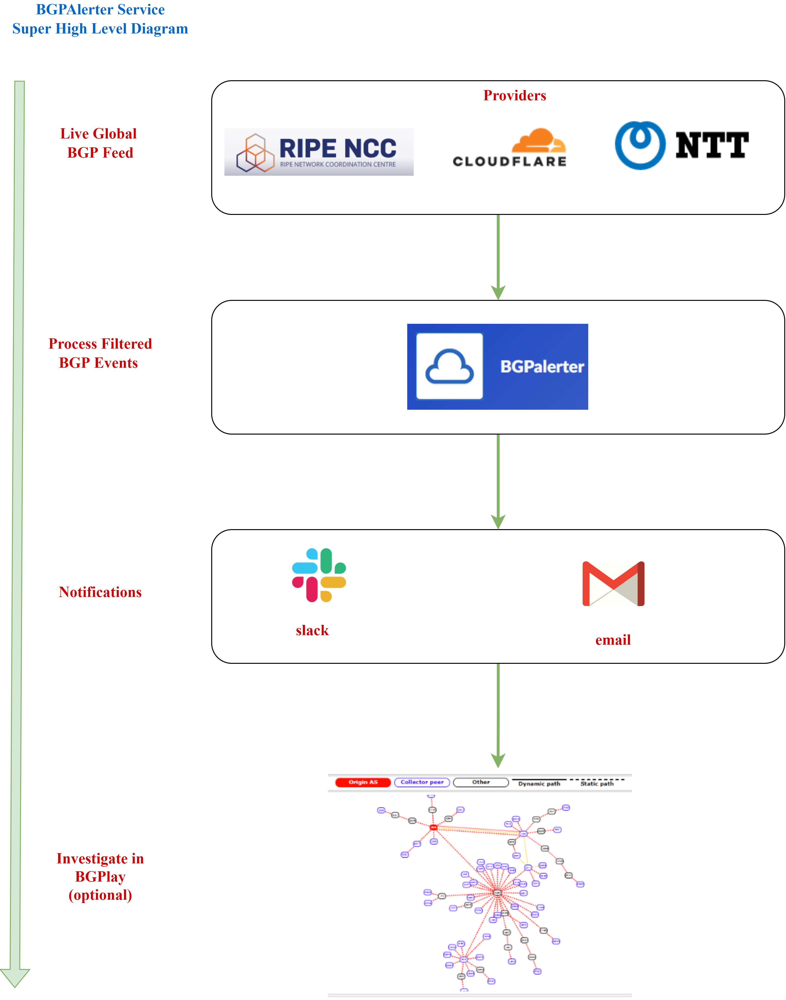

**Live RIPE Feed Example**
* Here is an example of the [Live RIPE Feed of BGP Updates](https://ris-live.ripe.net/)

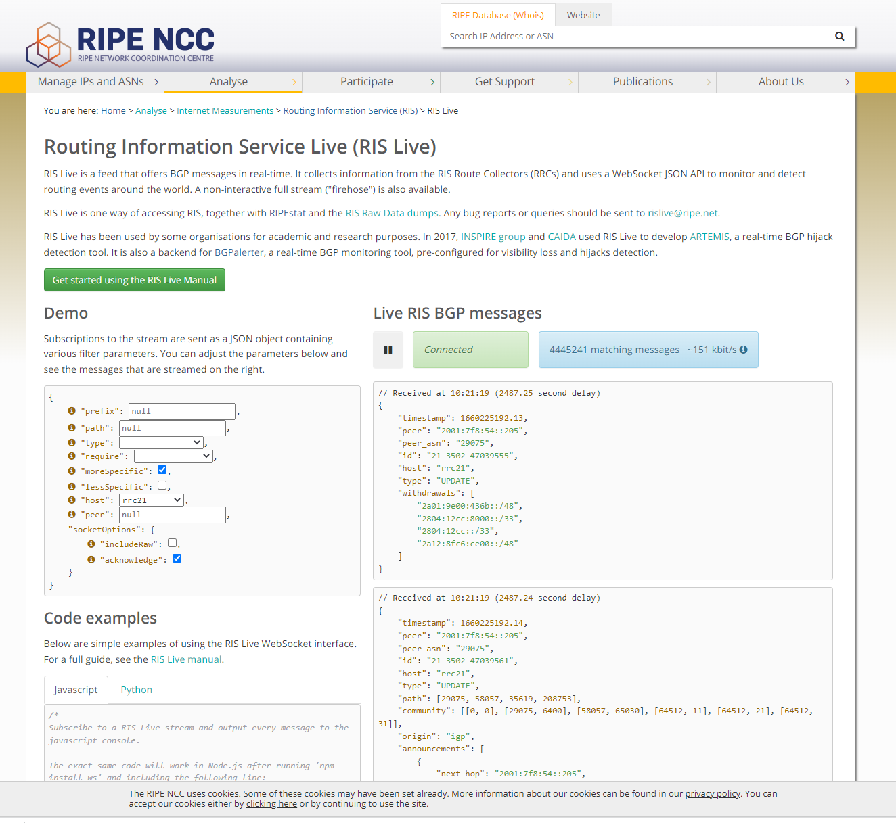

## Why should we use Infrastructure as Code?

**Network Engineers love tools**, but oftentimes, the tools that Network Engineers deploy turn into 
bespoke pet projects that are hard to keep in sync, maintain or document.

* Infrastructure as code (IaC) helps alleviate these problems because it:
    * Allows for version controlled configuration changes
    * Self-documents (for the most part)
    * Creates an easy-to-follow process for updating and maintaining the tool application and system environment

## The Solution

**High Level Diagram**

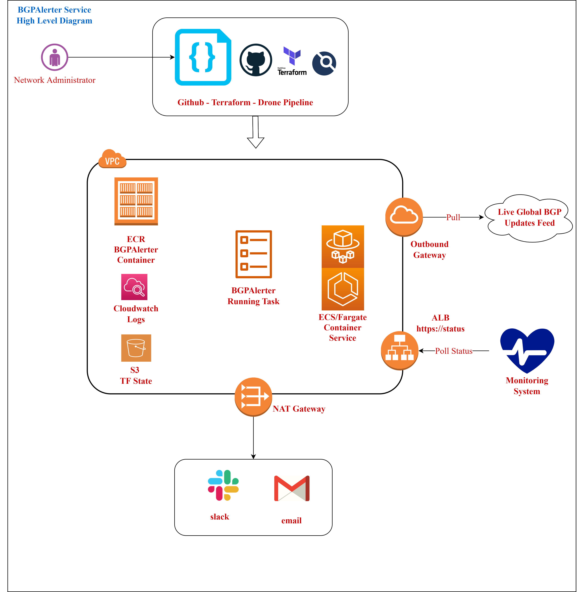

**Drone Process**

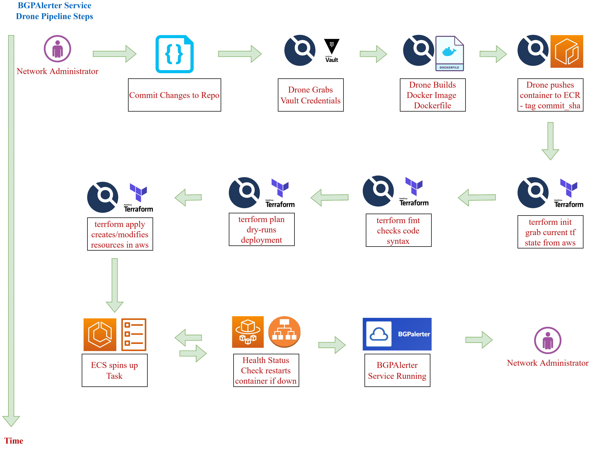

## The Code
* Github Repo of the Code can be [found here](https://github.com/kaon1/bgpalerter-as-code)
* This repo and blog post are not meant to be "plug-and-play" ready, there are some parts of the infrastructure omitted (such as the VPC, Route53 etc)
* The key **learning takeaways** of this guide is how to format the drone.yml, Dockerfile, ecr.tf and ecs.tf files
* Credit goes to the devops folks at my org from whom I borrowed much of the terraform code and made my own tweaks as needed

### Components

**prefix.yml**

**The source file** that BGPAlerter reads of which prefixes and ASNs to monitor
```yaml
1.1.1.0/23:
  description: ABCDEFG
  asn:
    - 111111
  ignoreMorespecifics: false
  ignore: false
  group: noc
2.2.2.0/24:
  description: HIJKLMNOP
  asn:
    - 22222
  ignoreMorespecifics: false
  ignore: false
  group: noc
3.3.3.0/21:
  description: QRSTUVWXYZ
  asn:
    - 33333
  ignoreMorespecifics: false
  ignore: false
  group: noc
options:
  monitorASns:
    '111111':
      group: noc
      upstreams:
        - 55555
      downstreams: []
  generate:
    asnList:
      - '111111'
      - '22222'
      - '33333'
    exclude: []
    excludeDelegated: false
    prefixes: null
    monitoredASes: true
    historical: true
    group: noc
```
**Dockerfile**

**Instructions** that Drone uses to build your docker image. This image is later pushed to AWS ECR
```dockerfile
### Pull latest bgpalerter container from nttgin docker hub
FROM nttgin/bgpalerter:latest
### Copy our own prefix.yml file and config file to the docker image
### When drone builds this image and pushes it to ECR, it will contain our files (not the defaults)
COPY bgpalerter/YOUR_ASN_PREFIX_LIST.yml /opt/bgpalerter/volume/YOUR_ASN_PREFIX_LIST.yml
COPY bgpalerter/config.yml /opt/bgpalerter/volume/config.yml
### Slack webhook should not be committed in code. This script replaces the slackwebhook in config.yml with a tf var
COPY bgpalerter/slack-token-replace.sh /opt/bgpalerter/volume/slack-token-replace.sh

### open port 8011 for status checks
EXPOSE 8011
```
**Drone File**

**The Drone file** are the steps that drone takes to build the infrastructure. This file consists of two sections 
* First, build the docker image and push it to ECR
* Second, build the AWS Fargate infra from the terraform directory
```yaml
---
### First pipeline creates the docker image from Dockerfile and pushes to your ECR repo
kind: pipeline
name: ecr

workspace:
 path: XXX

steps:
### Drone pushes to ECR/bgpalerter and tags as latest + adds commit_sha
### The commit_sha is important because its how we force Fargate to always rebuild/redeploy the container on changes
 - name: publish-image-local
   image: plugins/ecr
   settings:
     registry: xxx.dkr.ecr.us-east-1.amazonaws.com
     repo: bgpalerter
     dockerfile: Dockerfile
     tag:
       - latest-${DRONE_COMMIT_SHA}
       
   environment:
     SHARED_CREDENTIALS_FILE: XXX
### When main changes, drone runs this pipeline
   when:
     event: push
     branch: main

---
### The 2nd drone pipeline runs terraform code to build aws infrastructure
kind: pipeline
name: default

workspace:
 path: XXX

steps:
### Format syntax check terraform files
 - name: fmt-module
   image: hashicorp/terraform
   commands:
     - cd terraform/modules/fargate-infra
     - terraform fmt -check -diff=true

 - name: fmt-aws
   image: hashicorp/terraform
   commands:
     - cd terraform/aws
     - terraform fmt -check -diff=true
### Build terraform plan file and sleep30 seconds. Giving admin time to abort
 - name: prd-terraform-plan
   image: hashicorp/terraform
   commands:
     - cd terraform/aws
     - terraform init -input=false
     - terraform plan -out=PLANFILE -input=false -lock-timeout=5m
     - sleep 30
   environment:
     SHARED_CREDENTIALS_FILE: XXX
### Pass commit_sha so we can use it in terraform file to call our docker image
     TF_VAR_image_tag_digest: ${DRONE_COMMIT_SHA}
   when:
     event: push
     branch: main

### Deploy infra with terraform apply
 - name: prd-terraform-apply
   image: hashicorp/terraform
   commands:
     - cd terraform/aws
     - terraform apply -input=false -lock-timeout=5m PLANFILE
   environment:
     SHARED_CREDENTIALS_FILE: XXX
### Pass commit_sha so we can use it in terraform file to call our docker image
     TF_VAR_image_tag_digest: ${DRONE_COMMIT_SHA}
### When main changes, drone runs this pipeline
   when:
     event: push
     branch: main
```
**Slack Webhook Script**

**Slack Webhooks** are sensitive, and should not be committed to Github. This script grabs the slackwebhook from a tf env
variable and uses sed to load it into confi.yml.
This is done before the BGPAlerter service is started on the container. 
```shell script
### This script is whats started on the docker container. First we replace the slackwebhook then start bgpalerter service
### Call SLACK_API_TOKEN from tf env variable which is stored in AWS Param Store
ESCAPED_REPLACE=$(printf '%s\n' "$SLACK_API_TOKEN" | sed -e 's/[\/&]/\\&/g')
/bin/sed -i "s/slacktokentobereplaced/$ESCAPED_REPLACE/g" /opt/bgpalerter/volume/config.yml
/bin/cat /opt/bgpalerter/volume/config.yml
/usr/local/bin/npm run serve -- --d /opt/bgpalerter/volume/
```
**ECR Terraform File**

**Builds** the Elastic Container Registry in AWS
```hcl-terraform
###This file creates the ECR repository for the docker image.

resource "aws_ecr_repository" "app_image" {
  name                 = "bgpalerter"
  image_tag_mutability = "MUTABLE"

  image_scanning_configuration {
    scan_on_push = true
  }
}
```
**ECS Terraform File**
**Builds** the Elastic Container Service in AWS
```hcl-terraform
### ECS File creates the Fargate service for the docker container
### Sets CPU and RAM
### Creates the bgpalerter task definition and runs it

resource "aws_ecs_cluster" "bgpalerter-fargate" {
  name               = local.svc_name
  capacity_providers = ["FARGATE_SPOT"]


  default_capacity_provider_strategy {
    capacity_provider = "FARGATE_SPOT"
  }

  tags = var.common_tags
}

// ECS service

resource "aws_ecs_service" "bgpalerter-svc" {
  name            = local.svc_name
  cluster         = aws_ecs_cluster.bgpalerter-fargate.id
  task_definition = aws_ecs_task_definition.task_definition.arn
  desired_count   = 1
  launch_type     = "FARGATE"

  network_configuration {
    subnets         = xxx
    security_groups = [xxx]
  }

  load_balancer {
    target_group_arn = xxx
    container_name   = xxx
    container_port   = xxx
  }

  tags = xxx
}

### Create BGPAlerter Task
resource "aws_ecs_task_definition" "task_definition" {
  family = local.svc_name
  requires_compatibilities = ["FARGATE"]
  network_mode             = "awsvpc"
  execution_role_arn       = xxx
  task_role_arn            = xxx
  ### CPU and Memory
  cpu                      = 512
  memory                   = 1024
  tags                     = xxx
  container_definitions = jsonencode([
    {
      name  = local.svc_name
      image = "${var.image_name}${var.image_tag_digest}"
      essential  = true
      ### Call the shell script when the image starts. This replaces the slack webhook and starts the service
      entryPoint = ["/bin/sh", "/opt/bgpalerter/volume/slack-token-replace.sh"]
      secrets = [
        {
          name      = "SLACK_API_TOKEN"
          valueFrom = xxx
        }
      ]
      portMappings = [
        {
          containerPort = 8011
          hostPort      = 8011
        }
      ]
      logConfiguration = {
        logDriver = "awslogs"
        options = {
          awslogs-group         = local.svc_name
          awslogs-region        = "us-east-1"
          awslogs-stream-prefix = "bgpalerter"
        }
      }
    }
  ])
}
```

## The Results

**Drone Build Progress**

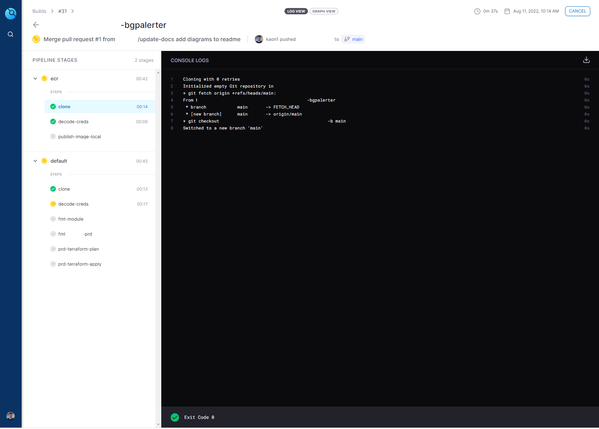

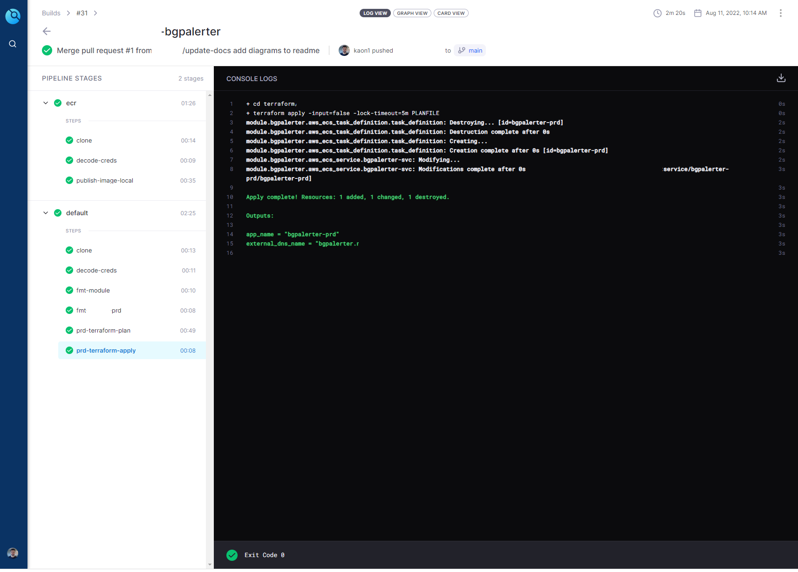

**Deployed Infrastructure - Elastic Container Registry**

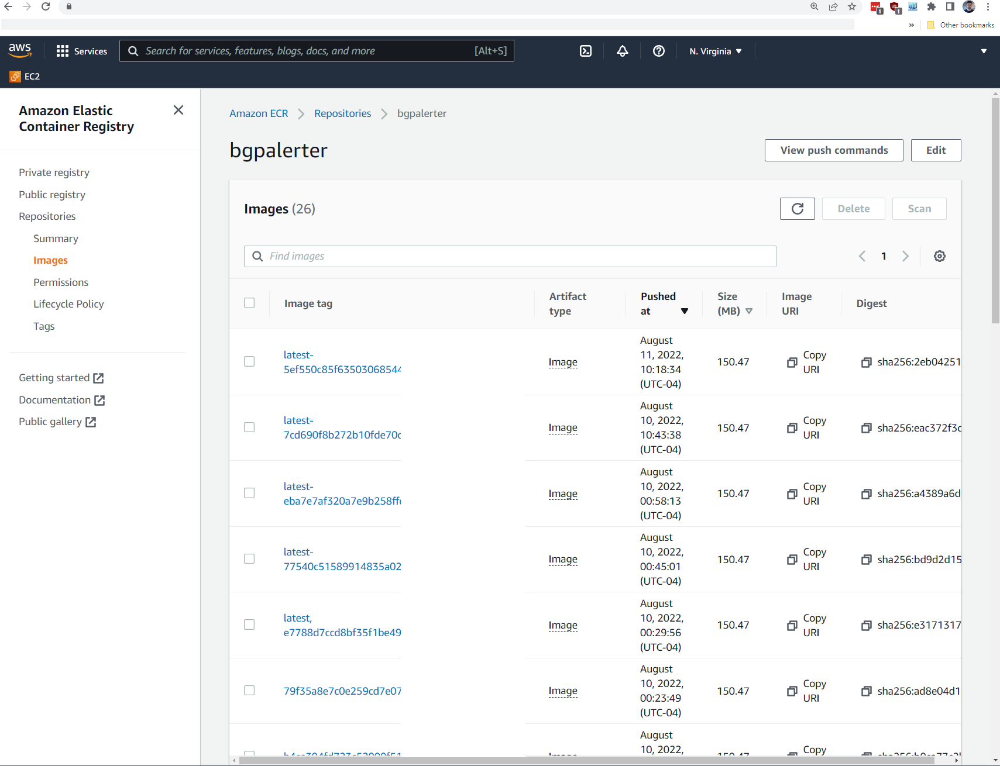

**Deployed Infrastructure - Elastic Container Service and Fargate**

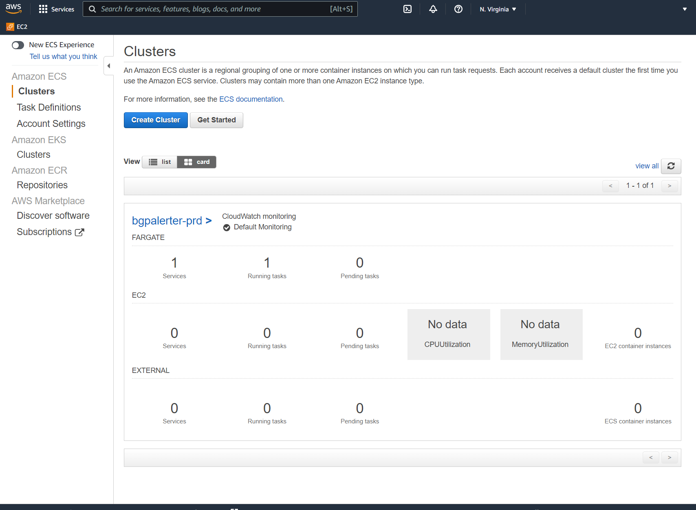

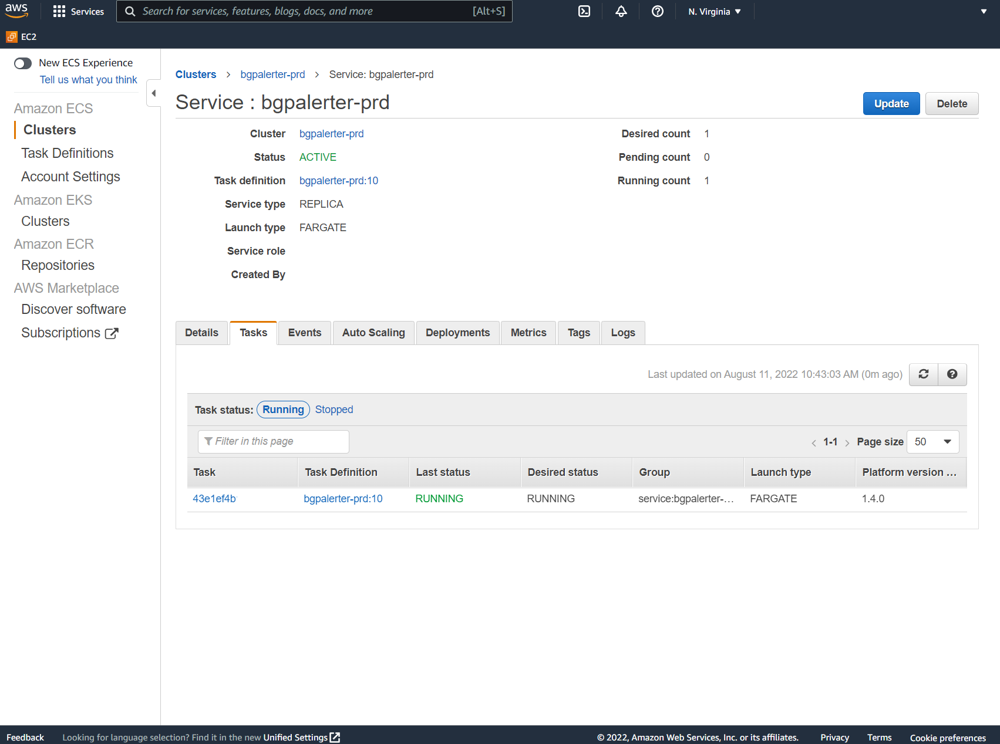

**BGPAlerter Running and Status**

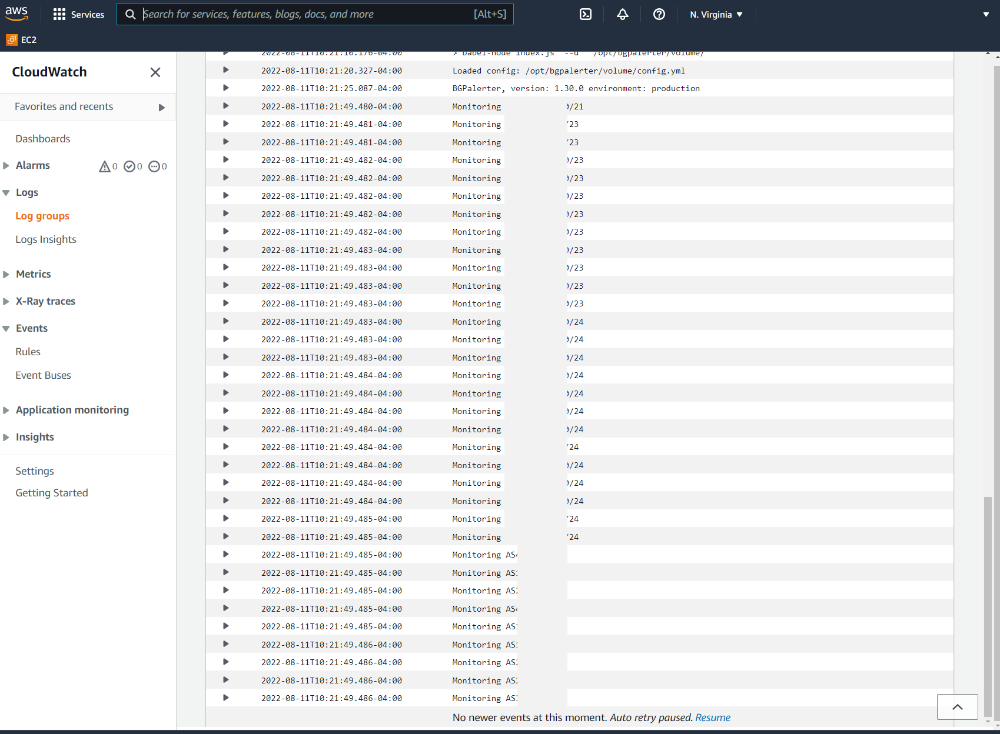

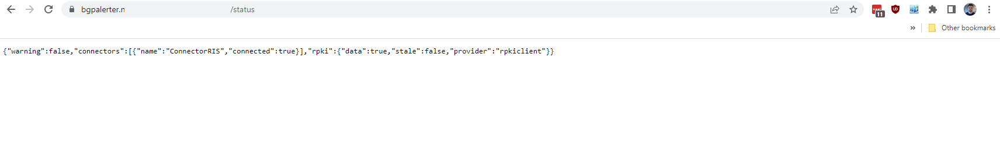

**Notifications**

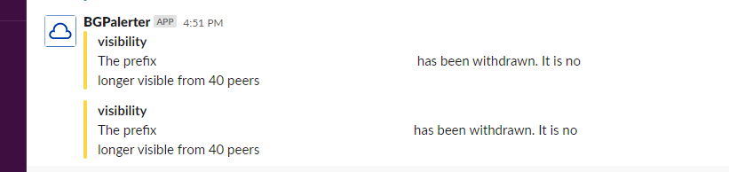

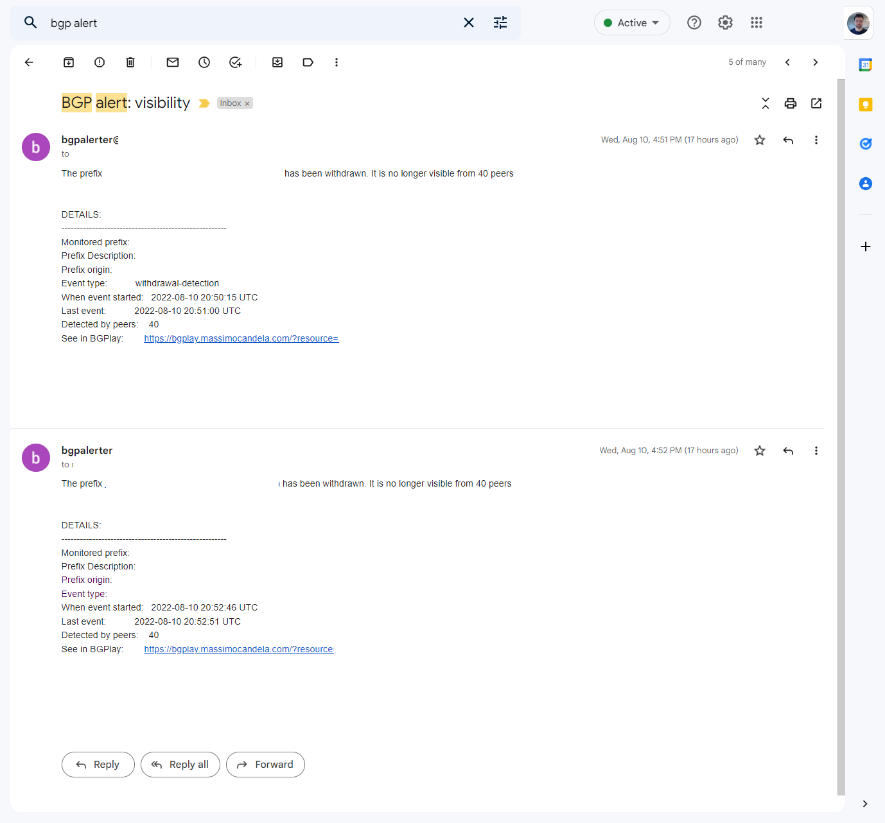

**The Alert email** provides a link to BGPLay which lets you view the event in a graphed form
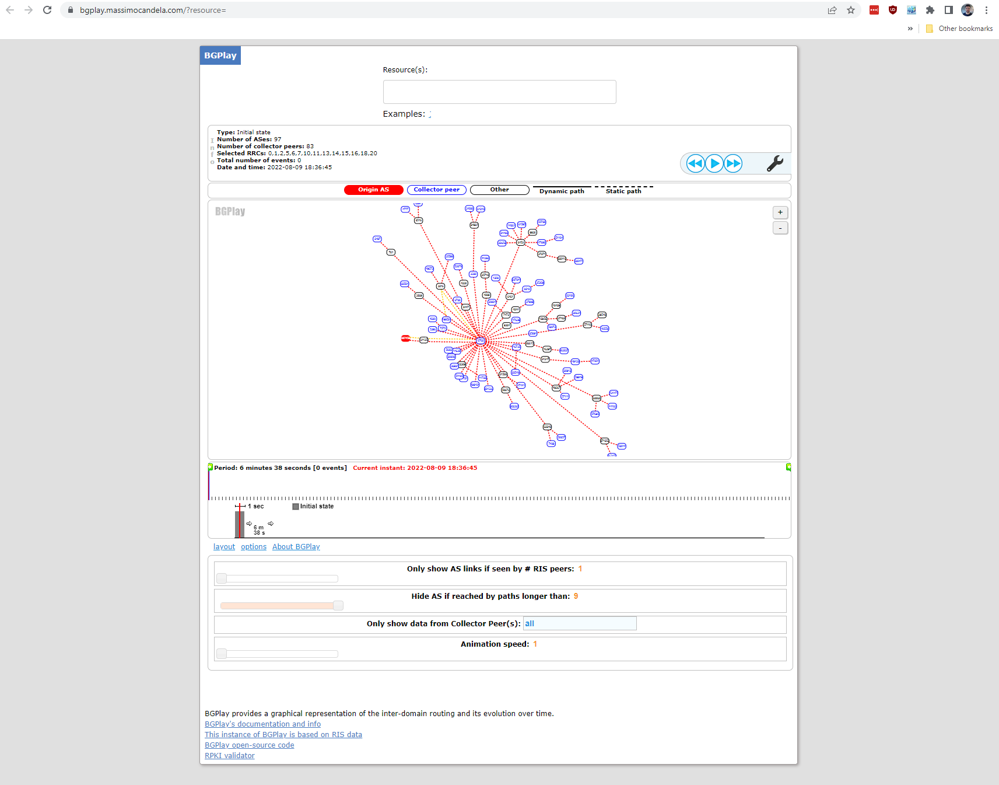

## Final Thoughts
**As a Network Engineer**, I often find it hard to grasp abstract concepts of software development. In my experience,
the best way to learn these concepts such as IaC and CICD is to port over something you **know** (like a networking tool)
into a new system. Hopefully, this post will help others in their journey. Thanks for reading!