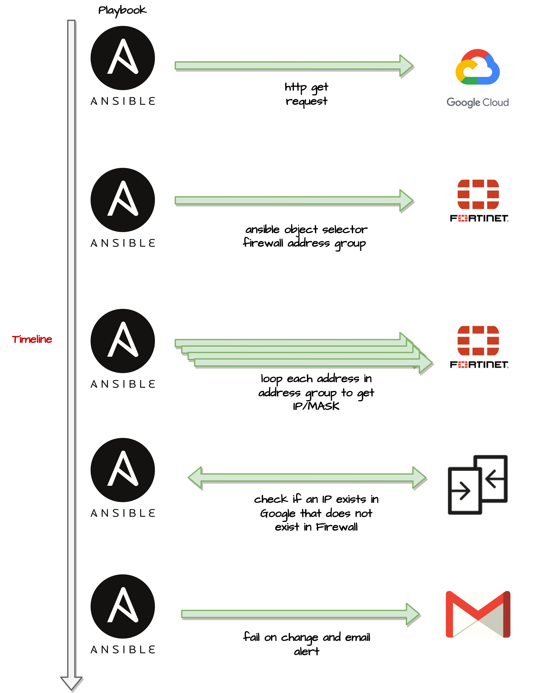
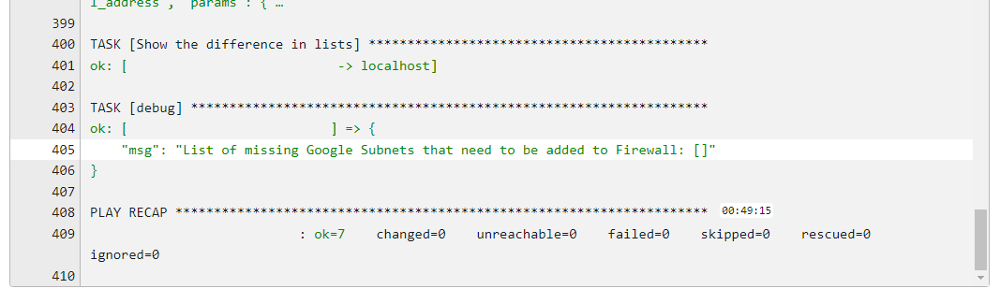
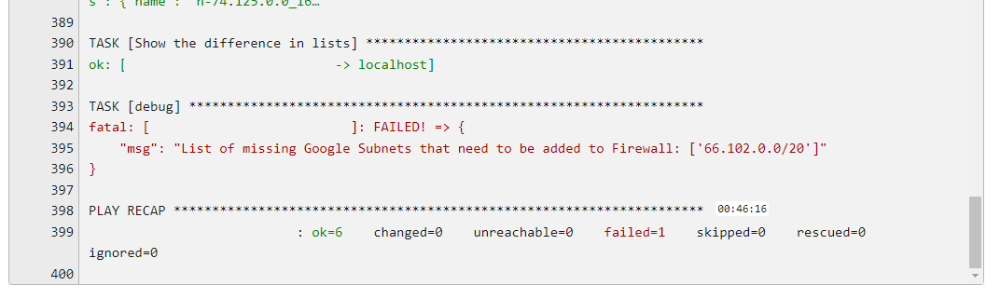
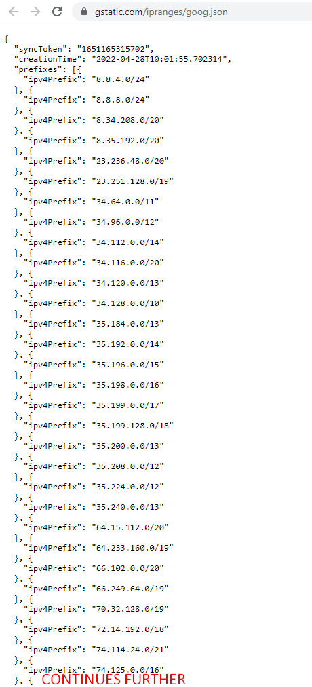
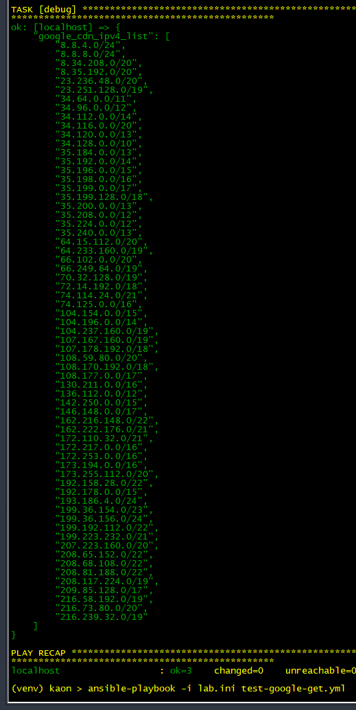
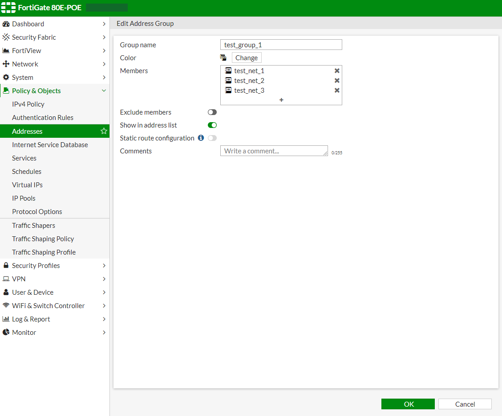
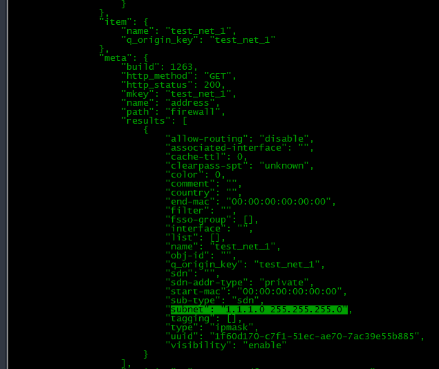
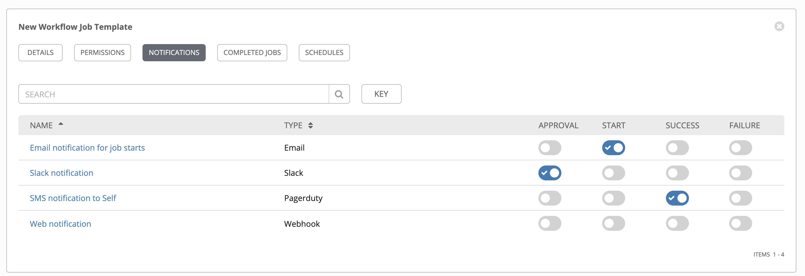
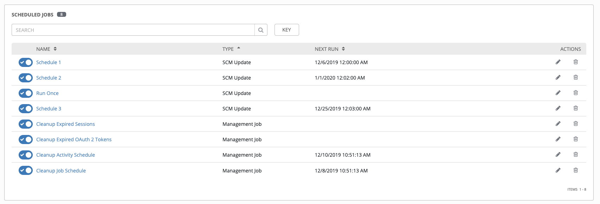

+++
author = "Kaon Thana"
title = "Use Ansible to compare Cloud IP Ranges against Firewall object"
date = "2022-04-28"
description = "Guide to automate a daily Ansible job to compare a Fortinet Address Object against known public IP Ranges of cloud providers such as GCN, Fastly or AWS"
categories = [
    "ansible",
    "automation",
    "cloud",
    "security",
    "fortinet",
]

aliases = ["cloud-ip-ranges-checks"]
image = "cloud-ip-checks-mini.png"
+++

**A common IT Workflow exists** where a Cloud provider's public IP ranges are added to a static firewall object list. 
The reasons why this is done include: Network Address Translation (NAT), Access Control (ACL) or logging.

Often times, the network engineer is unaware when the Cloud Provider updates their IP ranges and thus the **IT Workflow is no longer in compliance**.

We can **automate** some of this process by setting up a job to continually check the Cloud IP ranges and **alert** us if a change is required.


## Overview
The below process is specifically for [Google Cloud IP Ranges](https://www.gstatic.com/ipranges/goog.json) 
and Fortinet Firewall Objects. However, with a few tweaks 
can be ported to other services such as [Fastly](https://api.fastly.com/public-ip-list) and 
[AWS](https://ip-ranges.amazonaws.com/ip-ranges.json) as well as other firewall vendors supported by
 [ansible collections](https://docs.ansible.com/ansible/latest/collections/index.html). 
 
 

## Ansible Code

[compare-google-ips-check-against-fortinet.yml](https://github.com/kaon1/ansible-misc/blob/main/cloud-ip-ranges-checks/compare-google-ips-check-against-fortinet.yml)

```yaml
### This playbook will compare the list of known IPv4 Google Cloud IP addresses against
### the a deployed 'address_grp' object in a Fortigate Firewall
### First we grab the json data from https://www.gstatic.com/ipranges/goog.json and extract ipv4 addresses to a list
### Next we grab the firewall_addrgrp called 'google_cdn' on the firewall and put it into a list
### We run a difference of list1 vs list2. If there is a difference, the PB will throw an error and Tower sends email
---
- name: PB to compare Google Cloud IPs vs current 'google_cdn' object in firewall
  hosts: firewall_host1
  gather_facts: false
  vars:
    ### Fortinet specific vars for Ansible to connect - https://galaxy.ansible.com/fortinet/fortios
    ansible_python_interpreter: /usr/bin/python3
    ansible_user: user
    ansible_password: password
    ansible_connection: httpapi
    ansible_httpapi_use_ssl: yes
    ansible_httpapi_validate_certs: no
    ansible_httpapi_port: 443
    ansible_network_os: fortinet.fortios.fortios
    vdom: "root"
    ### Variable to store list of 'google_cdn' ips as a list from the user firewall
    google_ip_list: []
    ### Variable to store list of Google Cloud IP addresses we retrieve from the internet
    google_cdn_ipv4_list: []
    ### Variable to store the list difference result
    missing_google_ips: []
  tasks:
    ### GET request to retrieve the current json data of Google Cloud IP Ranges
    - name: Get all google cloud ip ranges as json result
      uri:
        url: "https://www.gstatic.com/ipranges/goog.json"
        method: GET
        validate_certs: no
      register: google_web_json_result
      ### Ansible will register a change here, we can ignore it.
      changed_when: false
      delegate_to: localhost

    ### Extract only IPv4 Addresses and add to a flat list
    - set_fact:
        google_cdn_ipv4_list: "{{ google_cdn_ipv4_list + [ item['ipv4Prefix'] ] }}"
      loop: "{{ google_web_json_result.json.prefixes }}"
      when: item['ipv4Prefix'] is defined
      changed_when: false
      delegate_to: localhost

    ### Hit the firewall once here to retrieve the object. This object does not contain IP/Mask info only names
    - name: Get google_cdn list of objects from firewall
      fortinet.fortios.fortios_configuration_fact:
        vdom:  "{{ vdom }}"
        selector: "firewall_addrgrp"
        params:
          name: "google_cdn"
      register: google_networks_objects
      changed_when: false

    ### For each name in 'google_cdn' object we ask the firewall to give us back the IP/Mask info. Many API hits here.
    - name: Iterate through every Google object and extract subnet info
      fortinet.fortios.fortios_configuration_fact:
        vdom:  "{{ vdom }}"
        selector: "firewall_address"
        params:
          name: "{{ item.name }}"
      register: google_item
      loop: "{{ google_networks_objects.meta.results[0]['member'] }}"
      changed_when: false

    ### The returned IP and Subnet info is in form 10.10.10.10 255.255.255.0. These Filters translate that to 10.10.10.10/24
    ### List is populated with all 'google_cdn' IP/Mask in correct format for comparison
    - set_fact:
        google_ip_list: "{{ google_ip_list + [ item.meta.results[0].subnet | replace(' ','/') | ansible.netcommon.ipaddr ] }}"
      loop: "{{ google_item.results }}"
      changed_when: false
      delegate_to: localhost

    ### Use ansible difference filter to compare list1 to list2. It shows items that are in list1 but not in list2
    - name: Show the difference in lists
      set_fact:
        missing_google_ips: "{{ google_cdn_ipv4_list | difference(google_ip_list) }}"
      changed_when: false
      delegate_to: localhost

    ### If an IP Subnet exists in the google cdn ipv4 list but not on the firewall 'google_cdn object' then
    ### we fail the PB and Tower will send an email with the list
    - debug:
        msg: "List of missing Google Subnets that need to be added to Firewall: {{ missing_google_ips }}"
      failed_when: missing_google_ips | length>0
```
### Results

* **No Difference Detected:**



* **Difference Detected:**



## Detailed Step-by-Step
Let's dive into the step-by-step
### Get Google Cloud IP Ranges
Browsing to https://www.gstatic.com/ipranges/goog.json returns a JSON result of IP Prefixes.

We can programmatically access the JSON result and store all IPv4 prefixes in an ansible list called **google_cdn_ipv4_list**:
```yaml
### GET request to retrieve the current json data of Google Cloud IP Ranges
- name: Get all google cloud ip ranges as json result
  uri:
    url: "https://www.gstatic.com/ipranges/goog.json"
    method: GET
    validate_certs: no
  register: google_web_json_result
  ### Ansible will register a change here, we can ignore it.
  changed_when: false
  delegate_to: localhost

### Extract only IPv4 Addresses and add to a flat list
- set_fact:
    google_cdn_ipv4_list: "{{ google_cdn_ipv4_list + [ item['ipv4Prefix'] ] }}"
  loop: "{{ google_web_json_result.json.prefixes }}"
  when: item['ipv4Prefix'] is defined
  changed_when: false
  delegate_to: localhost
```

We can run the above tasks and print the result. Below is a printout of each dataset: 
**https://www.gstatic.com/ipranges/goog.json** and **google_cdn_ipv4_list**

| `HTTP Site`                | `Ansible GET Result`          |
| ------------------------------  | ------------------------------ | 
|                     |                    | 


### Get Address Group from Fortigate
We can use the [ansible collection provided by Fortinet](https://ansible-galaxy-fortios-docs.readthedocs.io/en/latest/) to gather facts. 

In the below task we will retrieve the firewall address group named **test_group_1**

```yaml
- name: Get Fortigate Address Group
  fortinet.fortios.fortios_configuration_fact:
    vdom:  "root"
    selector: "firewall_addrgrp"
    params:
      name: "test_group_1"
  register: google_networks_objects

- debug:
    var: google_networks_objects.meta.results[0]
```

Here is a comparison of the Address Group in the Fortigate GUI and the Ansible Result:

| `HTTP Site`                |
| ------------------------------  | 
|                     | 

Ansible Result:
```yaml
TASK [debug] *********************
ok: [localhost] => {
    "google_networks_objects.meta.results[0]": {
        "allow-routing": "disable",
        "color": 0,
        "comment": "",
        "exclude": "disable",
        "exclude-member": [],
        "member": [
            {
                "name": "test_net_1",
                "q_origin_key": "test_net_1"
            },
            {
                "name": "test_net_2",
                "q_origin_key": "test_net_2"
            },
            {
                "name": "test_net_3",
                "q_origin_key": "test_net_3"
            }
        ],
        "name": "test_group_1",
        "q_origin_key": "test_group_1",
        "tagging": [],
        "uuid": "3ff6c462-c7f1-51ec-f405-2a6b59ee9591",
        "visibility": "enable"
    }
}
```

### Get Each Member of Group

The above ansible result gives us a list of address group member names. 
We have to query the firewall again for the IP address and subnet mask of each member.

This task will loop through each group member:

```yaml
- name: Iterate through every Google object and extract subnet info
  fortinet.fortios.fortios_configuration_fact:
    vdom:  "{{ vdom }}"
    selector: "firewall_address"
    params:
      name: "{{ item.name }}"
  register: google_item
  loop: "{{ google_networks_objects.meta.results[0]['member'] }}"

- debug:
    var: google_item
```

  

### Extract Subnet Info to List

The returned results need to be parsed. The `subnet` field should be normalized to IP/MASK notation so
that we can more easily run a diff later against the exisiting google cdn list that we grabbed earlier from the web.

We can parse each `subnet` field and transfrom it to IP/MASK notation with this task:

```yaml
- set_fact:
    google_ip_list: "{{ google_ip_list + [ item.meta.results[0].subnet | replace(' ','/') | ansible.netcommon.ipaddr ] }}"
  loop: "{{ google_item.results }}"
  changed_when: false
  delegate_to: localhost
```

Now we have a list of all IPs from the Fortigate in a normalized view (Example Data):
```yaml
TASK [debug] *****************************
ok: [localhost] => {
    "google_ip_list": [
        "1.1.1.0/24",
        "2.2.0.0/22",
        "3.3.3.0/30"
    ]
}

```

### Data Comparison

We use the built-in ansible `difference` filter to compare the two lists that we have extracted. 

This is a one-way comparison, meaning we compare Google list from the web --> Google List from the Fortigate.

If we wanted a full comparison, we would run this task again in reverse.

```yaml
### Use ansible difference filter to compare list1 to list2. It shows items that are in list1 but not in list2
- name: Show the difference in lists
  set_fact:
    missing_google_ips: "{{ google_cdn_ipv4_list | difference(google_ip_list) }}"
  changed_when: false
  delegate_to: localhost

### If an IP Subnet exists in the google cdn ipv4 list but not on the firewall 'google_cdn object' then
### we fail the PB and Tower will send an email with the list
- debug:
    msg: "List of missing Google Subnets that need to be added to Firewall: {{ missing_google_ips }}"
  failed_when: missing_google_ips | length>0
```

### Alerting and Scheduling

We can use [Ansible Tower/AWX](https://github.com/ansible/awx) to schedule playbook execution and alerting.

The playbook is set to **fail** if there is an IP in the web list that does not exist in the Fortigate list. 

We do this so that Ansible Tower can alert on failure. More info on setting up [Notifications here](https://docs.ansible.com/ansible-tower/latest/html/userguide/notifications.html)

  

Similarly, job scheduling can also be setup so the task [runs daily](https://docs.ansible.com/ansible-tower/latest/html/userguide/scheduling.html)



## Wrap Up

I hope this tutorial was useful to anyone looking to automate a common operational workflow. This playbook performs
**read actions**, its a good way to get started on your automation journey without worrying about making **breaking changes**.

The next logical iteration for this process is to automatically update the firewall object without manual intervention.

Feel free to comment below or contact me on [Twitter](https://twitter.com/KaonThana) if you have any questions.

Thanks!

