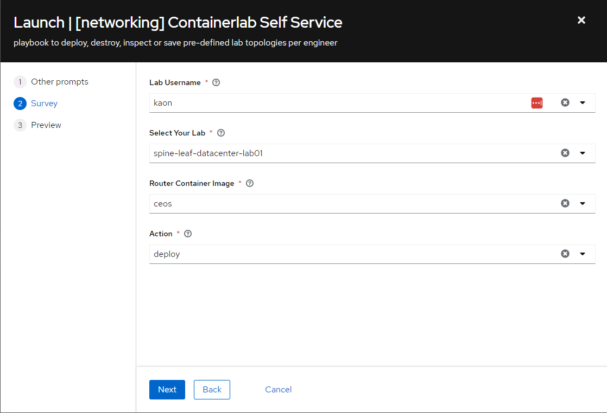
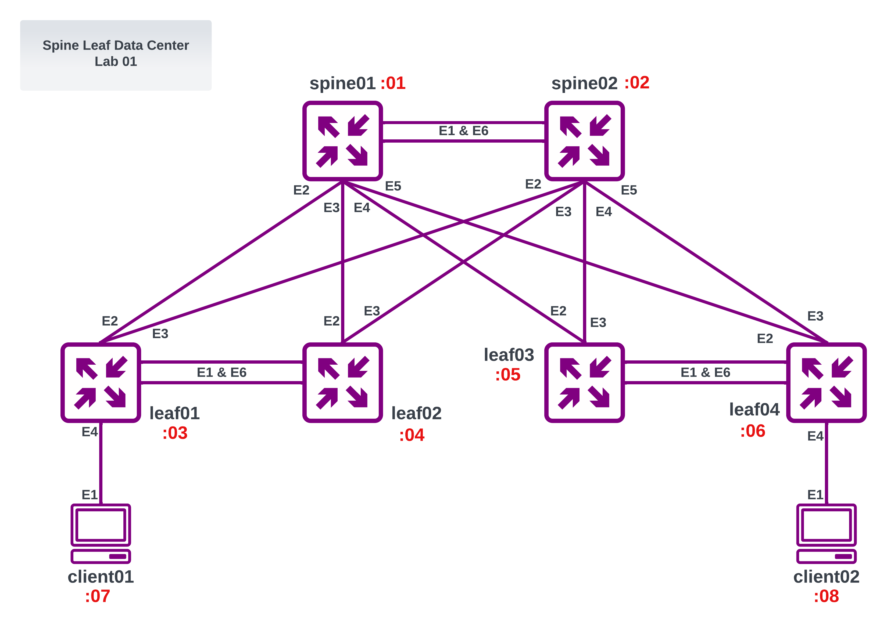
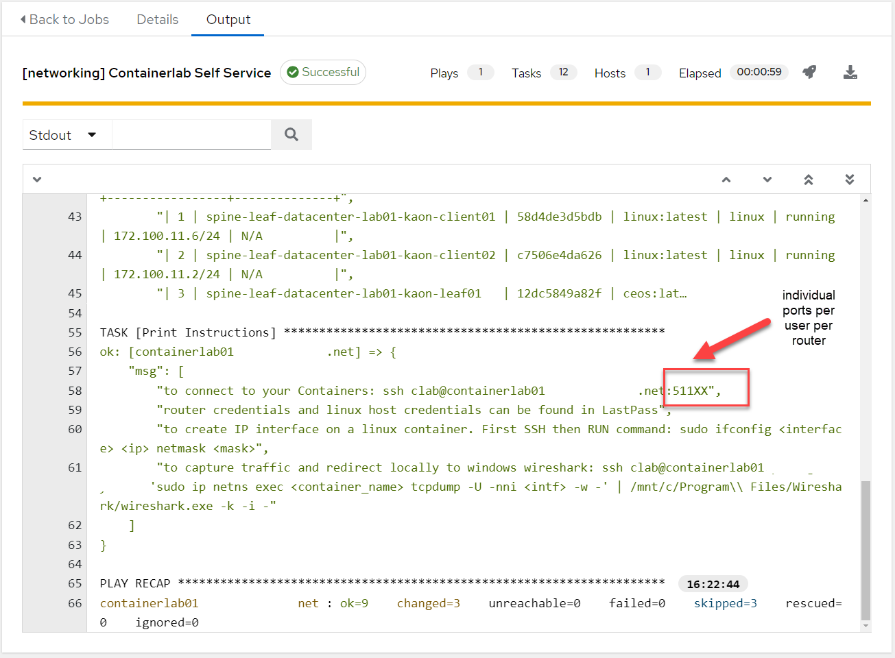
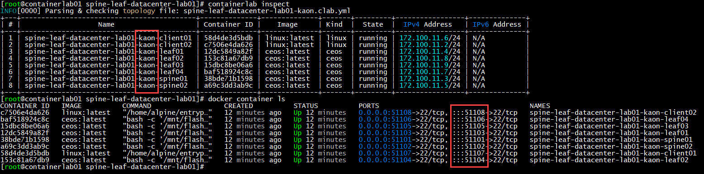
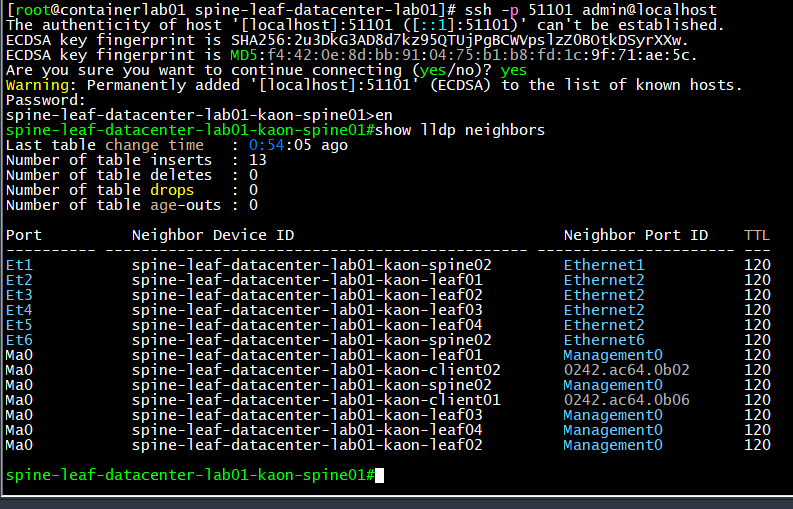
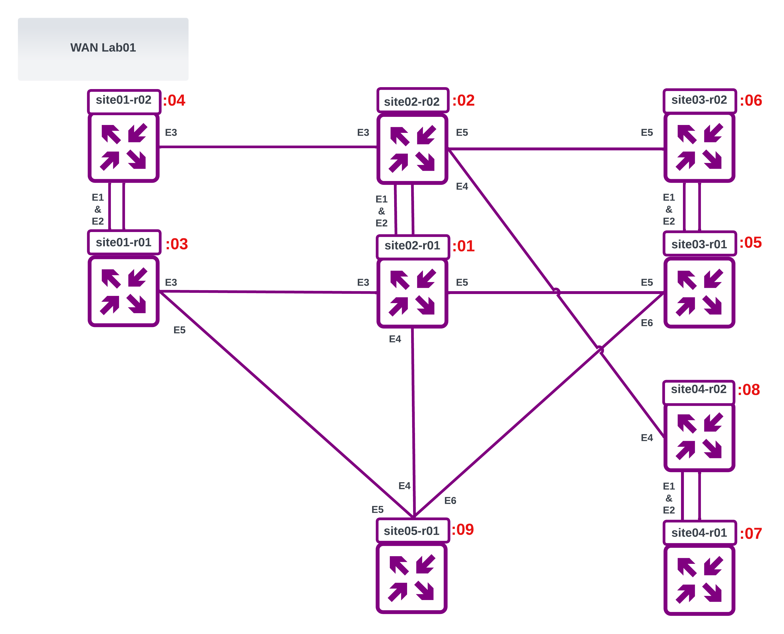
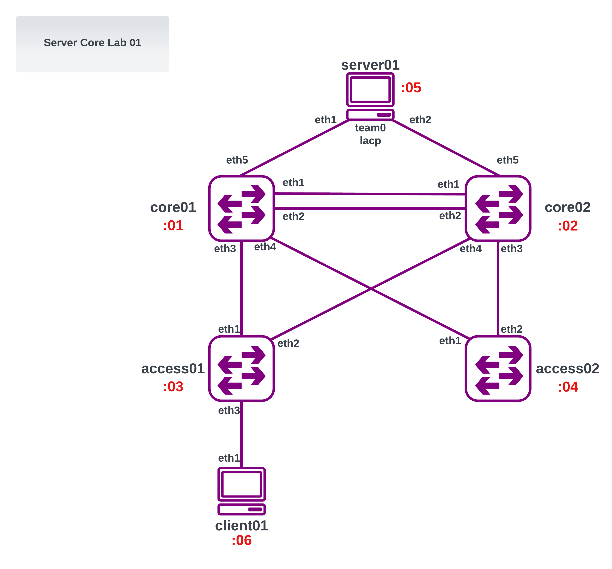

+++
author = "Kaon Thana"
title = "Self-Service ContainerLab Deployment with Ansible Tower"
date = "2023-07-24"
description = "Generating dynamic ContainerLab topology files with ansible to facilitate team labbing and learning"
categories = [
    "ansible",
    "arista",
    "containerlab",
    "netdevops"
]

aliases = ["clab-ansible"]
image = "images/clab-ansible.png"
+++

## About

Not long ago, I was asked by [Kris Beevers](https://www.linkedin.com/in/beevek/), the CEO of [NetBox Labs](https://netboxlabs.com/) --- what actionable steps I recommend for individuals who are interested in a career in network engineering. My number one answer is to **lab it up**. Deploying a lab environment and getting hands on to solve a real (or made up) problem is the best way to accelerate your learning.

There are multiple ways to create network lab environments: if you have the resources to grab real physical gear go for it. However, this has limitations, there is a cost to this, power, cabling, and space requirements. Another option is to use an application such as EVE-NG or GNS3. These platforms let you deploy virtual machine based labs. However, the images are usually memory intensive and setting up the topology is not programmatically friendly.

Luckily for us, in the last few years more and more vendors are providing **containerized network operating systems**. A network OS hosted on a docker container uses significantly less cpu and memory and can be deployed using infrastructure-as-code methods (IAC)

SRL Labs has built an open source tool called [ContainerLab](https://containerlab.dev/) which can orchestrate a routing topology for these network containers. In addition to network operating systems, ContainerLab allows us to deploy and virtually wire-up arbitrary linux containers to host applications. This can allow for full end-to-end testing of the application and network stack.

ContainerLab does have somewhat of a learning curve get labs up and running. I realize that not all network engineers want to learn a new platform or how docker containers work. For these cases, I built an **Ansible wrapper** which lets a user deploy their own pre-canned lab environment using Ansible Tower. The hope is that this limits the barrier to entry for using ContainerLab.

## Workflow

1. User Selects their Desired Pre-Canned Lab Topology
2. User Selects their desired Router Image
3. Action:
   - Deploy - Start Lab from Scratch
   - Inspect - Show information about existing already deployed lab
   - Save - logs into all routers of lab and saves config (can also be done manually on cli)
   - Shutdown - powers off lab routers but keeps the config on server (config persists on next lab deployment)
   - Destroy - powers off lab routers and deletes all configs on server (all saved configs lost)
4. After Job is complete. Lab Nodes can be accessed by following the output prompts

Ansible Tower Prompts:


Lab to be Deployed using Arista cEOS images:


Results of Ansible Playbook:


Deployed Docker Images:


The unique lab names (per user) and unique port-mappings per container allow for multiple engineers to deploy the same lab on the same server.

Logging into one of the routers:


## How it Works

The full code and other lab topologies can be found here: https://github.com/kaon1/containerlab-selfservice

### Creating the ContainerLab Topology Files

We can use a jinja2 template to dynamically create unique topology files per user and per lab. For [example](https://github.com/kaon1/containerlab-selfservice/blob/main/labs/spine-leaf-datacenter-lab01/spine-leaf-datacenter-lab01.j2), here we have the jinja2 template for the spine-leaf-datacenter lab:
```yaml
name: {{ lab_title }}-{{ lab_username }}
prefix: ""
topology:
  nodes:
    {{ lab_title }}-{{ lab_username }}-spine01:
      kind: "{{ router_container_kind }}"
      image: "{{ router_container_kind }}:latest"
      ports:
        - "5{{ user_map[lab_username] }}01:22"
    {{ lab_title }}-{{ lab_username }}-spine02:
      kind: "{{ router_container_kind }}"
      image: "{{ router_container_kind }}:latest"
      ports:
        - "5{{ user_map[lab_username] }}02:22"
    {{ lab_title }}-{{ lab_username }}-leaf01:
      kind: "{{ router_container_kind }}"
      image: "{{ router_container_kind }}:latest"
      ports:
        - "5{{ user_map[lab_username] }}03:22"
    {{ lab_title }}-{{ lab_username }}-leaf02:
      kind: "{{ router_container_kind }}"
      image: "{{ router_container_kind }}:latest"
      ports:
        - "5{{ user_map[lab_username] }}04:22"
    {{ lab_title }}-{{ lab_username }}-leaf03:
      kind: "{{ router_container_kind }}"
      image: "{{ router_container_kind }}:latest"
      ports:
        - "5{{ user_map[lab_username] }}05:22"
    {{ lab_title }}-{{ lab_username }}-leaf04:
      kind: "{{ router_container_kind }}"
      image: "{{ router_container_kind }}:latest"
      ports:
        - "5{{ user_map[lab_username] }}06:22"
    {{ lab_title }}-{{ lab_username }}-client01:
      kind: "{{ host_container_kind }}"
      image: "{{ host_container_kind }}:latest"
      ports:
        - "5{{ user_map[lab_username] }}07:22"
    {{ lab_title }}-{{ lab_username }}-client02:
      kind: "{{ host_container_kind }}"
      image: "{{ host_container_kind }}:latest"
      ports:
        - "5{{ user_map[lab_username] }}08:22"
  links:
    
    - endpoints: [{{ lab_title }}-{{ lab_username }}-{{link['endpoints'][0]}},{{ lab_title }}-{{ lab_username }}-{{link['endpoints'][1]}}]
    

mgmt:
  network: "{{ lab_title }}-{{ lab_username }}-network"
  ipv4-subnet: "{{ ipv4_subnet | ansible.utils.ipaddr }}"
```

The virtual wiring is handled by the endpoints file [here](https://github.com/kaon1/containerlab-selfservice/blob/main/labs/spine-leaf-datacenter-lab01/spine-leaf-datacenter-lab01-vars.yml):
```yaml
---
links:
  - endpoints: ["spine01:eth1", "spine02:eth1"]
  - endpoints: ["spine01:eth2", "leaf01:eth2"]
  - endpoints: ["spine01:eth3", "leaf02:eth2"]
  - endpoints: ["spine01:eth4", "leaf03:eth2"]
  - endpoints: ["spine01:eth5", "leaf04:eth2"]
  - endpoints: ["spine01:eth6", "spine02:eth6"]
  - endpoints: ["spine02:eth2", "leaf01:eth3"]
  - endpoints: ["spine02:eth3", "leaf02:eth3"]
  - endpoints: ["spine02:eth4", "leaf03:eth3"]
  - endpoints: ["spine02:eth5", "leaf04:eth3"]
  - endpoints: ["leaf01:eth1", "leaf02:eth1"]
  - endpoints: ["leaf01:eth6", "leaf02:eth6"]
  - endpoints: ["leaf03:eth1", "leaf04:eth1"]
  - endpoints: ["leaf03:eth6", "leaf04:eth6"]
  - endpoints: ["client01:eth1", "leaf01:eth4"]
  - endpoints: ["client02:eth1", "leaf04:eth4"]
```

The other base vars are populated by this [file](https://github.com/kaon1/containerlab-selfservice/blob/main/labs/base_vars.yml):
```yaml
### Base vars to get over-written by Ansible Tower Survey (i.e. Extra Vars) at runtime
---
lab_hosts: containerlab01.server
lab_username: kaon
lab_userid: "11"
lab_title: "server-core-lab01"
router_container_kind: ceos
host_container_kind: linux
wireshark_command: "ssh clab@containerlab01.server 'sudo ip netns exec <container_name> tcpdump -U -nni <intf> -w -' | /mnt/c/Program\\ Files/Wireshark/wireshark.exe -k -i -"
actions:
  - deploy
user_map:
  jack: "00"
  jill: "01"
  john: "02"
  bob: "03"
  mary: "04"
  joe: "05"
  kaon: "11"

```


### Ansible Wrapper

We can use Ansible to take in user input, render the jinja2 template and launch the ContainerLab binary. The ansible playbook can also handle tearing down and destroying the topology.

[containerlab_engine.yml](https://github.com/kaon1/containerlab-selfservice/blob/main/labs/containerlab_engine.yml):
```yaml
---
- name: Container Lab Engine for Self Service Labs
  gather_facts: false
  hosts: "{{ lab_hosts }}"
  become: yes
  vars_files:
  - "{{ lab_title }}/{{ lab_title }}-vars.yml"
  - base_vars.yml
  tasks:
    ### Create User and Lab specific directory on remote linux server hosting containerlab
    - name: Create User Specific Lab Directory
      file:
        path: "/opt/containerlab/labs/{{ lab_username }}/{{ lab_title }}"
        state: directory
      when: '"deploy" in actions'

    ### Declare unique Subnet Per user to be used later for Docker Container network
    - name: Set CLAB Docker IP Network for Each User
      set_fact:
        ipv4_subnet: 172.100.{{ user_map[lab_username] }}.0/24
      changed_when: false
      when: '"deploy" in actions'

    ### Use local topology jinja2 file to build remote containerlab topology file with per user/lab variables
    - name: Build Lab Topology File
      ansible.builtin.template:
        src: "{{ lab_title }}/{{ lab_title }}.j2"
        dest: "/opt/containerlab/labs/{{ lab_username }}/{{ lab_title }}/{{lab_title}}-{{ lab_username }}.clab.yml"
      when: '"deploy" in actions'

    ### Run Container Lab Deploy to build lab from .clab.yaml topology file
    - name: Deploy Lab File
      ansible.builtin.command:
        chdir: /opt/containerlab/labs/{{ lab_username }}/{{ lab_title }}
        cmd: containerlab deploy
      when: '"deploy" in actions'

    ### Show All Docker Containers Running By current User
    - name: Show Docker Containers
      ansible.builtin.command:
        chdir: /opt/containerlab/labs/{{ lab_username }}/{{ lab_title }}
        cmd: docker container ls -f name={{lab_username}}
      register: docker_output
      when: ("deploy" in actions) or ("inspect" in actions)

    - name: Print Docker Output
      ansible.builtin.debug:
        msg: "{{ docker_output.stdout_lines }}"
      when:
        - docker_output is defined
        - ("deploy" in actions) or ("inspect" in actions)

    ### Inspect containerlab info for current user and lab
    - name: Inspect Lab Topology
      ansible.builtin.command:
        chdir: /opt/containerlab/labs/{{ lab_username }}/{{ lab_title }}
        cmd: containerlab inspect
      register: deploy_output
      when: ("deploy" in actions) or ("inspect" in actions)

    - name: Print Lab Topology Output
      ansible.builtin.debug:
        msg: "{{ deploy_output.stdout_lines }}"
      when:
        - deploy_output is defined
        - ("deploy" in actions) or ("inspect" in actions)

    ### Powerdown lab nodes while maintaining startup configuration
    - name: Shutdown Lab
      ansible.builtin.command:
        chdir: /opt/containerlab/labs/{{ lab_username }}/{{ lab_title }}
        cmd: containerlab destroy
      when: '"shutdown" in actions'

    ### Powerdown and delete all startup configuration of nodes
    - name: Destroy Lab
      ansible.builtin.command:
        chdir: /opt/containerlab/labs/{{ lab_username }}/{{ lab_title }}
        cmd: containerlab destroy -c
      when: '"destroy" in actions'

    ### Run containerlab save on all nodes to save startup configs locally
    - name: Save Lab
      ansible.builtin.command:
        chdir: /opt/containerlab/labs/{{ lab_username }}/{{ lab_title }}
        cmd: containerlab save
      when: '"save" in actions'

    - name: Print Instructions
      ansible.builtin.debug:
        msg:
          - "to connect to your Containers: ssh clab@{{inventory_hostname}}:5{{ user_map[lab_username] }}XX"
          - "to create IP interface on a linux container. First SSH then RUN command: sudo ifconfig <interface> <ip> netmask <mask>"
          - "to capture traffic and redirect locally to windows wireshark: {{ wireshark_command }}"
      when:
        - deploy_output is defined
        - ("deploy" in actions) or ("inspect" in actions)
```

### Garbage Collector

If a user forgets to tear down their lab. We can run a periodic garbage collector playbook which checks for labs running longer than 7 days and powers them down. 

[garbage-collector.yml](https://github.com/kaon1/containerlab-selfservice/blob/main/garbage-collector/garbage-collector.yml):
```yaml
---
- name: Service to Shutdown Long Running ContainerLabs
  gather_facts: false
  hosts: localhost
  become: yes
  tasks:
    - name: Grab List of All Running ContainerLab Docker Instances
      ansible.builtin.command:
        chdir: /opt/containerlab/
        cmd: containerlab inspect -a --details -f json
      register: containerlab_inspect

    - name: Loop through and inspect each ID
      ansible.builtin.command:
        chdir: /opt/containerlab/
        cmd: "docker inspect {{ item['ShortID']}}"
      register: docker_inspect_raw
      with_items: "{{containerlab_inspect.stdout}}"
      loop_control:
        label: "{{ item['ShortID']}}"

    - name: Create ID to Creation timestamp dictionary mapping
      set_fact:
        timestamps: "{{ timestamps | default({}) | combine( {item.item.Labels['clab-topo-file']: item.stdout | from_json | json_query('[0].Created')}) }}"
      with_items: "{{docker_inspect_raw.results}}"
      loop_control:
        label: "{{item.cmd[2]}}"

    - name: custom filter
      set_fact:
        list_to_shutdown: "{{ timestamps | timestamp_differ }}"

    - name: Loop through and shutdown long running labs
      ansible.builtin.command:
        chdir: /opt/containerlab/
        cmd: "containerlab destroy -t {{ item }}"
      with_items: "{{list_to_shutdown}}"
      loop_control:
        label: "{{ item}}"
```

### Other Pre-Canned Labs

#### Wan Lab 01
[wan-lab-01](https://github.com/kaon1/containerlab-selfservice/tree/main/labs/wan-lab01)


#### Server Core Lab 01
[server-core](https://github.com/kaon1/containerlab-selfservice/tree/main/labs/server-core-lab01)


#### Spine Leaf Lab 01
[spine-leaf](https://github.com/kaon1/containerlab-selfservice/tree/main/labs/spine-leaf-datacenter-lab01)


### Linux Image and LACP Bonding

In order to test real-world scenarios, we can spin up an alpine-linux container and connect it to our router images with LACP link bonding.

We build the docker image using this dockerfile and build script found [here](https://github.com/kaon1/containerlab-selfservice/blob/main/alpine-linux-host/build.sh)
Once built, we can use the image in our topology files as clients or servers.

### Wireshark and iperf
Testing end-to-end application and network connectivty may require more than just ping and traceroute. We can do full wireshark packet captures on any of the links. We can also generate traffic with iperf from the pre-built alpine linux containers.

To capture traffic and redirect locally to windows wireshark:
```bash
 ssh clab@containerlab01.server 'sudo ip netns exec <container_name> tcpdump -U -nni <intf> -w -' | /mnt/c/Program\\ Files/Wireshark/wireshark.exe -k -i -
```

To run an iperf server one of the alpine-linux containers:
```bash
docker exec -it <container-name> /bin/sh -c "sudo iperf3 -s -B <iperf-server-ip> -p 5201"
```

To run an iperf client test:
```bash
docker exec -it <container-name> /bin/sh -c "sudo iperf3 -c <iperf-server-ip> -b 10Mbit -p 5201 -P 5 -t 60"
```

## End

I hope a guide like this can help ease the barrier to entry for creating network lab environments. If you have any questions don't hesitate to reach out to me on my socials. Thank you.