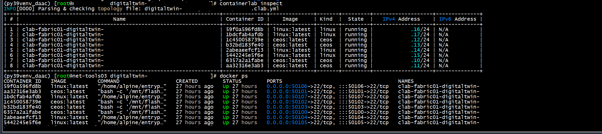

+++
author = "Kaon Thana"
title = "Building a DataCenter As Code with Arista CloudVision"
date = "2023-08-31"
description = "Leverage NetDevOps tools such as Netbox, ContainerLab, and Ansible to deploy and manage an Arista Datacenter with CloudVision"
categories = [
    "ansible",
    "arista",
    "containerlab",
    "netdevops",
    "netbox"
]

aliases = ["dcac"]
image = "images/dcac-front.png"
+++

## About

I recently worked on a project using [Arista](https://en.wikipedia.org/wiki/Arista_Networks) Network switches and [Arista CloudVision](https://www.arista.com/en/products/eos/eos-cloudvision) in the datacenter. As a greenfield deployment, I thought it would be a good opportunity to combine multiple netdevops techniques and tools to create a complete data-center-as-code pipeline to manage this deployment.

The code I will be referencing can all be [found here on my personal GitHub](https://github.com/kaon1/datacenter-as-code-arista-cloudvision).

## Pipeline

The Pipeline looks something like this:

1. Commit desired configuration changes to source control (GitHub)
2. Render intended configurations
3. Use Ansible to upload these configurations to CloudVision
4. Use Ansible to interact with CloudVision, create and execute a change control
5. Deploy to Digital Twin (staging environment) built by [ContainerLab](https://containerlab.dev/)
6. Run post-check assurance testing to validate state
7. Deploy to Production


## Walkthrough

### Commit
Commit desired configuration changes to source control (GitHub)


### Render and Upload
Render and upload to CloudVision (staging)

```bash
ansible-playbook -i netbox_dynamic_inventory.yml daac-deploy.yml --ask-vault-pass -e "deploy_hosts=dc-stage" --diff
```


### Deploy and Execute
CloudVision Change Control Executed Successfully


- Re-Run playbook changing flag to **Prod**


- Device Overview


### Test and Assure
Run Post Validation Checks:

```bash
ansible-playbook -i netbox_dynamic_inventory.yml --ask-vault-pass -e "deploy_hosts=dc-prod" post-change-validate.yml 
```


## The Code

### Deploy
This is the [playbook](datacenter-as-code/daac-deploy.yml) that generates the configurations and interacts with Arista CloudVision:

```yaml
### Ansible Playbook to Generate Desired Configuration Files for Arista Datacenter Network
### and run CI Checks
### and Deploy Configs to Arista Cloudvision Platform
---
- name: Arista Cloudvision Datacenter Playbook
  # Deploy to either stage or prod (use command line extra vars to set) - defaults to stage nev
  hosts: "{{ deploy_hosts | default('device_roles_dc-stg') }}"
  # lookup and decrypt vault file from command line --ask-vault-pass. Contains secrets and api keys
  vars_files: vault.yml
  connection: local
  gather_facts: False
  vars:
    # token to use to connect to cvp as a service arista.io
    ansible_password: "{{ cvp_token2 }}"
    ansible_httpapi_host: www.arista.io
    ansible_host: www.arista.io
    ansible_user: cvaas
    ansible_connection: httpapi
    ansible_httpapi_use_ssl: True
    ansible_httpapi_validate_certs: False
    ansible_network_os: eos
    ansible_httpapi_port: 443
    ansible_command_timeout: 1200
    ansible_connect_timeout: 600
    # how long to wait for cvp to commit changes in change control
    change_wait_timeout: 120
    # dict to store configlets per host
    configlets: {}
  tasks:
    - name: Template Lookup and Config Generation
      # generate template of system params. Variables are filled in by Netbox (from hostvars pulled to inventory)
      template:
        src: "{{playbook_dir}}/templates/{{ hostvars[inventory_hostname]['config_context'][0]['template_name'] }}.j2"
        # create a temp candidate config file to be loaded in next task
        dest: "{{playbook_dir}}/generated_configs/{{ inventory_hostname }}.conf"
      delegate_to: localhost
      tags:
        - generate_config

    - name: "Push configlet to CVP"
      # for each host, lookup the generated config and push up to cvp
      arista.cvp.cv_configlet_v3:
        configlets: "{{ configlets | combine ({ inventory_hostname : lookup('file', '{{playbook_dir}}/generated_configs/'+inventory_hostname+'.conf') }) }}"
        state: present
      register: configlet_push
      tags:
        - push_to_cvp

    - name: Save taskIDs to file
      # for each host, grab the taskID that was created in previous step and save it to a local flat file
      ansible.builtin.lineinfile:
        path: "{{playbook_dir}}/task_id_list.txt"
        line: "{{ configlet_push.taskIds[0] }}"
        create: yes
      when: configlet_push.taskIds[0] is defined
      tags:
        - push_to_cvp

    - name: convert task list file to ansible list
      # grab task file created from previous function and create a task id list to be used in next function
      set_fact:
        taskIds: "{{ taskIds | default([]) + [item] }}"
      with_lines: "cat {{playbook_dir}}/task_id_list.txt"
      # only run this once, not for every host
      run_once: True
      tags:
        - execute_change

    - name: Remove taskid file (delete file)
      # delete task file of taskids so it doesnt conflict on future runs
      ansible.builtin.file:
        path: "{{playbook_dir}}/task_id_list.txt"
        state: absent
      run_once: True
      tags:
        - execute_change

    - name: Generate JSON Change File
      # CVP has speciific way to list out multiple changes. Use json template to variablize these for multiple hosts
      template:
        src: "templates/change_vars.j2"
        dest: "{{playbook_dir}}/generated_configs/change_vars.json"
      delegate_to: localhost
      run_once: True
      tags:
        - execute_change

    - name: Get Change Vars
      # Load the previously created change vars file into memory for next task
      ansible.builtin.include_vars:
        file: "{{playbook_dir}}/generated_configs/change_vars.json"
      run_once: True
      tags:
        - execute_change

    - name: "Create a change control on {{inventory_hostname}}"
      # call out to CVP as a service and create a change control window with all the previously created tasks
      arista.cvp.cv_change_control_v3:
        state: set
        change: "{{ change }}"
      register: cv_change_control
      run_once: True
      tags:
        - execute_change

    - name: "Approve a change control on {{inventory_hostname}}"
      # Approve change window in CVP
      arista.cvp.cv_change_control_v3:
        state: approve_and_execute
        change_id: ["{{cv_change_control.data.id}}"]
      run_once: True
      tags:
        - execute_change

    - name: Sleep for X seconds while change control executes
      # wait for cvp change control window to complete
      ansible.builtin.wait_for:
        timeout: "{{change_wait_timeout}}"
      delegate_to: localhost
      run_once: True
      tags:
        - execute_change

    - name: "Check Change Control Status"
      # if change window status is completed then we are good, otherwise fail
      arista.cvp.cv_change_control_v3:
        state: show
        change_id: ["{{cv_change_control.data.id}}"]
      register: change_info
      failed_when: change_info['data']['change_controls:'][0]['value']['status'] != 'CHANGE_CONTROL_STATUS_COMPLETED'
      run_once: True
      tags:
        - execute_change
```

### Templates
We use individual [templates](https://github.com/kaon1/datacenter-as-code-arista-cloudvision/tree/main/datacenter-as-code/templates) per class of switch and map the generated configuration to a CloudVision Configlet.


The change_vars [file](datacenter-as-code/templates/change_vars.j2) is a datastrucutre created dynamically during runtime. It populates the individual taskIDs generated by cloudvision so we can refer to them in the change control execution window:

```json
{
    "change": {
      "name": "Change Created By Ansible",
      "notes": "Created via playbook",
      "activities": [
        
        {
          "task_id": "{{ item }}",
          "stage": "ansible_change_window"
        },
        
      ],
      "stages": [
        {
          "name": "ansible_change_window"
        }
      ]
    }
  }
```

### CloudVision Service Account

In CloudVision, we must create a service account so that the Ansible Playbook can authenticate. This account username should also exist on your local switches. Create the token and save it in ansible vault or some other secure method when running the playbook.


## Creating the Digital Twin Staging Environment

I previously published a blog post about the [usefulness of ContainerLab](https://kaonbytes.com/p/self-service-containerlab-deployment-with-ansible-tower/)

Arista does a good job of containerizing their EOS image (cEOS). Because of this, we can easily spin up a staging environment and maintain the topology with Infrastructure as Code (IaC) techniques.

Here is a ContainerLab environment with Arista cEOS images.

### Topology 
The [topology file](datacenter-as-code/containerlab/digitaltwin-staging-build/digitaltwin-staging-build-01.yml):

```yaml
name: digitaltwin-staging-build
prefix: ""
topology:
  nodes:
    digitaltwin-staging-build-core01:
      kind: ceos
      image: ceos:latest
      ports:
        - 50001:22
    digitaltwin-staging-build-core02:
      kind: ceos
      image: ceos:latest
      ports:
        - 50002:22
    digitaltwin-staging-build-access01:
      kind: ceos
      image: ceos:latest
      ports:
        - 50003:22
    digitaltwin-staging-build-access02:
      kind: ceos
      image: ceos:latest
      ports:
        - 50004:22
    digitaltwin-staging-build-server01:
      kind: linux
      image: "linux:latest"
      env:
        TMODE: lacp
      ports:
        - 50005:22
    digitaltwin-staging-build-client01:
      kind: linux
      image: linux:latest
      ports:
        - 50006:22
  links:
        - endpoints: [digitaltwin-staging-build-core01:eth1,digitaltwin-staging-build-core02:eth1]
        - endpoints: [digitaltwin-staging-build-core01:eth2,digitaltwin-staging-build-core02:eth2]
        - endpoints: [digitaltwin-staging-build-core01:eth3,digitaltwin-staging-build-access01:eth1]
        - endpoints: [digitaltwin-staging-build-core01:eth4,digitaltwin-staging-build-access02:eth1]
        - endpoints: [digitaltwin-staging-build-core02:eth3,digitaltwin-staging-build-access01:eth2]
        - endpoints: [digitaltwin-staging-build-core02:eth4,digitaltwin-staging-build-access02:eth2]
        - endpoints: [digitaltwin-staging-build-server01:eth1,digitaltwin-staging-build-core01:eth5]
        - endpoints: [digitaltwin-staging-build-server01:eth2,digitaltwin-staging-build-core02:eth5]
        - endpoints: [digitaltwin-staging-build-client01:eth1,digitaltwin-staging-build-access01:eth3]

mgmt:
  network: digitaltwin-staging-build-network
  ipv4-subnet: 172.100.11.0/24
```

The Topology:


Docker Containers Running:



## Wrap Up

I hope you found this post informative and useful in your Network Automation journey. Thanks for reading.