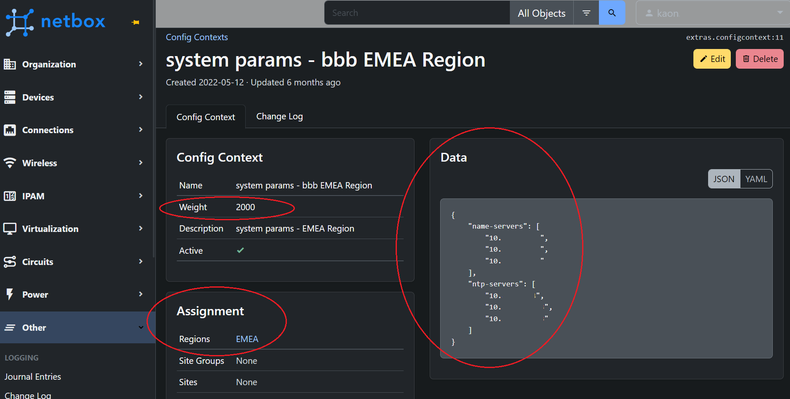
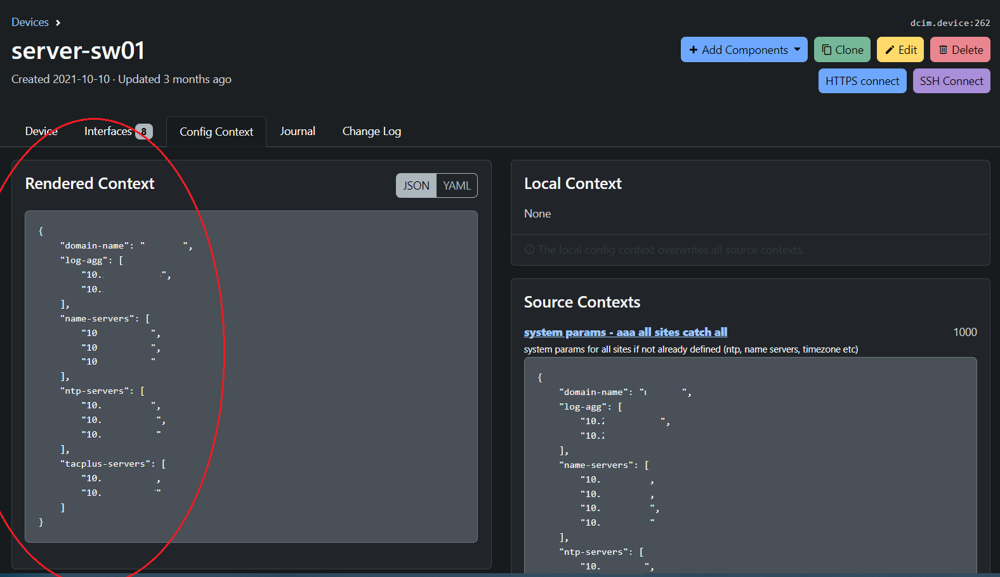
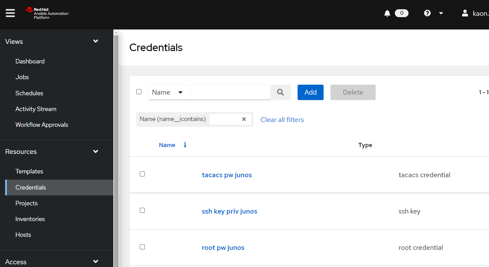
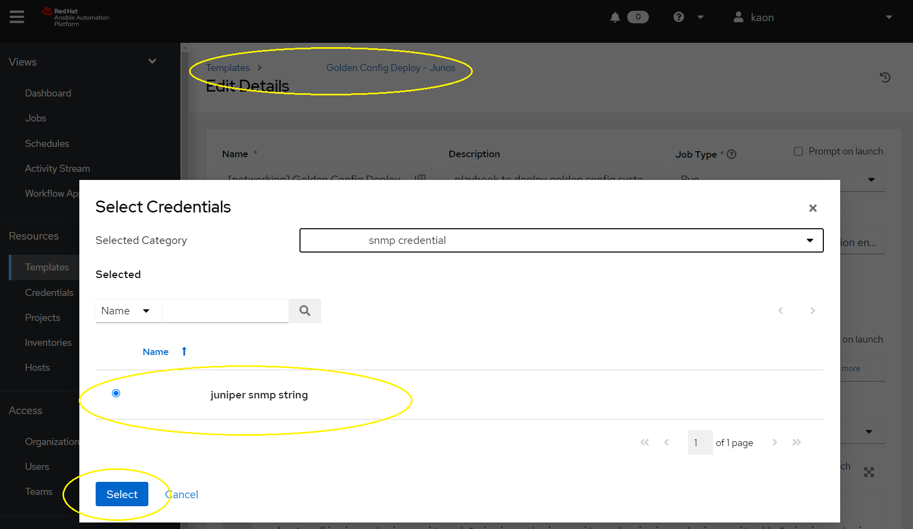
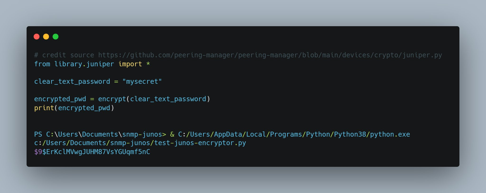
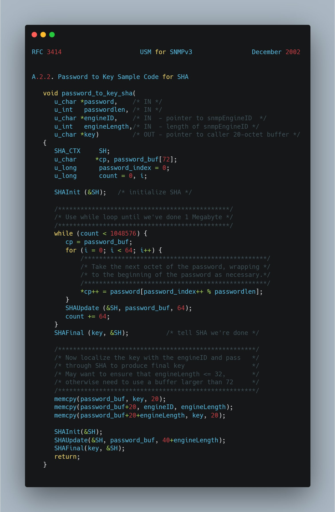
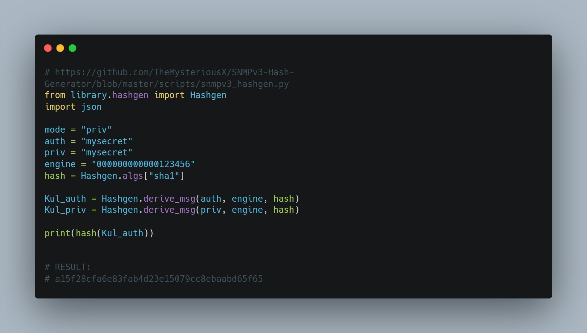
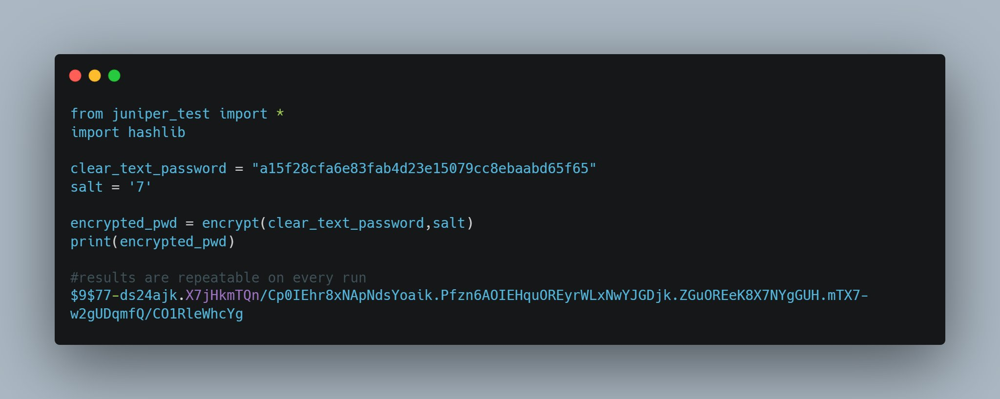
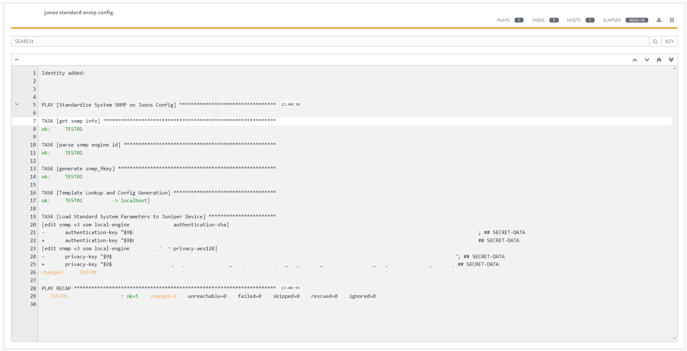
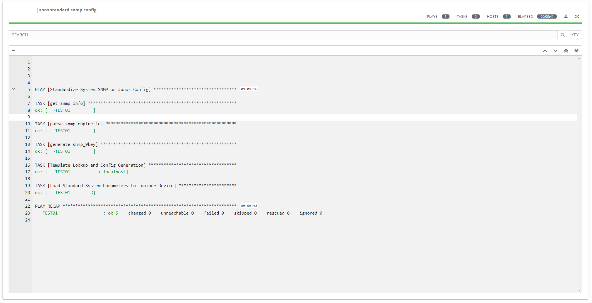

+++
author = "Kaon Thana"
title = "Golden Configuration Deployment with Ansible and Netbox"
date = "2022-11-15"
description = "Enforce intended network state using ansible and a rendered golden configuration template"
categories = [
    "ansible",
    "automation",
    "netbox",
    "juniper",
    "netdevops"
]

aliases = ["golden-config-engine"]
image = "golden-config-front.png"
+++

**The first step in creating a self-healing network** is to implement a golden configuration standard. Ensuring that your network devices are in compliance with intended parameters improves operational overhead, limits security risks and potential outages caused by human error. 

However, this is a **complex** problem to solve because a universal one-size-fits-all configuration is not common. Many factors cause slight changes in configurations such as: 
  - device hardware
  - firmware
  - region specific parameters
  - non-idempotent secret keys
  
... just to name a few. So how can we do it?

## Purpose
In this blog post, I will share a technical architecture that I have deployed in **production** on hundreds of network nodes accross dozens of sites and global regions. 

### The Steps
1. Populate **Source of Truth (Netbox)** with desired configuration context to be loaded as dynamic inventory host variables
    * Use weighted config context to populate region or site wide specific configuration
    * Use custom fields to populate device specific configuration (if needed)
2. Populate **Secret Passwords** in Ansible Automation Platform Credentials library, Ansible Vault, HashiCorp Vault or some other secure method to be called later
3. Build custom python module to **create idempotent secret keys** per host. 
    * Securely encrypted keys which can be re-produced on each host (i.e not change on every run)
4. Render intended confgiurations with Ansible **Jinja2 Templating**
5. **Deploy** desired configuration with Ansible
    * In this case, we are deploying on Juniper Devices using the junos_config module with the **replace** argument
6. Use the junos_config option **commit_check** to perform Compliance Checking. i.e. Dry Run of changes to be made


## The End Result

### The Code

Github Repo can be found here - [Golden Config Compliance Engine](https://github.com/kaon1/golden-config-engine)

[The Juniper Configuration Template](https://github.com/kaon1/golden-config-engine/blob/main/junos-golden-config-template.j2)

[The Ansible Playbook](https://github.com/kaon1/golden-config-engine/blob/main/junos-golden-config-engine.yml)

### Running the playbook

Example of **out-of-compliance** run:

```sh
(py38env_ansible) [root@net config-templates]# ansible-playbook -i netbox_inventory.yml --e "@extra-vars.yml" --diff junos-golden-config-engine.yml -u kaon -k
SSH password: 

PLAY [Standardize System Params on Junos Config] ***

TASK [Lookup Timezone Info by Device Site] ***
ok: [TEST01 -> localhost]

TASK [Set Time Zone Fact to be used in jinja2 template] ***
ok: [TEST01]

TASK [Grab switch software fw version from Netbox and set as integer Value] ***
ok: [TEST01]

TASK [get snmp info] ***
ok: [TEST01]

TASK [parse snmp engine id] ***
ok: [TEST01]

TASK [generate snmp_9key] ***
ok: [TEST01]

TASK [generate tacacs_key] ***
ok: [TEST01]

TASK [generate root login key per device] ***
ok: [TEST01]

TASK [Template Lookup and Config Generation] ***
ok: [TEST01 -> localhost]

TASK [Load Standard System Parameters to Juniper Device] ***
[edit system login]
-    user bob-super-admin {
-        uid 2006;
-        class super-user;
-        authentication {
-            encrypted-password "$6$Hyk9Ve...."; ## SECRET-DATA
-        }
-    }
[edit system services ssh]
-    root-login allow;
+    root-login deny;
[edit system]
+   processes {
+       web-management disable;
+   }
changed: [TEST01]

TASK [debug] ***
fatal: [TEST01]: FAILED! => {
    "msg": "Change detected, action needed"
}

PLAY RECAP ***
TEST01         : ok=10   changed=1    unreachable=0    failed=1    skipped=1    rescued=0    ignored=0   
```

Example of **in-compliance** run:
```sh
(py38env_ansible) [root@net config-templates]# ansible-playbook -i netbox_inventory.yml --e "@extra-vars.yml" --diff junos-golden-config-engine.yml -u kaon -k
SSH password: 

PLAY [Standardize System Params on Junos Config] ***

TASK [Lookup Timezone Info by Device Site] ***
ok: [TEST01 -> localhost]

TASK [Set Time Zone Fact to be used in jinja2 template] ***
ok: [TEST01]

TASK [Grab switch software fw version from Netbox and set as integer Value] ***
ok: [TEST01]

TASK [get snmp info] ****
ok: [TEST01]

TASK [parse snmp engine id] ***
ok: [TEST01]

TASK [generate snmp_9key] ***
ok: [TEST01]

TASK [generate tacacs_key] ***
ok: [TEST01]

TASK [generate root login key per device] ***
ok: [TEST01]

TASK [Template Lookup and Config Generation] ***
ok: [TEST01 -> localhost]

TASK [Load Standard System Parameters to Juniper Device] ***
ok: [TEST01]

PLAY RECAP ***
TTEST01         : ok=10   changed=0    unreachable=0    failed=0    skipped=2    rescued=0    ignored=0   

(py38env_ansible) [root@server config-templates]# 

```

## The Nuts and Bolts How-To

### Declaring Intended State 
In order to build a golden configuration we have to start _somewhere_. In this tutorial we are using **Juniper Junos** devices. 
Junos devices facilitate automation because:
 - They offer the ability to load all or parts of configuration as **hierarchical text**. 
 - Allows for **replace functionality** in which the operating system determines configuration differences and inserts/deletes lines as needed
 - Has the ability to **check commit** which performs a dry run load of the intended configuration without making the change

A simple Junos Configuration .txt file could look something like this:
```sh
replace:
system {

    host-name <some_name>;

    services {
        ssh {
		<some_more config>
    }

    time-zone <some_tz>;

    name-server {
		<some_ns1>
		<some_ns2>
		<some_ns3>
    }

    syslog {
		<some_more config>
    }

    ntp {
		<some_server1>
		<some_server2>
    }

    login {
		<some_user_config>
    }
}

replace:
snmp {
    description <some_description>;
    location <some_location>;
    contact <some_email>;
    v3 {
		<some_more config>
    }
...
<some_more config>
```

If we manually populate all the above values with correct Junos syntax and load it via the CLI then the OS will replace the **system** section and **snmp** section with the declared .txt file. 

But how can we turn the above snippet into a golden config to apply across multiple devices?

### Source Of Truth - Netbox
First we need to model our devices into a centralized location. [Netbox](https://github.com/netbox-community/netbox) is a good tool to use for this, but other products also exist such as Nautobot, Solarwinds, InfoBlox etc

In a [previous blog post](http://localhost:1313/p/netbox-dynamic-inventory-for-ansible-as-a-feedback-loop/) I discussed how we can use Netbox as our dynamic Ansible inventory. When we populate our Ansible Inventory from Netbox, we can also pull in important **host variables**. These variables can be used to populate our Juniper System Configuration text file.

Example of Ansible hostvars from Netbox inventory:

`# ansible-inventory -i ../netbox/netbox_inventory.yml --host TEST01`
```json
{
    "ansible_connection": "netconf",
    "ansible_host": "10.X.X.X",
    "ansible_network_os": "junos",
    "custom_fields": {
        "ansible_connection": "netconf",
        "code_version": "20",
    },
    "device_roles": [
        "access_switch"
    ],
    "device_site": "",
    "device_types": [
        "ex4300-48p"
    ],
    "is_virtual": false,
    "local_context_data": [
        null
    ],
    "locations": [],
    "manufacturers": [
        "juniper"
    ],
    "platforms": [
        "junos"
    ],
    "primary_ip4": "10.x.x.x",
    "regions": [
        "americas"
    ],
    "services": [],
    "sites": [
        "xxx"
    ],
    "status": {
        "label": "Active",
        "value": "active"
    },
    "tags": [
        "3",
        "2",
        "1"
    ]
}
```

### Config Context
In addition to device specific variables, we can render large blocks of configuration with the [Context Data](https://docs.netbox.dev/en/stable/features/context-data/) feature of Netbox. 
Context data can be applied to a class of devices on different conditions such as site, region, role, etc
 - For example, all switches in Europe should use an EU set of NTP servers

Weighting can be used to apply multiple layers of context data. 
 - For example, all devices should use DNS server 10.10.10.10 (default weight of 1000)
 - However, devices in SITE A should use DNS server 11.11.11.11 (set weight 2000)

**Example Config Context Declaration:**



**Example of Rendered Content Per Device:**



In the above screenshot, we have populated the following parameters for this individual device:
- Domain Name
- Name Servers
- NTP Servers
- TACACS Servers

The rendered config can now be sent to the Ansible Inventory as variable called `hostvars[inventory_hostname]['config_context']`

### Handling Credentials And Secret Passwords
Do **not** commit secret keys to github :)

Instead, let's inject our passwords as credentials in [Ansible Automation Platform](https://docs.ansible.com/automation-controller/4.0.0/html/userguide/credentials.html) and call them as variables during runtime execution. As an alternative, we can also do this with [Hashicorp Vault](https://www.vaultproject.io/) using the hashi_vault lookup module. 

**Example Passwords to Store:**



**Example of injecting passwords into your playbook build:**



Passwords can be called as variables inside your playbook. The variable name is determined by the credential_type that was created earlier. For example, the snmp credential type passes a variable called `snmp_cred` which can be referenced as such:

```yaml
  vars:
    # lookup secrets from ansible credentials
    tacacs_pw: "{{ tacacs_pw }}"
    root_pw: "{{ root_pw }}"
    snmp_cred: "{{ snmp_cred }}"
    ssh_key: "{{ ssh_key }}"
  tasks:
```
#### Creating Idempotent Secret Keys from Passwords
We _could_ load these secrets directly into our Jinja2 template. Junos would accept the rendered configuration and internally convert the passwords to encrypted keys in its running configuration. However, if we did this, then each subsequent run would register a **change** (i.e. not idempotent)

Here's how we can solve this problem:

**The $9$ Key**

- Juniper uses **$9$ encoded keys** (similar to cisco type 7) for shared secrets which run on services such as BGP, TACACS and SNMP. The user inputs a plain text password and the OS obfuscates it, when needed the OS is able to decrypt the key.
- Simple, lets find a python library that encodes the $9$ algorithm, input our snmpv3 plaintext password and call it a day. WRONG :( unfortunately, the OS accepts the key but snmpv3 authentication breaks:



- RFC3414 describes how snmpv3 creates a localized unique key per device. We need to hash the local engine ID + password + other. The below C code is provided as an example in the RFC. Luckily there's a python library for that...



- The snmpv3_hashgen library takes the input of your plain text pw + your engineID and outputs a key. Great, lets take this key and put it in our $9$ function. so localized key --> $9$ function = $9$...key to be used for junos config.



- The $9$ key is compatible and works in junos snmpv3 config block. However there's still a problem, the key is different every time it's generated. This breaks repeatability. We can fix this by setting a static salt in the $9$ generator function.
- In this case, a static salt does not make us less secure because each $9$ key is already unique per device (because each localized snmp key is unique due to the engineID being different). Now we have a working process. Lets put all this into a python filter and implement it.



- Custom python filter to be imported in the ansible playbook can be [found here](https://github.com/kaon1/golden-config-engine/blob/main/filter_plugins/filter.py). Snippet of the function:

```python
    def gen_snmp_9key(engine_id, snmp_pass):
        """
        Takes two inputs (engine_id and snmp password).
        Hashes the password and engine id together to create a localized key.
        Then encodes the key with the juniper $9$ algorithm to be used in junos configuration
        """

        hash = Hashgen.algs["sha1"]

        Kul_auth = Hashgen.derive_msg(snmp_pass, engine_id, hash)
        Kul_priv = Hashgen.derive_msg(snmp_pass, engine_id, hash)

        localized_key = hash(Kul_auth)

        snmp_9key = encrypt(localized_key)

        return snmp_9key
```

- Results: first run to standardize the config. Registers a change (as expected):



- Subsequent runs. No change. But confirms we are in compliance and standardization:



**Other $9$ Keys (Not SNMP)**

For other System $9$ keys (such as TACACS, RADIUS, etc). We can use the **device hostname** as our salt. Using the device hostname means we always generate a repeatable $9$ key per device but not the same key accross all devices.

In the same python filter, we have some modified functions here which take two inputs 
1. Device Hostname 
2. Password 

and spit out an encrypted unique but repeatable $9$ key:

```python
## Create a unique but repeatable decimal number based on string (i.e. hostname)
## Set range of decimal with modulo (i.e to get a number between 0 to 64 set modulo 65)
## Example: input hostname 'switch-123' output: 56
def get_unique_decimal_from_string(str_to_hash,modulo):
    str_to_hash_hex = md5(str_to_hash.encode("utf")).hexdigest()
    str_to_hash_dec = int(str_to_hash_hex, 16)
    return str_to_hash_dec % modulo

## Create a unique, 'random', single character salt value from the string hostname. Repeatable.
## Example: input hostname 'switch-123' output: 'V' (this is a character from the FAMILY structure above)
def get_deterministic_salt_from_hostname(hostname):
    # returns a number from 0-64
    str_to_hash_dec = get_unique_decimal_from_string(hostname,65)
    # calls index of list NUM_ALPHA[0-64] and returns 1 character
    return NUM_ALPHA[str_to_hash_dec]

## Create a unique, 'random', 0-3 character bookend-salt value from the string hostname. Repeatable.
## Example: input hostname 'switch-123' and salt 'V' Output '9wY'. 
## The length of the output is determined by the index of the salt in the EXTRA dictionary (i.e. EXTRA[salt])
def get_deterministic_bookend_from_hostname(hostname,salt):
    end_piece = ''
    for count in range(EXTRA[salt]):
        bookend_letter_dec = get_unique_decimal_from_string(hostname[count],65)
        end_piece += NUM_ALPHA[bookend_letter_dec]
    return end_piece

def encrypt_with_hostname(value, hostname):

    salt = get_deterministic_salt_from_hostname(hostname)
    rand = get_deterministic_bookend_from_hostname(hostname,salt)

    position = 0
    previous = salt
    crypted = MAGIC + salt + rand

    for x in value:
        encode = ENCODING[position % len(ENCODING)]
        crypted += __gap_encode(x, previous, encode)
        previous = crypted[-1]
        position += 1

    return crypted
```

**$1$ - $5$ and $6$ Keys**

These keys are MUCH simpler to implement. 1,5,6 keys use standard hashing algorithms.
- Legacy JUNOS devices use $1$ keys (Hash Algo md5)
- Modern JUNOS devices use $5$ keys (sha256) or $6$ (sha512)

We can use the built in ansible module **password_hash** to generate these keys. However, to create an idempotent key, we need to use the device hostname as the random seed. Example below:

```yaml
    - name: generate root login key per device
      set_fact:
        root_key: "{{ root_pw | password_hash(hash_algo, 65534 | random(seed=inventory_hostname) | string) }}"
```

The root password is encrypted with the sha512 algorithm + device hostname as the random seed. The resulting string is a unique but repeatable $6$ key per device.

### Jinja2 Template

After all that work, we have our base config, variables and secret keys ready. We can mash them all together in a jinja2 template. [Here is the template](https://github.com/kaon1/golden-config-engine/blob/main/junos-golden-config-template.j2):

```json
replace:
system {

    root-authentication {
        encrypted-password "{{ root_key }}"; ## SECRET-DATA
    }

    authentication-order [ password tacplus ];

    host-name {{ inventory_hostname }};

    services {
        ssh {
	    root-login deny;
            protocol-version v2;
            max-sessions-per-connection 32;
            
            sftp-server;
            
        }
        netconf {
            ssh;
        }
    }

    domain-name {{ hostvars[inventory_hostname]['config_context'][0]['domain-name'] }};

    time-zone {{ timezone }};

    name-server {
		
        {{ item }};
		
    }

    syslog {
        user * {
            any emergency;
        }
		
        host {{ item }} {
            any any;
        }
		
        file messages {
            any warning;
            authorization info;
        }
        source-address {{ ansible_host }};
    }

    ntp {
        server {{ hostvars[inventory_hostname]['config_context'][0]['ntp-servers'][0] }} prefer;
		
        server {{ item }};
		
		source-address {{ ansible_host }};
    }

    login {

        user ansible {
            class super-user;
            authentication {
                ssh-rsa "{{ ssh_pub_key }}"; ## SECRET-DATA
            }

    }

    tacplus-server {
        {{ hostvars[inventory_hostname]['config_context'][0]['tacplus-servers'][0] }} {
            port 49;
            secret "{{ tacacs_key }}"; ## SECRET-DATA
            source-address {{ ansible_host }};
        }
        {{ hostvars[inventory_hostname]['config_context'][0]['tacplus-servers'][1] }} {
            port 49;
            secret "{{ tacacs_key }}"; ## SECRET-DATA
            source-address {{ ansible_host }};
        }
    }
    
    accounting {
        events [ login interactive-commands ];
        destination {
            tacplus {
                server {
                    {{ hostvars[inventory_hostname]['config_context'][0]['tacplus-servers'][0] }} {
                        port 49;
                        secret "{{ tacacs_key }}"; ## SECRET-DATA
                        timeout 1;
                        source-address {{ ansible_host }};
                    }
                    {{ hostvars[inventory_hostname]['config_context'][0]['tacplus-servers'][1] }} {
                        port 49;
                        secret "{{ tacacs_key }}"; ## SECRET-DATA
                        timeout 1;
                        source-address {{ ansible_host }};
                    }
                }
            }
        }
    }
}

replace:
snmp {
    description {{ inventory_hostname }};
    location {{ device_site }};
    contact "email@email.com";
    v3 {
        usm {
            local-engine {
                user usernameforsnmp {
                    authentication-sha {
                        authentication-key "{{ snmp_9key }}"; ## SECRET-DATA
                    }
                    privacy-aes128 {
                        privacy-key "{{ snmp_9key }}"; ## SECRET-DATA
                    }
                }
            }
        }
        vacm {
            security-to-group {
                security-model usm {
                    security-name usernameforsnmp {
                        group groupforsnmp;
                    }
                }
            }
            access {
                group groupforsnmp {
                    default-context-prefix {
                        security-model usm {
                            security-level privacy {
                                read-view view-all;
                            }
                        }
                    }
                }
            }
        }
    }
    view view-all {
        oid 1 include;
    }
    }
```

Notice the python-style logic using **IF and FOR Loops** above. We can use conditional logic to add/subtract configuration. 

In the above example, if running Junos version 19 or greater add the **sftp line**. 
For loops can also be used to implement multiple entries (like NTP servers).

**Generating Config from Template**

The Ansible module **template** can take the jinja2 text file and inject the variables to spit out a ready-to-go junos.conf file
```yaml
    - name: Template Lookup and Config Generation
      # generate template of system params. Variables are filled in by Netbox (from hostvars pulled to inventory)
      template:
        src: "{{ template_name }}.j2"
        # create a temp candidate config file to be loaded in next task
        dest: "{{ inventory_hostname }}.conf"
      delegate_to: localhost
      # this task will always generate a change, don't need to see it.
      changed_when: false
```

**Loading configuration using Junos_Config module:**

```yaml
    - name: Load Standard System Parameters to Juniper Device
      junipernetworks.junos.junos_config:
        # if TRUE this will be a DRY RUN (no changes)
        check_commit: "{{ check_commit }}"
        src_format: text
        # we use the replace flag to overwrite specific blocks of config
        update: replace
        # temp candidate config file created in previous task
        src: "{{ inventory_hostname }}.conf"
      register: result
```

### Juniper Commit_Check Feature

In the above ansible task, notice the flag `check_commit`. 

This is a junos-specific function that we can use to perform dry runs (when set to **TRUE**). During execution, we can inject the check_commit variable (True or False) to decide if our playbook should be running in enforcing mode or compliance mode.

### First Run and Recurring Enforcement

A potential workflow could look like this:

1. Standardize all configurations with the initial run of changes.
2. Subsequent playbook runs are scheduled regularly in `check_commit` mode
3. If something has changed (either in the field or in the Source-of-truth) which does not match the standard then fail the playbook and send a notification.
4. Engineer manually assesses the situation and determines if the playbook should be run again in enforcing mode (revert the change) or update the source of truth.

We can use a _hack_ to fail the playbook and trigger a notification with this code:

```yaml
    # if running in compliance mode, error out when change is detected and action is needed to be taken. i.e alert on non-compliance
    - debug:
        msg: "Change detected, action needed"
      when: 
        - result.changed
        - check_commit
      failed_when: 
        - result.changed
        - check_commit
```

In AAP (or Ansible Tower), we can set [notifications](https://docs.ansible.com/ansible-tower/latest/html/userguide/notifications.html) on failed playbooks via email, slack or other methods. 

If running directly from ansible CLI yu can use [callback plugins](https://docs.ansible.com/ansible/latest/collections/index_callback.html) to send notifications.

## Final Thoughts

Standardizing configurations across a distributed network is an essential pillar of Network Automation. I hope this guide is helpful to anyone looking for a similar solution. 
My solution can be improved upon by adding more vendors to the mix (Cisco, Arista, etc) and adding additional config blocks such as BGP, Interface configurations, Prefix Maps etc....but that's another post :)

If you have any questions or need clarifications feel free to leave a comment below or contact me. Thanks for reading!