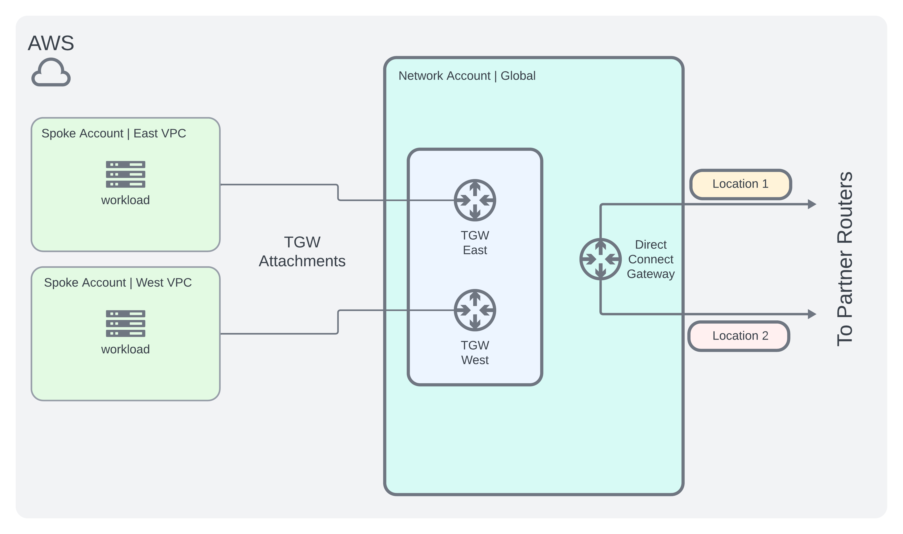

+++
author = "Kaon Thana"
title = "A Case Study in Hybrid Cloud Network Design"
date = "2024-05-17"
description = "The challenges of interconnecting the big 3 cloud providers to form a cohesive solution"
categories = [
    "cloud",
    "observability",
    "netdevops",
    "bgp"
]

aliases = ["hybrid-cloud-design"]
image = "images/front2.png"
+++

## About

A case study in network design for the **hybrid network engineer**. A walkthrough of the year-long journey to interconnect **public cloud workloads** from all three major CSPs ([Azure](https://azure.microsoft.com/en-us), [AWS](https://aws.amazon.com/), [GCP](https://cloud.google.com/?hl=en)) and on-premises **Enterprise Networks** to provide a robust and highly available solution for the application teams. I will discuss the architectural strategy, lessons learned, pitfalls and wins of the **overall solution**. 

## Problem Statement

In many organizations, there may exist scenarios where some **applications** are built in one cloud provider (such as GCP) and another application or supporting system run by a different team is built in a different environment (such as AWS). This may be due to specific **cloud offerings** of one provider over another, developer preferences/experience, historical reasons, cost optimization etc. The **why** doesn't really matter - but when these workloads want to communicate - now this becomes a **connectivity puzzle**. 

The answer for many teams is to route this traffic over the **public internet**. Like so:


This solution works and for most orgs thats usually **good enough**.  There are some quick fixes we could implement instead of the above solution, such as to create **site-to-site VPN tunnels** or more recently CSPs are now offering cloud-to-cloud interconnects. However, when you are dealing with dozens of **cloud accounts** (tenants), large amounts of **traffic** and on-prem **data center** traffic these fixes may not scale. Let's step back and take a look at the whole picture.

Some key **info** to take note of:
- Most of the cloud-to-cloud traffic is happening in the **US-East** region. We can focus our efforts here.
- The traffic pattern rates will not exceed **10Gbps** (for now :D)

Can we **architect** a solution that:

1. Decreases cloud egress **costs**
2. Improves **security posture** by reducing the amount of public endpoints that don't need to be exposed
3. Integrates with the existing on premises **data center network**
4. Improves network **latency**

While still mainting the performance, reliability and **agility** of hosting workloads in the cloud...

## Strategy - Weighing the Options

### Option 1 - Hairpin
In my case, I have a production data center already built out and running in **New York**. I could leverage the existing Headquarters data center to provision new circuits to each Cloud Provider and integrate them into the existing **WAN**. Utilize **BGP** routing to bounce traffic back and forth as needed. 

Like So:


#### Pros
- Relatively **short lead time** to complete this option. 
- The **network** already exists (minus the new circuits)

#### Cons
- **Hair-pinning** traffic from US-East1 (Virginia) to NY back to Virginia
- May require hardware refresh depending on **speeds/feeds** available of current switches in my data center. Additional lead-time to buy new gear and set it up.
- Introduces on-prem **SLA factors** (network uptime, upgrades, power work, maintenance windows etc) to **cloud-to-cloud** apps. 

### Option 2 - Greenfield
Rent out space at two co-location providers near Ashburn. Purchase new layer3 switches/routers and order new circuits for the connections.
i.e. **Build it all yourself**


#### Pros
- As a network engineer who loves new toys this would have been great, a **new greenfield deployment**
- Full **control** of the environment
#### Cons
- New Colo Vendor research, approval and onboarding **process** would take some time
- Upfront **capital** costs
- Vendor lead-time on new switches was still high at the time of this design | 1 year+ (post-covid **supply chain issues**)

### Option 3 - Cross Cloud
Utilize the new **cross cloud** interconnect services provided by GCP


#### Pros
- Cloud **Native** Solution
- Simple to setup and **quickly** implement
#### Cons
- Good for GCP to a CSP but doesn't help with other **traffic patterns** for different cloud providers or on-prem workloads
- Cost savings is not **maximized**

### Option 4 - Partner Interconnect
Onboard a **3rd party interconnect** vendor to essentially “rent a router” in Virginia at a monthly cost. Multiple companies exist who provide this **service** such as Megaport, Equinix, PacketFabric and [others](https://cloud.google.com/network-connectivity/docs/interconnect/concepts/service-providers).


#### Pros
- **Flexibility** in choosing regions or zones to deploy partner interconnect routers as needed
- Ephemeral solution that could be **scaled up/down** quickly
- Easy to compare monthly costs vs **monthly savings**
- Follows the overall **cloud-first** mindset of my technology organization
#### Cons
- **New vendor** research, onboarding and learning
- Losing some **control** of the network to another party - i.e nerd knobs, visibility
- Introducing a new vendor into your critical path of traffic - high availability **system design** is crucial


## Design Decisions

We decided on **Option 4**. Using a 3rd party interconnect provider would give us the most flexibility and allow us the option to **dynamically** spin up and down resources/circuits as needed.
After a few weeks of going back and forth with a couple of **providers**, we chose one of them based on community feedback, price and availability of resources.

Additionally, the architecture should:
- Follow the concept of **least privileged access** - meaning don't open up the routing for **ALL** cloud teams to be able to talk to **ALL** other cloud accounts in perpetuity. Narrow the scope down for specific **account-to-account** workloads.
- Implement **99.99% availability** for each cloud provider interconnect (following each CSP published best practice guides).
- Use **devops principles** to spin up resources as code via Terraform, Ansible, Python APIs etc with well defined pipelines. Make the work visible for the entire tech organization and limit institutional knowledge.

### GCP Architecture

- Create a **hub and spoke** type model
- Centralized **networking hub** project to host the GCP Routers + interconnects to partner routers
- Spoke projects will **VPC peer** to hub project for access as needed
- Following the [GCP Best Practices guide](https://cloud.google.com/network-connectivity/docs/interconnect/tutorials/partner-creating-9999-availability), we can design an architecture as shown below:


### AWS Architecture

- Create a centralized **networking account** to host an AWS Transit Gateway which attaches to other spoke accounts.
- Following the [AWS High Resiliency Guide](https://docs.aws.amazon.com/directconnect/latest/UserGuide/high_resiliency.html), it should look something like this:



### Azure Architecture

- Follow Azure Hub-Spoke network topology for peering [VNETs together](https://learn.microsoft.com/en-us/azure/architecture/networking/architecture/hub-spoke?tabs=cli)
- Design [high availability express route](https://learn.microsoft.com/en-us/azure/expressroute/designing-for-high-availability-with-expressroute)


### Partner Router Architecture

- Following high availability patterns, create **two virtual routers** in two different availability zones in Virginia.
- Create **virtual cross connects** for each desired CSP path
- Provision new on-prem **circuits** (physical paths) to partner locations


## Implementation

### Challenges

As with most projects, you can **plan** and design all day long. But once you start **building**, something unexpected always comes up. We ran into some **challenges** along the way but were able to find solutions and push through. Here's some key ones...

#### GCP Network Peering
A [key requirement](https://cloud.google.com/vpc/docs/vpc-peering) for GCP Network Peering is that IP network space cannot overlap. When I originally audited the candidate GCP accounts to peer, I only looked at the **primary ranges** - I took note that there were no collisions and moved ahead. 

However, when it came time to actually peer the networks we immediately found a problem. There were some **secondary ranges** which shared similar space in the `100.X.X.X` space. These secondary ranges are used by the project's **kubernetes** clusters. 

Some possible solutions to fix this:
1. Re-IP these secondary ranges - wasn't a fan of this option as it would cause more work and intrusion on the **application owners** side.
2. **Implement** Google's New Product offering called [Network Connectivity Center](https://cloud.google.com/network-connectivity-center?hl=en) (it was in Beta at the time)
    - The key feature that could help here was the ability to **prefix filter** routes from peering
    - Unfortunately, even with NCC enabled we quickly ran into [another blocker](https://cloud.google.com/network-connectivity/docs/network-connectivity-center/concepts/vpc-spokes-overview) `IPv4 static and dynamic routes exchange across VPC spokes are not supported.`
    - This meant we could not **exchange** dynamically learned routes from the partner interconnect to the spoke accounts. This was a no-go. 

With NCC Peering off the table, we went back to VPC Peering. But this time the decision was to select a few **high value** GCP Projects that made up the majority of the traffic load. Re-IP those secondary kubernetes **ranges** (if needed) and move on.

Another **issue** that arose: Google Cloud Routers connected to the interconnects would not automatically export the [learned VPC Peering routes](https://cloud.google.com/vpc/docs/vpc-peering#custom-route-exchange):


To solve this **problem**, we have to install custom advertisements on the google cloud routers (i.e. maintain an **IP Prefix List**). This adds complexity to the project, but could be solved **programmatically** during our pipeline build which will be shared later on in this post. 

#### AWS - Account-to-Account Routing Options

The original design assumed to use the existing **Transit Gateway** connections to route the newly introduced traffic to each account. However, after performing a cost reduction [analysis](https://calculator.aws/#/) we realized that the Transit Gateway **transfer costs** were still high, making the effort of the entire project less appealing. Another option would be to create new connections with Virtual Private Gateways (**VGW attachments**). 

As an example exercise, if we assume **1000TB** of monthly data transfers:

- Using the **TGW** architecture would save up to **30%** of data transfer costs.
- Using the **VGW** architecture would save up to **60%** of data transfer costs.

So the tradeoff we made was to select a few **heavy hitter** accounts to peer directly with the hub network account using a **VGW Architecture**. 

To do this, I needed to create dedicated VGWs in each **heavy hitter** account and attach it to a new DXGW instead of using the existing Transit Gateway **architecture**. For the **rest of the accounts** connectivity would still be established via the TGW. 

Additionally, this meant we had to create 2 additional **virtual cross connects** to our partner routers and also pay close attention to the hard limit quotas of [AWS Direct Connect](https://docs.aws.amazon.com/directconnect/latest/UserGuide/limits.html). Although the cost of additional cross connects doubles our intended budget, it still made sense

The new AWS **Architecture** would be as follows:


#### Azure Quirks

Prior to this project, I had almost no **experience** building anything in Azure. The interface felt foreign to me and the **naming conventions and iconography** also took some time to get used to...but in general, there were no major hangups in **Azure** except for one issue:

- Prior to this work, an Azure **site-to-site VPN** had already been setup in one VNET to an on-prem resource.
- Due to this, I was unable to peer this azure VNET to the new **hub vnet**
- To work around this problem, we had to relocate the **site-to-site VPN** to the hub vnet and pay close attention to the routing. For this specific case I used **less specific routes** to [prefer](https://learn.microsoft.com/en-us/azure/expressroute/designing-for-disaster-recovery-with-expressroute-privatepeering) the express route connection over the existing site-to-site VPN


#### Differences of Networking Concepts across CSPs

In general understanding the **different concepts** of VPCs vs VNETs - Projects vs Accounts vs Subscriptions - Global route tables vs regional route tables etc... could be a **whole book** (that I would not be qualified to write). One example that comes to mind which took me by surprise:

- In GCP - US **East1** is in South Carolina but in AWS US East1 is in **Virginia**. Something to keep in mind when thinking about traffic latency and regional disaster recovery scenarios.

### High Availability

As I mentioned previously in the **design** section, implementing a highly available solution is crucial. We don't want to introduce additional **failure events** that do not typically occurr in cloud deployments (i.e. limit the blame on the network :D )

To Summarize the best practice documentation from each provider environment:

- In [GCP](https://cloud.google.com/network-connectivity/docs/interconnect/tutorials/partner-creating-9999-availability), high availability requires **4** partner interconnects across **2** Google Cloud Routers in **2** different regions

- In [AWS](https://docs.aws.amazon.com/directconnect/latest/UserGuide/high_resiliency.html), high resiliency can be achieved with **2** single connections in **2** different direct connect locations

- [Azure ExpressRoutes](https://learn.microsoft.com/en-us/azure/expressroute/designing-for-high-availability-with-expressroute) requires **2** express route circuits in zone redundant virtual gateways

- 3rd Party Interconnect Routers require **2** virtual routers and the virtual cross connects should be in distinct **A/B Availability Zones**

### Routing Decisions

This is where **network engineering** chops matter. The standard routing protocol for all Cloud Service Providers is [Border Gateway Protocol - BGP](https://datatracker.ietf.org/doc/html/rfc4271)

What are some BGP decisions we have to make to design a **reliable and fast network**?

1. Use [Bidirectional Forwarding Detection - BFD](https://datatracker.ietf.org/doc/html/rfc5880) for fast BGP **Failover**
    - Keep in mind that different CSPs may have different **BFD supported values**, for example:
      - In GCP we **must** use the values:
        ```
        Transmit Interval - 1000 ms
        Receive Interval  - 1000 ms
        Multiplier        - 5
        ```
      - However, AWS supports faster values:
        ```
        Transmit Interval - 300 ms
        Receive Interval  - 300 ms
        Multiplier        - 3
        ```
    - When I performed failover testing of these circuits, it took almost **5 seconds** for the GCP traffic to recover as opposed to the AWS failure took under **1 second** to recover. 

2. Understand Route Manipulations and Priorities in Different Cloud **Environments**
   - For example, in AWS its best practice to **influence** traffic using [longest prefix match](https://aws.amazon.com/blogs/networking-and-content-delivery/influencing-traffic-over-hybrid-networks-using-longest-prefix-match/)
   - We can also influence routing **policies** with [BGP Communities](https://docs.aws.amazon.com/directconnect/latest/UserGuide/routing-and-bgp.html)
   - Additionally, using AS PATH Prepending or MED values is another **option**
   - Also keep in mind, Route Priority of [Propagated Routes](https://docs.aws.amazon.com/vpc/latest/userguide/VPC_Route_Tables.html#route-table-priority-propagated-routes)

3. Should we use Equal Cost Multipathing (**i.e. ECMP Load Sharing**) across multiple links?

  - Possible **negatives** of ECMP:
    - **Non-deterministic** route paths - hard to "know" which way your traffic is flowing at all times.
    - **Gray outages** where one path is not working optimally and causes intermittent issues making it hard to troubleshoot.
    - If a **stateful firewall** is in line inspecting traffic and return routes take a different path, it may get dropped
    - Load balancing across different **geographical locations** may cause latency variations
  - **Benefits**:
    - **Maximize** your provisioned circuits. i.e more available **bandwidth**
    - More resilient to **failover** - if a link fails all of your traffic does not go down waiting for BFD to kick in.

  - I decided to use ECMP - but I understand why other's may choose not to.

### Visibility and Operations

In my view, a project is not **done** just because traffic is flowing from point A to point B. I believe it is just as important to devote equal planning, time and energy towards **supporting systems**

#### Observability

How do we **monitor** these new partner virtual routers? The typical network construct of pointing your **SNMP poller** to a router and graphing bandwidth does not apply here. 

- Answer: Use **APIs** to gather info and relay it back to a centralized observability platform. In my case, our tech org has standardized on a single **SaaS observability platform** so I wrote some glue scripts to do this. I will share below.

[Python Script to Send Metrics](https://github.com/kaon1/python-misc/blob/master/observability-metrics/megaport-status-checks-for-resources.py)

The **script** does the following:
1. Gathers a **status check** of the Virtual Routers and Cross Connects
2. Sends the status to the observability platform **periodically**
3. In the platform we create **dashboards and monitors** to alert on interesting values or missing data (i.e a resource is no longer reporting)

- Another script [here polls bandwidth usage every 5 minutes](https://github.com/kaon1/python-misc/blob/master/observability-metrics/megaport-mcr-bw-to-dd.py) and sends the metric up to the observability platform for **graphing**.

All of this info **could** be gathered directly from the Cloud Provider's portal - an operator would just need to login and click around to find it. But, in keeping with the principles listed above of **limiting institutional knowledge** its important to make this data available and visible to all teams within the organization.

#### Testing

It is important to establish baseline tests of "what the network **should** look like at any given time" - so that if something goes wrong we have **historical data** to refer back to.

We should:
- Use **synthetic testing** to measure ICMP latency, HTTP Response Time, Packet Loss and Hop Count between two endpoints on each end of the **dedicated private links**
- Generate traffic using **iperf** across the links and **measure performance**
- There's a handy [iperf3 library](https://iperf3-python.readthedocs.io/en/latest/) which can be used to script these tests and send the results up to your **observability platform**. 

Here's an [example script](https://github.com/kaon1/python-misc/blob/master/observability-metrics/iperf-megaport-dd.py) which takes in some **user input** (like iperf destination, number of streams to send, duration of test and bandwidth) and sends the metrics up for graphing.

An example way to run this script would be with a 5 minute **cronjob** from a server in each Cloud Environment.
```
*/5 * * * * root python3 iperf-dd.py --direction upload --dest_name gcpuseast1 --dest_ip 10.x.x.x --dest_port 5201 --numofstreams 1 --duration 30 --bandwidth 1000000000
*/5 * * * * root python3 iperf-dd.py --direction upload --dest_name gcpuscentral1 --dest_ip 10.x.x.x --dest_port 5203 --numofstreams 1 --duration 30 --bandwidth 1000000000
```
#### Pipelines for Deploying Changes

As I mentioned in the **design** portion of this post, it is important to use devops principles wherever possible for provisioning and changing these resources. I have multiple blog posts about creating **terraform pipelines**, so I won't go into detail here. But the general idea is this:

1. Create a **shared repository** for these new cloud resources - give access to other teams to suggest changes (via PRs)
2. Build **pipelines** that perform dry runs or plans of changes
3. Execute new changes on **merges to main**

Here is an [example terraform file](https://github.com/kaon1/python-misc/blob/master/scripts/aws-vgw-to-dxgw-example.tf) that can be installed on a per account basis to create the VGWs and also attach them to the DXGW.

**Why** is this important?

- Provides **visibility** to app teams of the network connectivity (its no longer just a black box)
- Tracks changes, self **documents** the network
- Makes it easier to maintain complex, repeatable objects such as **IP Prefix Lists**

As mentioned above, we have to use IP Prefix lists on the GCRs, but Prefix Lists also give you more **control** of the routing and allows the ability to enforce the concept of **least access** (explicit permit). But these prefix lists can get **complex** with multiple virtual routers and cross connects. One way to keep these in **sync** is with a a [pipeline script](https://github.com/kaon1/python-misc/blob/master/scripts/prefix-sync-megaport.py).

The script eases the onboarding process of a new **workload/account**. If a new workload is onboarding to this **architecture**, we update the shared repository and add the **new prefixes**. The **pipeline** runs and updates the necessary prefix lists to allow communication.

## Overall Wins

### Lowering Monthly Cloud Traffic Costs
- It takes a **PHD** to understand the complexity of cloud costs - and I do not have one. But I have been told its **working**...so that's good enough for me :D 

### Improved Security Posture and Private Connectivity
- Able to reduce the amount of **public endpoints** which do not need to be exposed
- More **control** of cloud account routing

### Better Network Performance
- **ICMP** Latency Improvement: Public ~21 ms | **Private** ~13 ms 


- **HTTP** Latency Improvement: Public ~55 ms | **Private** ~ 45ms


### Team Collaboration Across Different Missions
Not long ago, I traveled to Las Vegas for **AWS Re:Invent**. There I ran into some of my fellow work colleagues and talked shop we hung out for multiple days and got to know each other - it was the first time I ever interacted with them... **DESPITE WORKING ON THE SAME FLOOR**.

That being said, projects like this are a great way to break down those corporate silos and build up some **cross team collaboration**. 

## End

A final cohesive **architecture** example that we can use looks like this:

