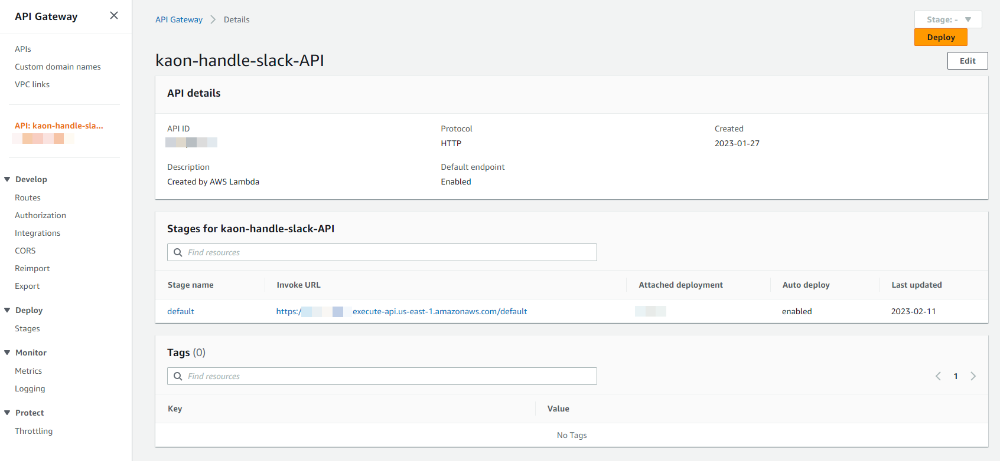
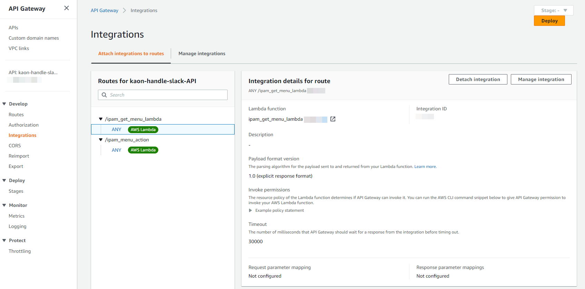
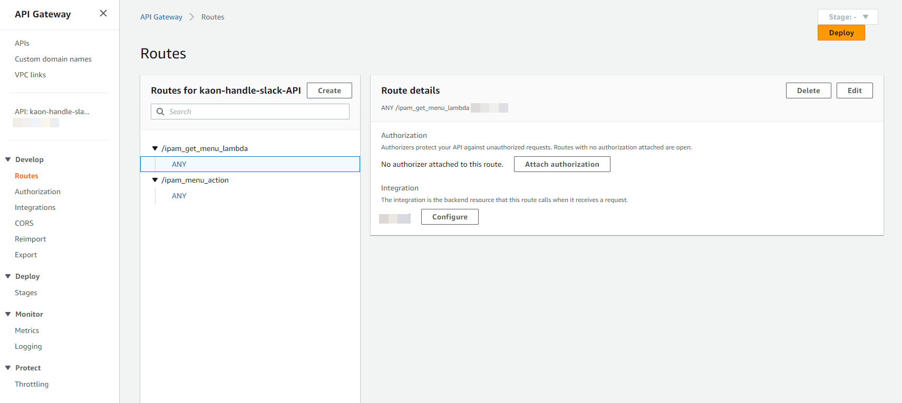
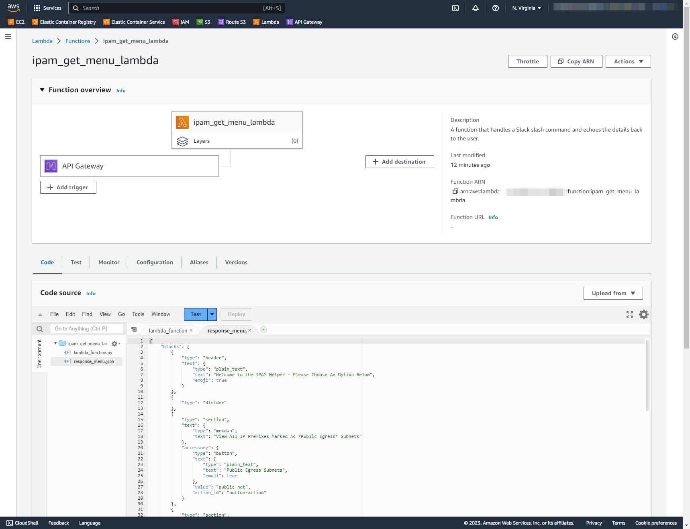
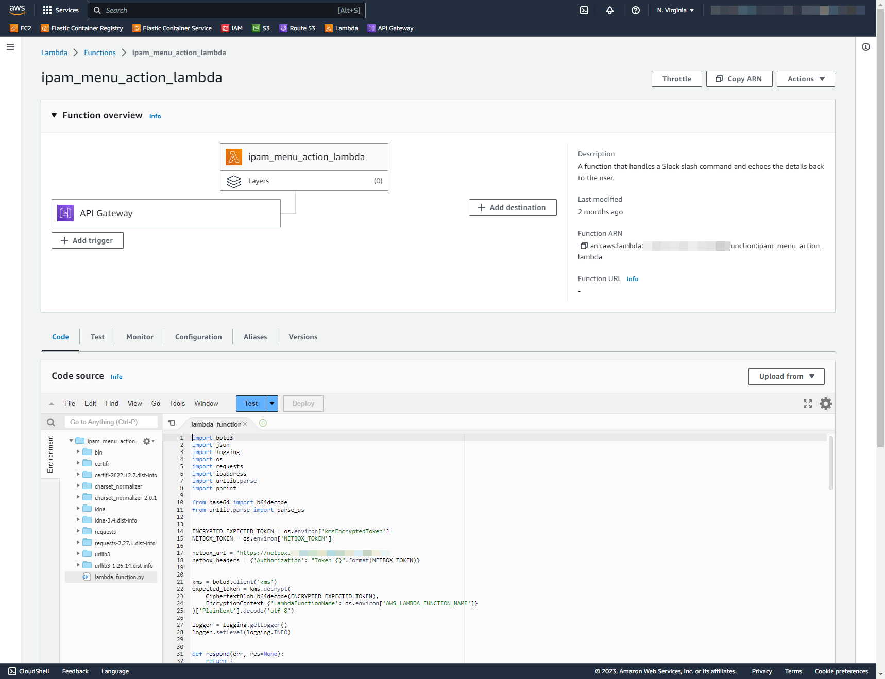
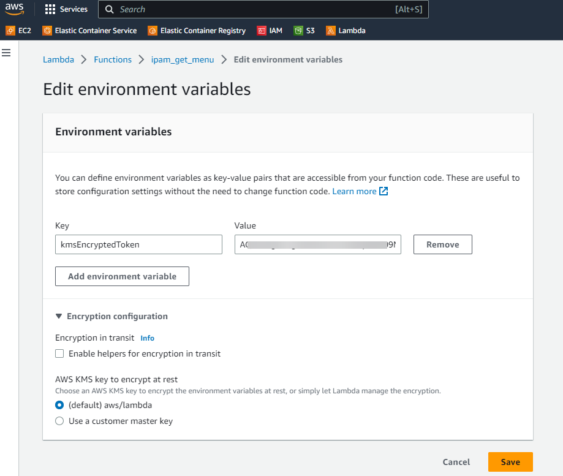

+++
author = "Kaon Thana"
title = "Slack IPAM Helper"
date = "2023-05-10"
description = "Using Slack slash commands to interact with the Netbox API. Built with a terraform pipeline on AWS API Gateway and Lambda"
categories = [
    "cloud",
    "automation",
    "netbox",
    "netdevops",
    "chatops"
]

aliases = ["ipam-helper"]
image = "images/ipam-helper-front.png"
+++

## Problem 
A stakeholder posts a question to the Network Team: "Hi, what's the IP Address range for _some list of services or sites_

Within a few minutes, a senior network greybeard emerges from his lair, dusts off his keyboard and starts typing away retrieving all the IPv4 addresses burned into his hippocampus due to years of on-call PTSD.

This is a **perfect solution** and we should never improve upon this. HOWEVER, for argument's sake lets say we wanted a more structured and consistent way of providing this information to our stakeholders? 

## Solution

I built a [Slack Application](https://api.slack.com/) which can be invoked with a **slash** command and interacts with [Netbox](https://github.com/netbox-community/netbox) to retrieve IP Address Management (IPAM) information.

The application code is hosted on [AWS Lambda Functions](https://aws.amazon.com/lambda/) which are triggered by an API Gateway request. The AWS infrastructure is deployed using Infrastructure as Code (IaC) principles with a Github, Drone, Terraform pipeline.

This blog post is a guide on how you can do it too.

### Why build it?

As I mentioned above, some of the most common queries asked of Network Teams are IP Address questions from stakeholders within the organization. Generally relating to, allow list ranges, egress IPs, site and user specific IP addresses for identification. Some examples may include:
- What are the VPN Subnets?
- Can I get a list of all remote site's Internet Egress addresses?
- What are the Wireless Subnets in Site X?

Instead of relying on shared spreadsheets and/or tribal knowledge which may change based on which engineer is answering the question this week. If we focus our energy on maintaining an accurate single source of truth (SSoT), then we can relay this information back with programmatic efficiency. 

### Where to host it?

It depends. 

Slack is in the public cloud therefore, slash commands, webhooks and bots need to make calls to public endpoints. If your SSoT (in this case Netbox) is not accessible on a public endpoint then what?

Well, in my case, i'm hosting Netbox in a private AWS VPC so the best solution is to create a public AWS API Gateway Endpoint which integrates with an AWS Lambda Function. The lambda function acts as a buffer between the public internet and the Netbox API. Request comes in to the API Gateway, gets forwarded to the lambda, lambda python code performs the logic, talks to Netbox and returns a pretty result for the end user. 

## What's it look like?

User types **/ipam** in Slack and a menu appears like below:


**Example 1:** User chooses first radio button and gets back a list of prefixes with descriptions:


**Example 2:** User enters a specific IP Address in the form and presses enter. They get back the full JSON result that Netbox has on that IP Address:


**Example 3:** User enters an IP Address that is not known, however is part of a larger prefix. We return information of the parent prefixes:


### High Level Architecture Diagram


### The Code

All code can be found on my [GitHub here](https://github.com/kaon1/ipam-helper)

### Deploying with a Terraform, Drone, GitHub Pipeline

Why should we use Infrastructure as Code (IaC)?

We don't want this project to turn into tech debt. IaC helps with this because:

* Allows for version controlled configuration changes
* Self-documents (for the most part)
* Creates an easy-to-follow process for updating and maintaining the application and system environment

Example Pipeline Run:


In this post, I am not going to dive deep into the IaC pipeline. If you want to learn more about it, you can follow my previous post: [bgpalerter-as-code-using-a-terraform-pipeline](https://kaonbytes.com/p/bgpalerter-as-code-using-a-terraform-pipeline/)

## System Components

### Netbox IPAM and Tagging

The key to this whole endeavor is to make sure we **maintain accurate data** in our IPAM. Much of this work will be manual, but it needs to be done somewhere, so its better that these updates are centralized.

Another way to supplement the IPAM data is to backfill Netbox with data directly from our devices. I have a blog post showing how we can do that [here -- netbox-dynamic-inventory-for-ansible-as-a-feedback-loop](https://kaonbytes.com/p/netbox-dynamic-inventory-for-ansible-as-a-feedback-loop/)

In addition to maintaining accurate data, we also need to **tag** the data that we want to relay to our stakeholders. For example, user clicks the **VPN Subnets** button on the slack app, then the data returned should be all prefixes tagged with **vpn_subnets**.

Example of tagging prefixes in Netbox:


### Slack API Admin

Building the Slack App requires access to https://api.slack.com/start/building. Once you have access, you can start building your app.

#### Slash Commands

First we can start by creating the **/ipam** slash command as shown here:


Inside the command, we enter our API Gateway Public Endpoint (we haven't actually created that yet):


The response of this endpoint will be a JSON result which will show our initial menu.

#### Interactivity & Shortcuts

When a user interacts with the initial menu, a new webhook is sent to slack. The destination of this webhook can be configured under Slack --> Interactivity.
Here we enter our 2nd API Gateway endpoint which points to our second lambda (not configured yet)


#### Token

A verification token is sent along with all slash command payloads. Our Lambda function will parse this token and verify that it is coming from our workspace. This prevents unauthorized users from gaining access to the Netbox data.

The verification token can be found in your Slack App Admin --> Basic Information --> Verification Token

#### Block Kit Builder

Block Kit builder is a visualization tool that slack provides to build your forms and user input fields. The JSON payload can be copied to our lambda function as the returning result of the **/ipam** slash command. 


### Amazon AWS Components

#### API Gateway

Terraform Code:
```tf
resource "aws_apigatewayv2_api" "ipam-helper-slack-api" {
  name          = "ipam-helper-slack-api"
  protocol_type = "HTTP"
}

resource "aws_apigatewayv2_integration" "ipam-get-menu-integration" {
  api_id           = aws_apigatewayv2_api.ipam-helper-slack-api.id
  integration_type = "AWS_PROXY"

  connection_type = "INTERNET"
  # content_handling_strategy = "CONVERT_TO_TEXT"
  description          = "Ipam Helper Get Menu Integration"
  integration_method   = "POST"
  integration_uri      = aws_lambda_function.ipam_get_menu.invoke_arn
  passthrough_behavior = "WHEN_NO_MATCH"
}

resource "aws_apigatewayv2_integration" "ipam-return-action-integration" {
  api_id           = aws_apigatewayv2_api.ipam-helper-slack-api.id
  integration_type = "AWS_PROXY"

  connection_type = "INTERNET"
  # content_handling_strategy = "CONVERT_TO_TEXT"
  description          = "Ipam Helper Return Action Integration"
  integration_method   = "POST"
  integration_uri      = aws_lambda_function.ipam_return_action.invoke_arn
  passthrough_behavior = "WHEN_NO_MATCH"
}


resource "aws_apigatewayv2_route" "ipam-get-menu-route" {
  api_id    = aws_apigatewayv2_api.ipam-helper-slack-api.id
  route_key = "ANY /ipam_get_menu"

  target = "integrations/${aws_apigatewayv2_integration.ipam-get-menu-integration.id}"
}

resource "aws_apigatewayv2_route" "ipam-return-action-route" {
  api_id    = aws_apigatewayv2_api.ipam-helper-slack-api.id
  route_key = "ANY /ipam_return_action"

  target = "integrations/${aws_apigatewayv2_integration.ipam-return-action-integration.id}"
}

resource "aws_apigatewayv2_stage" "ipam-helper-slack-api-deploy" {
  api_id      = aws_apigatewayv2_api.ipam-helper-slack-api.id
  name        = "default"
  auto_deploy = true
}
```

API GW in GUI:



API GW Integrations to Lambdas:



API GW Routes:




#### Lambda 1 - Get Menu

Terraform:

```tf
data "archive_file" "ipam_get_menu" {
  type        = "zip"
  source_dir  = abspath("${path.root}/../../lambda_ipam_get_menu")
  output_path = abspath("${path.root}/../modules/ipam-helper/lambda_ipam_get_menu.zip")
}

resource "aws_iam_role" "iam_for_ipam_get_menu" {
  name = "iam_for_ipam_get_menu"

  assume_role_policy = <<EOF
{
  "Version": "2012-10-17",
  "Statement": [
    {
      "Action": "sts:AssumeRole",
      "Principal": {
        "Service": "lambda.amazonaws.com"
      },
      "Effect": "Allow",
      "Sid": ""
    }
  ]
}
EOF
}

resource "aws_lambda_function" "ipam_get_menu" {
  filename      = data.archive_file.ipam_get_menu.output_path
  function_name = "ipam_get_menu"
  role          = aws_iam_role.iam_for_ipam_get_menu.arn
  handler       = "lambda_function.lambda_handler"


  source_code_hash = filebase64sha256(data.archive_file.ipam_get_menu.output_path)
  runtime          = "python3.8"
  timeout          = 30  # Time out in second, default value is 3
  memory_size      = 128 # Default value in MB

  environment {
    variables = {
      kmsEncryptedToken = "replacelater"
    }
  }
  depends_on = [aws_cloudwatch_log_group.cw_ipam_get_menu]
  tags       = var.tags
}

resource "aws_cloudwatch_log_group" "cw_ipam_get_menu" {
  name              = "/aws/lambda/ipam_get_menu"
  retention_in_days = 180
}

# See also the following AWS managed policy: AWSLambdaBasicExecutionRole
resource "aws_iam_policy" "ipam_get_menu_lambda_logging" {
  name        = "ipam_get_menu_lambda_logging"
  path        = "/"
  description = "IAM policy for logging from a lambda"

  policy = <<EOF
{
  "Version": "2012-10-17",
  "Statement": [
    {
      "Action": [
        "logs:CreateLogGroup",
        "logs:CreateLogStream",
        "logs:PutLogEvents"
      ],
      "Resource": "arn:aws:logs:*:*:*",
      "Effect": "Allow"
    },
    {
        "Sid": "VisualEditor0",
        "Effect": "Allow",
        "Action": "kms:*",
        "Resource": "*"
    }
  ]
}
EOF
}

resource "aws_iam_role_policy_attachment" "ipam_get_menu_lambda_logs" {
  role       = aws_iam_role.iam_for_ipam_get_menu.name
  policy_arn = aws_iam_policy.ipam_get_menu_lambda_logging.arn
}

resource "aws_lambda_permission" "apigw" {
  statement_id  = "AllowAPIGatewayInvoke"
  action        = "lambda:InvokeFunction"
  function_name = aws_lambda_function.ipam_get_menu.function_name
  principal     = "apigateway.amazonaws.com"

  # The /*/* portion grants access from any method on any resource
  # within the API Gateway "REST API".
  source_arn = "${aws_apigatewayv2_api.ipam-helper-slack-api.execution_arn}/*/*/ipam_get_menu"
}
```

Python Code:

```python
import boto3
import json
import logging
import os

from base64 import b64decode
from urllib.parse import parse_qs


ENCRYPTED_EXPECTED_TOKEN = os.environ['kmsEncryptedToken']

kms = boto3.client('kms')
expected_token = kms.decrypt(
    CiphertextBlob=b64decode(ENCRYPTED_EXPECTED_TOKEN),
    EncryptionContext={'LambdaFunctionName': os.environ['AWS_LAMBDA_FUNCTION_NAME']}
)['Plaintext'].decode('utf-8')

logger = logging.getLogger()
logger.setLevel(logging.INFO)


def respond(err, res=None):
    return {
        'statusCode': '400' if err else '200',
        'body': err.message if err else json.dumps(res).encode('utf8'),
        'headers': {
            'Content-Type': 'application/json',
        },
    }


def lambda_handler(event, context):
    # logger.info(event)
    decode_body = b64decode(str(event['body'])).decode('ascii')
    params = parse_qs(decode_body)
    token = params['token'][0]
    if token != expected_token:
        logger.error("Request token (%s) does not match expected", token)
        return respond(Exception('Invalid request token'))

    f = open('response_menu.json', "r")
    slack_menu_json = json.loads(f.read())

    return respond(None, slack_menu_json)
```

Console:



#### Lambda 2 - Return Data

Terraform:

```tf
data "archive_file" "ipam_return_action" {
  type        = "zip"
  source_dir  = abspath("${path.root}/../../lambda_ipam_return_action")
  output_path = abspath("${path.root}/../modules/ipam-helper/lambda_ipam_return_action.zip")
}

resource "aws_iam_role" "iam_for_ipam_return_action" {
  name = "iam_for_ipam_return_action"

  assume_role_policy = <<EOF
{
  "Version": "2012-10-17",
  "Statement": [
    {
      "Action": "sts:AssumeRole",
      "Principal": {
        "Service": "lambda.amazonaws.com"
      },
      "Effect": "Allow",
      "Sid": ""
    }
  ]
}
EOF
}

resource "aws_lambda_function" "ipam_return_action" {
  filename      = data.archive_file.ipam_return_action.output_path
  function_name = "ipam_return_action"
  role          = aws_iam_role.iam_for_ipam_return_action.arn
  handler       = "lambda_function.lambda_handler"


  source_code_hash = filebase64sha256(data.archive_file.ipam_return_action.output_path)
  runtime          = "python3.8"
  timeout          = 30  # Time out in second, default value is 3
  memory_size      = 128 # Default value in MB

  vpc_config {
    subnet_ids         = ["<subnet1>", "<subnet2>"]
    security_group_ids = [aws_security_group.lambda_slackbot_sg.id]
  }

  environment {
    variables = {
      kmsEncryptedToken = "replacelater"
      NETBOX_TOKEN      = "replacelater"
    }
  }
  depends_on = [aws_cloudwatch_log_group.cw_ipam_return_action]
  tags       = var.tags
}

resource "aws_cloudwatch_log_group" "cw_ipam_return_action" {
  name              = "/aws/lambda/ipam_return_action"
  retention_in_days = 180
}

# See also the following AWS managed policy: AWSLambdaBasicExecutionRole
resource "aws_iam_policy" "ipam_return_action_lambda_logging" {
  name        = "ipam_return_action_lambda_logging"
  path        = "/"
  description = "IAM policy for logging from a lambda"

  policy = <<EOF
{
  "Version": "2012-10-17",
  "Statement": [
    {
      "Action": [
        "logs:CreateLogGroup",
        "logs:CreateLogStream",
        "logs:PutLogEvents"
      ],
      "Resource": "arn:aws:logs:*:*:*",
      "Effect": "Allow"
    },
    {
        "Sid": "VisualEditor0",
        "Effect": "Allow",
        "Action": "kms:*",
        "Resource": "*"
    }
  ]
}
EOF
}

resource "aws_iam_role_policy_attachment" "ipam_return_action_lambda_logs" {
  role       = aws_iam_role.iam_for_ipam_return_action.name
  policy_arn = aws_iam_policy.ipam_return_action_lambda_logging.arn
}

resource "aws_lambda_permission" "apigw_2" {
  statement_id  = "AllowAPIGatewayInvoke"
  action        = "lambda:InvokeFunction"
  function_name = aws_lambda_function.ipam_return_action.function_name
  principal     = "apigateway.amazonaws.com"

  # The /*/* portion grants access from any method on any resource
  # within the API Gateway "REST API".
  source_arn = "${aws_apigatewayv2_api.ipam-helper-slack-api.execution_arn}/*/*/ipam_return_action"
}

resource "aws_iam_role_policy_attachment" "iam_role_policy_attachment_lambda_vpc_access_execution" {
  role       = aws_iam_role.iam_for_ipam_return_action.name
  policy_arn = "arn:aws:iam::aws:policy/service-role/AWSLambdaVPCAccessExecutionRole"
}

resource "aws_security_group" "lambda_slackbot_sg" {
  # provider    = aws.us-east-1
  name        = "lambda_slackbot_sg"
  description = "Security Group to manage lambda_slackbot access"
  vpc_id      = data.terraform_remote_state.account_base.outputs.vpc_east_id

  ingress {
    from_port   = 80
    to_port     = 80
    protocol    = "tcp"
    cidr_blocks = ["10.0.0.0/8"]
  }

  ingress {
    from_port   = 443
    to_port     = 443
    protocol    = "tcp"
    cidr_blocks = ["10.0.0.0/8"]
  }

  ingress {
    from_port   = -1
    to_port     = -1
    protocol    = "icmp"
    cidr_blocks = ["10.0.0.0/8"]
  }

  egress {
    from_port   = 0
    to_port     = 0
    protocol    = "-1"
    cidr_blocks = ["0.0.0.0/0"]
  }

}
```

Python Code:

```python
import boto3
import json
import logging
import os
import requests
import ipaddress
import urllib.parse
import pprint

from base64 import b64decode
from urllib.parse import parse_qs


ENCRYPTED_EXPECTED_TOKEN = os.environ['kmsEncryptedToken']
NETBOX_TOKEN = os.environ['NETBOX_TOKEN']

netbox_url = '<redacted>'
netbox_headers = {'Authorization': "Token {}".format(NETBOX_TOKEN)}


kms = boto3.client('kms')
expected_token = kms.decrypt(
    CiphertextBlob=b64decode(ENCRYPTED_EXPECTED_TOKEN),
    EncryptionContext={'LambdaFunctionName': os.environ['AWS_LAMBDA_FUNCTION_NAME']}
)['Plaintext'].decode('utf-8')

logger = logging.getLogger()
logger.setLevel(logging.INFO)


def respond(err, res=None):
    return {
        'statusCode': '400' if err else '200',
        'body': err.message if err else json.dumps(res).encode('utf8'),
        'headers': {
            'Content-Type': 'application/json',
        },
    }


def netbox_return_prefixes(tag):
    ipam_api_call = requests.get(netbox_url+"/api/ipam/prefixes/?limit=0&tag="+tag, headers=netbox_headers, verify=False).json()
    return ipam_api_call.get('results')


def netbox_return_addresses(tag):
    ipam_api_call = requests.get(netbox_url+"/api/ipam/ip-addresses/?limit=0&tag="+tag, headers=netbox_headers, verify=False).json()
    return ipam_api_call.get('results')


def netbox_return_ranges(tag):
    ipam_api_call = requests.get(netbox_url+"/api/ipam/ip-ranges/?limit=0&tag="+tag, headers=netbox_headers, verify=False).json()
    return ipam_api_call.get('results')


def netbox_return_prefix_input(input):
    ipam_api_call = requests.get(netbox_url+"/api/ipam/prefixes/?limit=0&prefix="+input, headers=netbox_headers, verify=False).json()
    return ipam_api_call.get('results')


def netbox_return_address_input(input):
    ipam_api_call = requests.get(netbox_url+"/api/ipam/ip-addresses/?limit=0&address="+input, headers=netbox_headers, verify=False).json()
    return ipam_api_call.get('results')

def netbox_return_prefix_contains_input(input):
    ipam_api_call = requests.get(netbox_url+"/api/ipam/prefixes/?limit=0&contains="+input, headers=netbox_headers, verify=False).json()
    return ipam_api_call.get('results')

def send_ephemeral_message(response_url, data):
    ephemeral_headers = {'Content-Type': 'application/json'}
    # logger.info(response_url)

    return requests.post(response_url, headers=ephemeral_headers, json=data)


def action_get_public_nat(tag="public_egress"):
    public_nat_prefixes = netbox_return_prefixes(tag)
    public_nat_ranges = netbox_return_ranges(tag)
    public_nat_addresses = netbox_return_addresses(tag)

    ephemeral_response_text = ""
    for prefix in public_nat_prefixes:
        ephemeral_response_text += "Prefix --> "+str(prefix.get('prefix'))+" | Description --> "+str(prefix.get('description'))+"\n"
    for range in public_nat_ranges:
        ephemeral_response_text += "Range --> "+str(range.get('display'))+" | Description --> "+str(range.get('description'))+"\n"
    for address in public_nat_addresses:
        ephemeral_response_text += "Address --> "+str(address.get('address'))+" | Description --> "+str(address.get('description'))+"\n"

    return ephemeral_response_text


def action_get_trusted_user_subnet(tag="wireless_user_subnet"):
    trusted_user_prefixes = netbox_return_prefixes(tag)
    trusted_user_ranges = netbox_return_ranges(tag)
    trusted_user_addresses = netbox_return_addresses(tag)

    ephemeral_response_text = ""
    for prefix in trusted_user_prefixes:
        ephemeral_response_text += "Prefix --> "+str(prefix.get('prefix'))+" | Description --> "+str(prefix.get('description'))+"\n"
    for range in trusted_user_ranges:
        ephemeral_response_text += "Range --> "+str(range.get('display'))+" | Description --> "+str(range.get('description'))+"\n"
    for address in trusted_user_addresses:
        ephemeral_response_text += "Address --> "+str(address.get('address'))+" | Description --> "+str(address.get('description'))+"\n"

    return ephemeral_response_text


def action_get_tagged_subnet(tag):
    trusted_user_prefixes = netbox_return_prefixes(tag)
    trusted_user_ranges = netbox_return_ranges(tag)
    trusted_user_addresses = netbox_return_addresses(tag)

    ephemeral_response_text = ""
    for prefix in trusted_user_prefixes:
        ephemeral_response_text += "Prefix --> "+str(prefix.get('prefix'))+" | Description --> "+str(prefix.get('description'))+"\n"
    for range in trusted_user_ranges:
        ephemeral_response_text += "Range --> "+str(range.get('display'))+" | Description --> "+str(range.get('description'))+"\n"
    for address in trusted_user_addresses:
        ephemeral_response_text += "Address --> "+str(address.get('address'))+" | Description --> "+str(address.get('description'))+"\n"

    return ephemeral_response_text


def action_get_more_info(user_input):
    prefix_info = netbox_return_prefix_input(user_input)
    address_info = netbox_return_address_input(user_input)
    prefix_contains_info = netbox_return_prefix_contains_input(user_input)

    # logger.info(user_input)
    # logger.info(prefix_info)
    # logger.info(address_info)

    ephemeral_response_text = ""
    if prefix_info is not None and len(prefix_info) > 0:
        # ephemeral_response_text += "Prefix --> "+str(prefix_info[0].get('prefix'))+" | Description --> "+str(prefix_info[0].get('description'))+"\n"
        ephemeral_response_text = pprint.pformat(prefix_info[0], indent=4)

    elif address_info is not None and len(address_info) > 0:
        # ephemeral_response_text += "Address --> "+str(address_info[0].get('address'))+" | Description --> "+str(address_info[0].get('description'))+"\n"
        ephemeral_response_text = pprint.pformat(address_info[0], indent=4)
        
    elif prefix_contains_info is not None and len(prefix_contains_info) > 0:
        ephemeral_response_text += "Specific entry not found but is contained in the following Prefixes:\n"
        for item in prefix_contains_info:
            ephemeral_response_text += "Prefix --> "+str(item.get('prefix'))+" | Description --> "+str(item.get('description'))+"\n"

    else:
        ephemeral_response_text = "No Information Found for This Entry --> "+user_input

    return ephemeral_response_text


def lambda_handler(event, context):
    # logger.info(event)
    decode_body = b64decode(str(event['body'])).decode('ascii')
    params = parse_qs(decode_body)
    payload_dict = json.loads(params['payload'][0])
    # logger.info(payload_dict)
    # logger.info(type(payload_dict))
    token = payload_dict['token']
    if token != expected_token:
        logger.error("Request token (%s) does not match expected", token)
        return respond(Exception('Invalid request token'))

    # logger.info(payload_dict['actions'][0]['value'])

    if payload_dict['actions'][0]['value'] == "public_egress":
        ephemeral_response_body = {"text": action_get_public_nat()}

    if payload_dict['actions'][0]['value'] == "wireless_user_subnet":
        ephemeral_response_body = {"text": action_get_trusted_user_subnet()}

    if payload_dict['actions'][0]['value'] == "vpn_subnet":
        ephemeral_response_body = {"text": action_get_tagged_subnet(payload_dict['actions'][0]['value'])}

    if payload_dict['actions'][0]['action_id'] == "plain_text_input-action":
        user_input = payload_dict['actions'][0]['value']
        try:
            user_input_validated = ipaddress.ip_interface(user_input)
            user_input_encoded = urllib.parse.quote(str(user_input).encode('utf8'))
            ephemeral_response_body = {"text": action_get_more_info(user_input_encoded)}
        except ValueError as e:
            ephemeral_response_body = {"text": "You entered an Unrecognized IP or Prefix - Please Enter in the Format of 10.10.10.1 or 10.10.10.0/24"}

    send_msg = send_ephemeral_message(payload_dict['response_url'], ephemeral_response_body)
    logger.info(send_msg)

    api_response = {"text": "okay"}

    return respond(None, api_response)
```
Console:



#### Encrypting the Slack Token

We can encrypt the Slack verification token using AWS KMS Encryption.
To encrypt your token use the following steps:

  1. Create or use an existing KMS Key - http://docs.aws.amazon.com/kms/latest/developerguide/create-keys.html

  2. Expand "Encryption configuration" and click the "Enable helpers for encryption in transit" checkbox

  3. Paste <COMMAND_TOKEN> into the kmsEncryptedToken environment variable and click "Encrypt"

  4. Give your function's role permission for the `kms:Decrypt` action using the provided policy template

The encrypted token will look something like this:



## Conclusion - Next Steps?
Future improvements for this app may include:
 - Additional inputs, create drop down lists instead of buttons
 - Auto-responder (instead of requiring slash command input)
 - Move away from ephemeral messages to persistent messages

Thanks for following along, cheers!


