+++
author = "Kaon Thana"
title = "Slack IPAM Helper"
date = "2023-05-10"
description = "Using Slack slash commands to interact with the Netbox API. Built with a terraform pipeline on AWS API Gateway and Lambda"
categories = [
    "cloud",
    "automation",
    "netbox",
    "netdevops",
    "chatops"
]

aliases = ["ipam-helper"]
image = "images/ipam-helper-front.png"
+++

Problem: 
A stakeholder posts a question to the Network Team: "Hey Folks, what's the IP Address range for _some list of services or sites_

Solution:
Within a few minutes, a senior network greybeard emerges from his lair, dusts off his keyboard and starts typing away retrieving all the IPv4 addresses burned into his hippocampus due to years of on-call PTSD.

This is a **perfect solution** and we should never improve upon this. HOWEVER, for argument's sake lets say we wanted a more structured and consistent way of providing this information to our stakeholders? 

## What is it?

I built a [Slack Application](https://api.slack.com/) which can be invoked with a **slash** command and interacts with [Netbox](https://github.com/netbox-community/netbox) to retrieve IP Address Management (IPAM) information.

The application code is hosted on [AWS Lambda Functions](https://aws.amazon.com/lambda/) which are triggered by an API Gateway request. The AWS infrastructure is deployed using Infrastructure as Code (IaC) principles with a Github, Drone, Terraform pipeline.

This blog post is a guide on how you can do it too.

### Why Build It?

As I mentioned above, some of the most common queries asked of Network Teams are IP Address questions from stakeholders within the organization. Generally relating to, allow list ranges, egress IPs, site and user specific IP addresses for identification. Some examples may include:
- What are the VPN Subnets?
- Can I get a list of all remote site's Internet Egress addresses?
- What are the Wireless Subnets in Site X?

Instead of relying on shared spreadsheets and/or tribal knowledge which may change based on which engineer is answering the question this week. If we focus our energy on maintaining an accurate single source of truth (SSoT), then we can relay this information back with programmatic efficiency. 

### Where To Host It?

It depends. 

Slack is in the public cloud therefore, slash commands, webhooks and bots need to make calls to public endpoints. If your SSoT (in this case Netbox) is not accessible on a public endpoint then what?

Well, in my case, i'm hosting Netbox in a private AWS VPC so the best solution is to create a public AWS API Gateway Endpoint which integrates with an AWS Lambda Function. The lambda function acts as a buffer between the public internet and the Netbox API. Request comes in to the API Gateway, gets forwarded to the lambda, lambda python code performs the logic, talks to Netbox and returns a pretty result for the end user. 

## What's it Look Like?

User types **/ipam** in Slack and a menu appears like below:

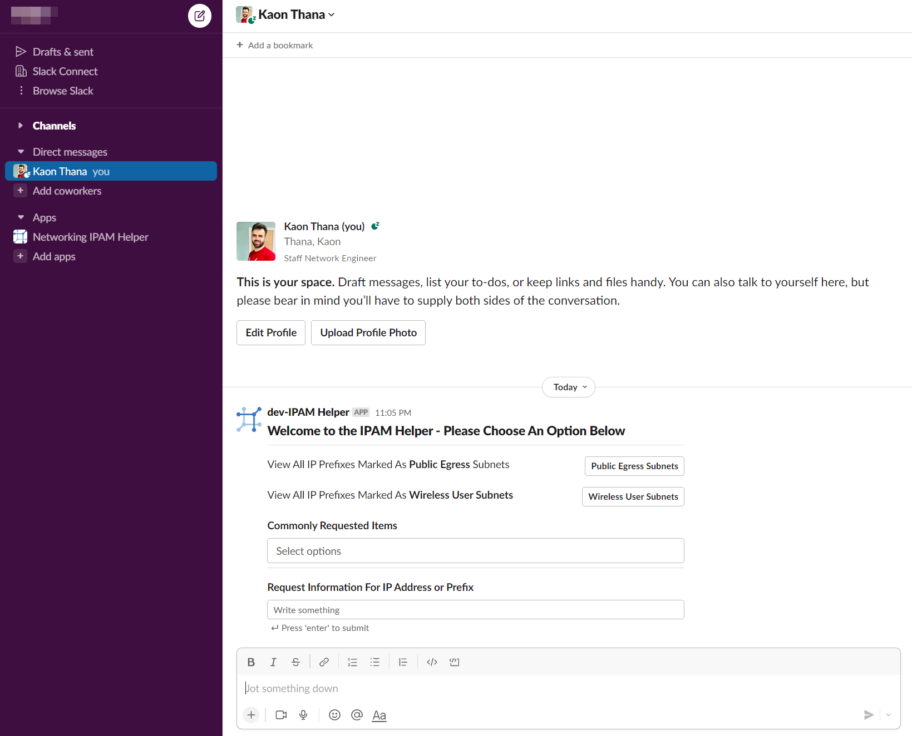

**Example 1:** User chooses first radio button and gets back a list of prefixes with descriptions:

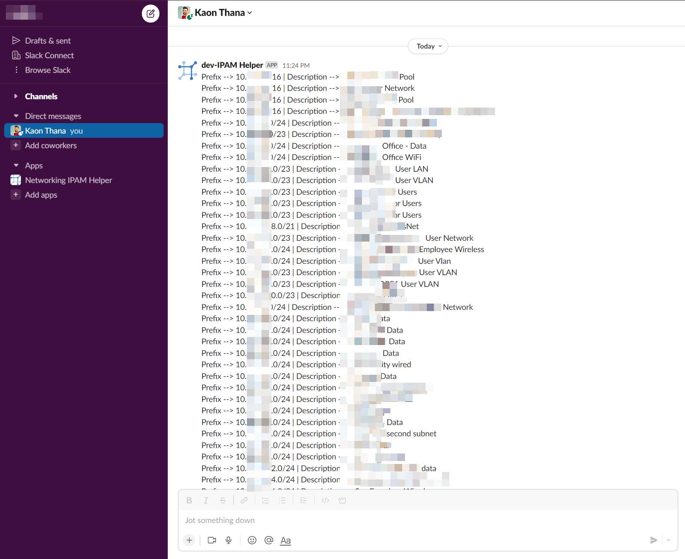

**Example 2:** User enters a specific IP Address in the form and presses enter. They get back the full JSON result that Netbox has on that IP Address:

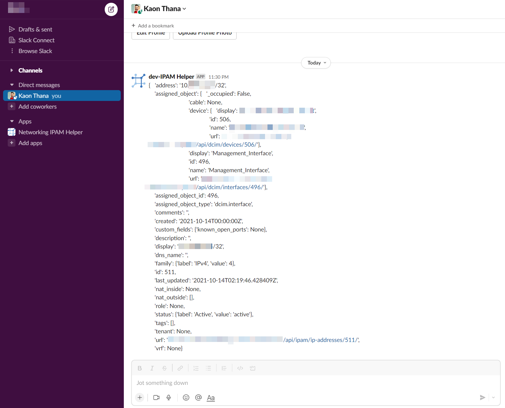

**Example 3:** User enters an IP Address that is not known, however is part of a larger prefix. We return information of the parent prefixes:

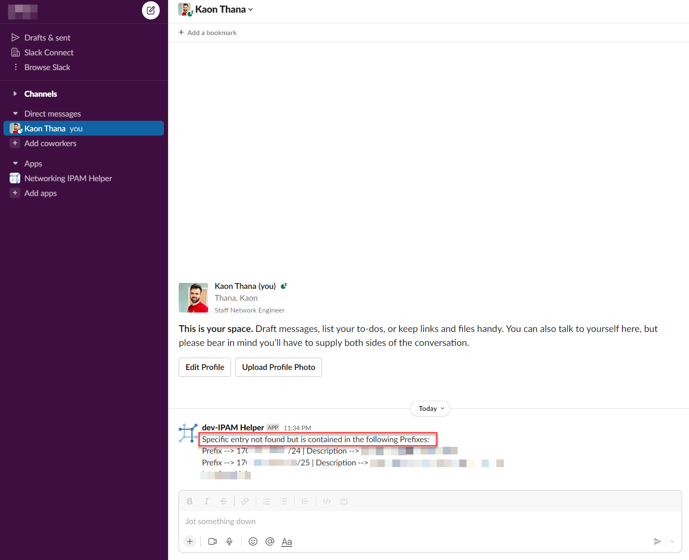

### High Level Architecture Diagram

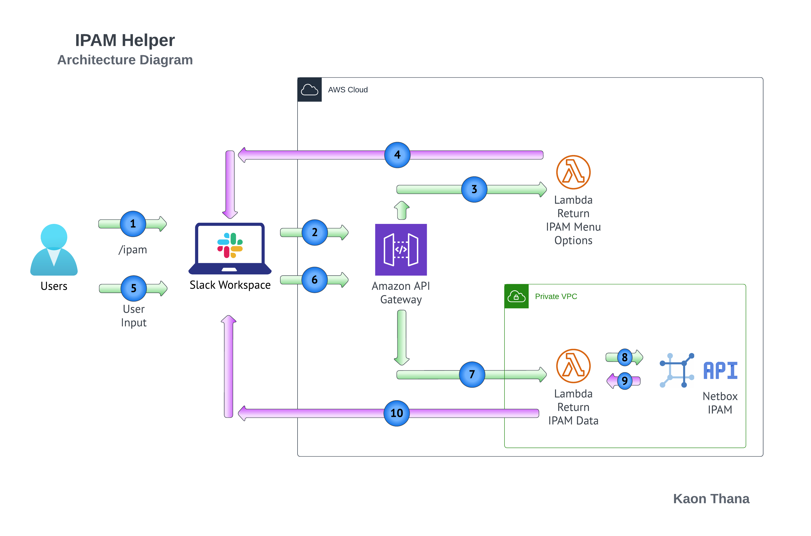

### The Code

All code can be found on my [GitHub here](https://github.com/kaon1/ipam-helper)

### Deploying with a Terraform, Drone, GitHub Pipeline

Why should we use Infrastructure as Code?

We don't want this project to turn into tech debt. IaC helps with this because:

* Allows for version controlled configuration changes
* Self-documents (for the most part)
* Creates an easy-to-follow process for updating and maintaining the application and system environment

In this post, I am not going to dive deep into the IaC pipeline. If you want to learn more about it, you can follow my previous post: [bgpalerter-as-code-using-a-terraform-pipeline](https://kaonbytes.com/p/bgpalerter-as-code-using-a-terraform-pipeline/)

Example Pipeline Run:

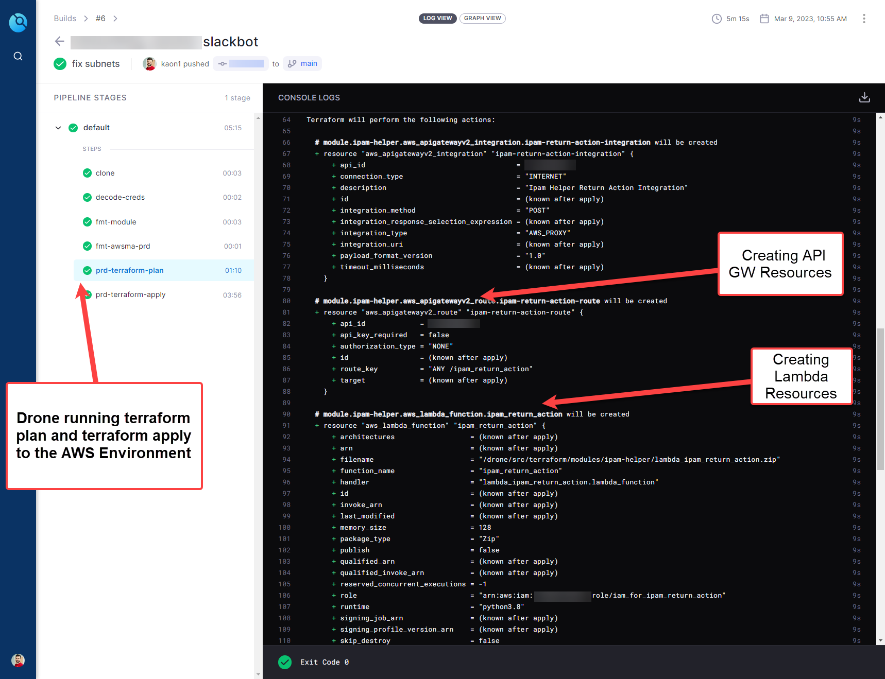

## System Components

### Netbox IPAM and Tagging

The key to this whole endeavor is to make sure we **maintain accurate data** in our IPAM. Much of this work will be manual, but it needs to be done somewhere, so why not in a structured central database instead of notepad.txt? 

Another way to supplement the IPAM data is to backfill Netbox with data directly from our devices. I have a blog post showing how we can do that [here -- netbox-dynamic-inventory-for-ansible-as-a-feedback-loop](https://kaonbytes.com/p/netbox-dynamic-inventory-for-ansible-as-a-feedback-loop/#the-chicken-or-the-egg-problem)

In addition to maintaining accurate data, we also need to **tag** the data that we want to relay to our stakeholders. For example, user clicks the **VPN Subnets** button on the slack app, then the data returned should be all prefixes tagged with **vpn_subnets**.

Example of tagging prefixes in Netbox:

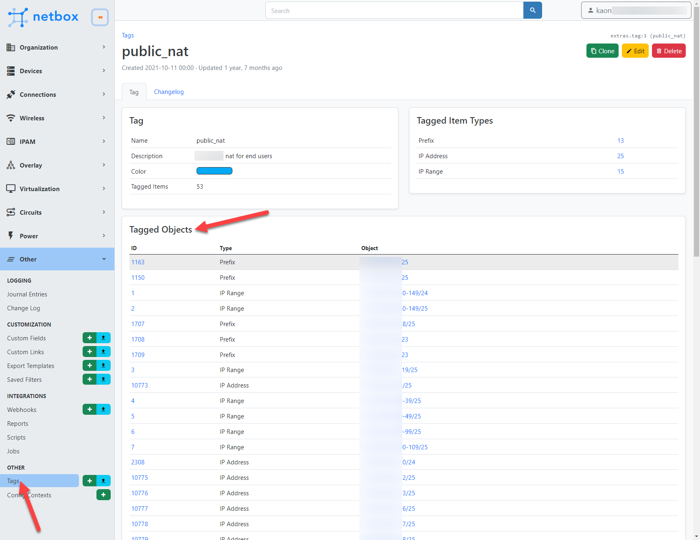

### Slack API Admin

Building the Slack App requires access to https://api.slack.com/start/building. Once you have access, you can start building your app.

#### Slash Commands

First we can start by creating the **/ipam** slash command as shown here:

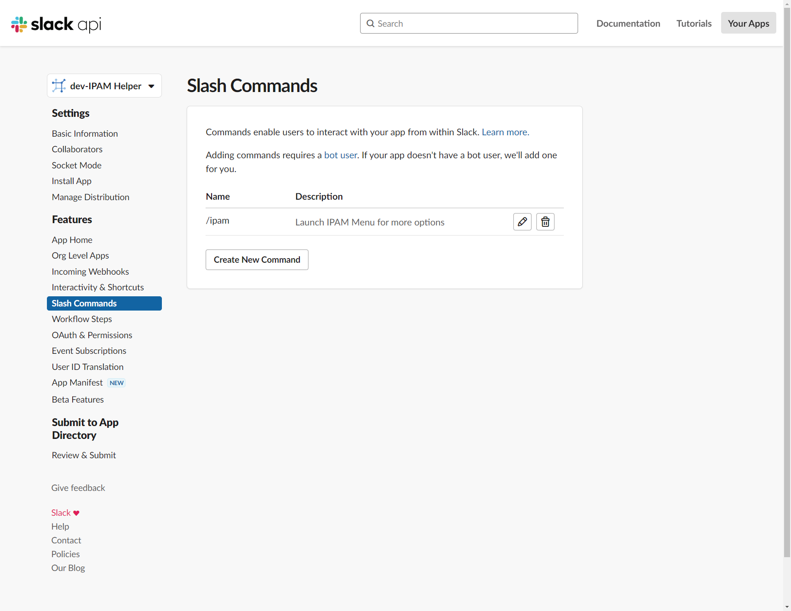

Inside the command, we enter our API Gateway Public Endpoint (we haven't actually created that yet):

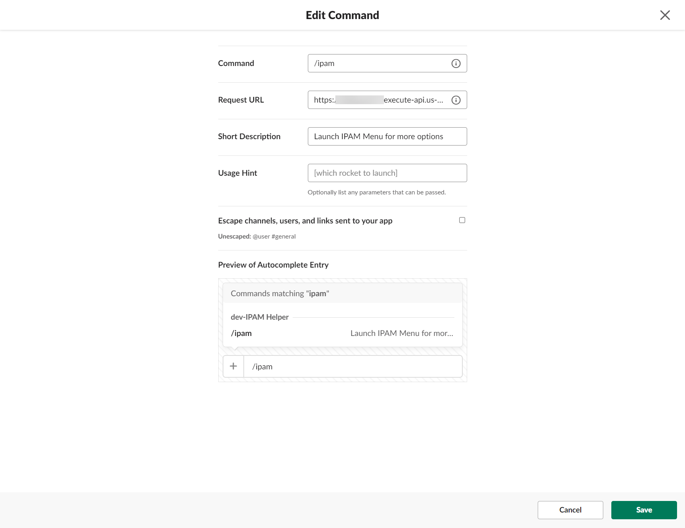

The response of this endpoint will be a JSON result which will show our initial menu.

#### Interactivity & Shortcuts

When a user interacts with the initial menu, a new webhook is sent to slack. The destination of this webhook can be configured under Slack --> Interactivity.
Here we enter our 2nd API Gateway endpoint which points to our second lambda (not configured yet)

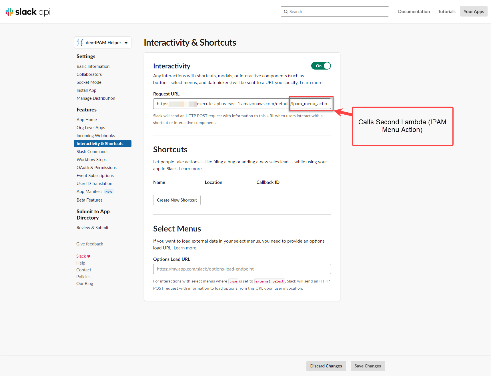

#### Token

A verification token is sent along with all slash command payloads. Our Lambda function will parse this token and verify that it is coming from our workspace. This prevents unauthorized users from gaining access to the Netbox data.

The verification token can be found in your Slack App Admin --> Basic Information --> Verification Token

#### Block Kit Builder

Block Kit builder is a visualization tool that slack provides to build your forms and user input fields.

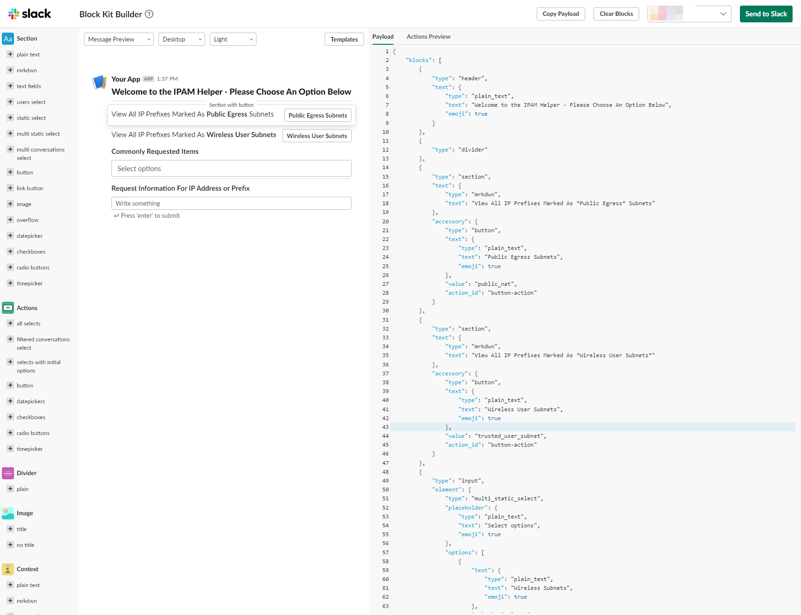

### Amazon AWS Components

#### API Gateway

#### Lambda 1 - Get Menu

#### Lambda 2 - Return Data

## Request Walkthrough

### Step 1

### Step 2

### Step 3

### Step 4

### Step 5

### Step 6

### Step 7

### Step 8/9

### Step 10

## Conclusion

