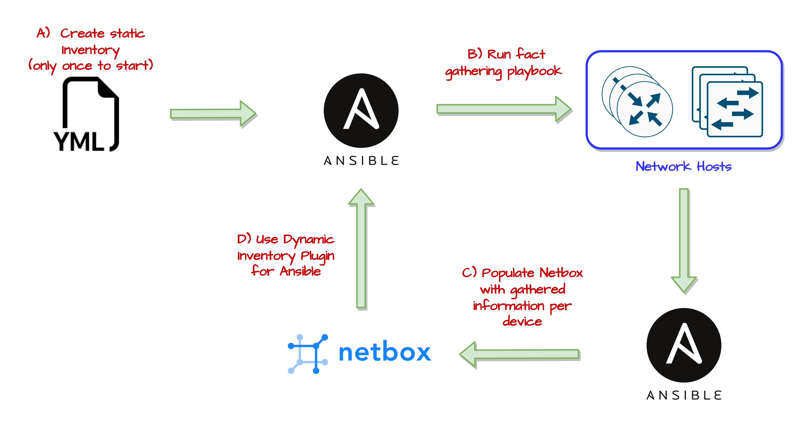
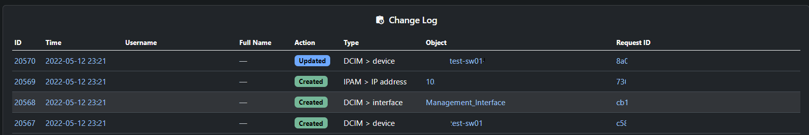
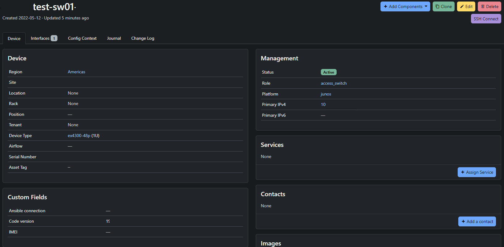
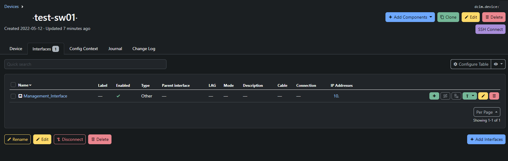

+++
author = "Kaon Thana"
title = "Netbox Dynamic Inventory for Ansible as a feedback loop"
date = "2022-05-13"
description = "Using Netbox as an Inventory Source of Truth for Ansible while gathering facts to inject back to Netbox"
categories = [
    "ansible",
    "automation",
    "netbox",
    "juniper",
    "netdevops"
]

aliases = ["netbox-ansible-feedback"]
image = "netbox-ansible-feedback.png"
+++

**The most important pillar** of Network Automation is a **Source of Truth** (SoT)

An accurate and well maintained SoT should provide:
* A list of device inventory (hosts)
* Connection parameters (IP/Hostname, connection protocol/port)
* Global, Regional, or Site specific parameters that are required to maintain desired network state

## The Chicken or the Egg Problem
When dealing with a [brownfield](https://www.techtarget.com/searchdatacenter/definition/brownfield-site) enterprise environment, 
we run into **The Chicken or The Egg Problem** at the beginning of our Network Automation journey. 

The problem is, we need an accurate and well maintained SoT but this requires manual work to gather data from 
all currently running devices and keep that data up to date as the network changes. Let's automate this! 
But wait, how can we automate this if we don't have a SoT?

### The Solution

The answer is a staged approach (i.e. bootstrapping):
* Choose your SoT platform, I like [Netbox](https://github.com/netbox-community/netbox)
* Perform some manual work to get a basic static device list as an [ansible inventory file](https://docs.ansible.com/ansible/latest/user_guide/intro_inventory.html)
* Run Ansible fact gathering accross all of your inventory
* Use the [Netbox Ansible Collection](https://docs.ansible.com/ansible/latest/collections/netbox/netbox/index.html) to populate netbox with key information of each device such as name, ip, connection profile, site, etc
* For all future playbooks, use the [Netbox Ansible Dynamic Plugin](https://docs.ansible.com/ansible/latest/collections/netbox/netbox/nb_inventory_inventory.html)
to populate your ansible inventory.
* Maintain accurate state by repeatedly running (scheduled) fact gathering and keep netbox up to date via Ansible

### Diagram


### The Code

**Bootstrap Playbook** --> [netbox-ansible-junos-bootstrap.yml](https://github.com/kaon1/ansible-misc/blob/main/netbox-ansible-populate/netbox-ansible-junos-bootstrap.yml)
```yaml
### Playbook to bootstrap netbox inventory with a list of juniper devices provided by static inventory file
# Uses ansible gather_facts to grab net_version, serial number and net_model
# Also perform a dig to get a FQDN which we can use as device name instead of the inventory_name

---
- name: PB to Bootstrap Netbox Inventory
  hosts: junosinv
  gather_facts: True
  vars:
    ansible_user:
    ansible_ssh_private_key_file:
    netbox_url:
    netbox_token:
    platform: "{{ ansible_network_os }}"
    site:
    device_role: "access_switch"
  tasks:
  - name: "Check if net_version exists"
    ### If ansible_facts does not provide net_version we manually fill it in as 111
    set_fact:
      net_version: "111"
    when: ansible_facts['net_version'] is undefined

  - name: "Assign net version"
    set_fact:
      net_version: "{{ ansible_facts['net_version'] }}"
    when: ansible_facts['net_version'] is defined

  ### Optional
  - name: "Resolve FQDN Hostname - perform DIG"
    ### Perform linux DIG command to get the reverse DNS record for the IP. THis will be our new hostname for netbox
    raw: "dig -x {{ ansible_host }} +short | sed -e 's/.$//'"
    register: dig_result
    delegate_to: localhost

  ### Optional
  - name: "TASK 11: Assign dig result to fqdn var"
    ### If Reverse DNS exists, trim whhite spaces and assing to var
    set_fact:
      fqdn: "{{ dig_result.stdout_lines[0] | trim}}"
    when: dig_result.stdout_lines[0] is defined

  ### Optional
  - name: "TASK 12: If no dig result, assign placeholder fqdn value"
    ### If no reverse DNS, then set a inventory hostname and IP as the hostname
    set_fact:
      fqdn: "{{ inventory_hostname }}-no-dns-{{ ansible_host }}"
    when: dig_result.stdout_lines[0] is undefined

  - name: "Add Device to NetBox"
    netbox.netbox.netbox_device:
      netbox_url: "{{ netbox_url }}"
      netbox_token: "{{ netbox_token }}"
      data:
        name: "{{ fqdn }}"
        device_type: "{{ ansible_facts['net_model'] }}"
        platform: "{{ platform }}"
        serial: "{{ ansible_facts['net_serialnum'] }}"
        site: "{{ site }}"
        device_role: "{{ device_role }}"
        custom_fields:
          code_version: "{{ net_version }}"
      state: present
      validate_certs: no
    delegate_to: localhost

  - name: "Add a new Interface called management_interface to device"
    ### this interface will be used as the primary IP and interface for the device
    netbox.netbox.netbox_device_interface:
      netbox_url: "{{ netbox_url }}"
      netbox_token: "{{ netbox_token }}"
      data:
        device: "{{ fqdn }}"
        name: Management_Interface
        type: other
      state: present
      validate_certs: no
    delegate_to: localhost

  - name: "Add IP address of ansible host to IPAM"
    netbox.netbox.netbox_ip_address:
      netbox_url: "{{ netbox_url }}"
      netbox_token: "{{ netbox_token }}"
      data:
        family: 4
        address: "{{ ansible_host }}/32"
        status: active
        assigned_object:
          name: Management_Interface
          device: "{{ fqdn }}"
      state: present
      validate_certs: no
    delegate_to: localhost

  - name: "Assign ansible_host IP as the primary interface for the device"
    netbox.netbox.netbox_device:
      netbox_url: "{{ netbox_url }}"
      netbox_token: "{{ netbox_token }}"
      data:
        name: "{{ fqdn }}"
        device_type: "{{ ansible_facts['net_model'] }}"
        platform: "{{ platform }}"
        serial: "{{ ansible_facts['net_serialnum'] }}"
        status: Active
        primary_ip4: "{{ ansible_host }}/32"
      state: present
      validate_certs: no
    delegate_to: localhost
```

## The Process

Let's go through the step by step.

The example below will use Juniper Devices. Junos provides some key features to help with automation:
* Configuration Structure (versioning, commit confirm, rollback options are super valuable)
* Ability to load configuration as text blocks with replace, override and merge options
* Return JSON values (i.e. Display JSON)

### Building Static Inventory File

**Bootstrap Inventory** --> [bootstrap_inventory.ini](https://github.com/kaon1/ansible-misc/blob/main/netbox-ansible-populate/bootstrap_inventory.ini)
```ini
[junosinv]
switch1 ansible_host=10.10.10.1
switch2 ansible_host=10.10.10.2
switch3 ansible_host=10.10.10.3

[junosinv:vars]
ansible_connection=netconf
ansible_network_os=junos  
```

### Running the bootstrap playbook

Now that we have a basic inventory. We can run the above **Bootstrap Playbook** --> [netbox-ansible-junos-bootstrap.yml](https://github.com/kaon1/ansible-misc/blob/main/netbox-ansible-populate/netbox-ansible-junos-bootstrap.yml)

The playbook will do the following:
* Connect to the remote juniper host and gather system facts
* Connect to the Netbox server and add a new device with the below data:
    * name
    * device_type (model)
    * platform (OS)
    * Serial Number
    * Site
    * Device role
    * Code Version
* Creates a new Netbox IP Address (IPAM) entry with the ansible_host IP
* Creates a new interface for the device named "management_interface"
* Assigns the IP address to the device's management_interface

**Ansible Result:**
```yaml
(venv) [root]# ansible-playbook -i bootstrap_inventory.ini netbox-ansible-junos-bootstrap.yml 

PLAY [PB to Bootstrap Netbox Inventory] ******
[WARNING]: Ignoring timeout(10) for junos_facts

TASK [Gathering Facts] ***********************
[WARNING]: default value for `gather_subset` will be changed to `min` from `!config` v2.11 onwards
ok: [switch1]

TASK [Assign net version] ********************
ok: [switch1]

TASK [Resolve FQDN Hostname - perform DIG] ***
changed: [switch1 -> localhost]

TASK [TASK 11: Assign dig result to fqdn var] *
ok: [switch1]

TASK [Add Device to NetBox] *****************
changed: [switch1 -> localhost]

TASK [Add a new Interface called management_interface to device] *
changed: [switch1 -> localhost]

TASK [Add IP address of ansible host to IPAM] ******
changed: [switch1 -> localhost]

TASK [Assign ansible_host IP as the primary interface for the device] *
changed: [switch1 -> localhost]

PLAY RECAP **************************************
switch1                    : ok=8    changed=5    unreachable=0    failed=0    skipped=2    rescued=0    ignored=0   

```

**Netbox Result:**







### Dynamic Inventory

Now that we have populated Netbox, we can use Netbox as our **ansible inventory**

The Netbox [Dynamic Inventory Plugin](https://docs.ansible.com/ansible/latest/collections/netbox/netbox/nb_inventory_inventory.html)
 can be used by creating an inventory file as follows:

```yaml
## Ansible Plugin file for dynamic inventory through netbox
---
plugin: netbox.netbox.nb_inventory
api_endpoint:
# token: "{{ lookup('env','NETBOX_API_KEY') }}"
validate_certs: false
config_context: true
compose:
 ansible_network_os: platform.slug
 ansible_connection: custom_fields.ansible_connection
device_query_filters:
 - status: 'active'
 - tag: 'some_tag'
```

To check if dynamic inventory is working, run **ansible-inventory**:
 
`# ansible-inventory -i ../netbox/netbox_inventory.yml --host TEST01`

**Result:**
```json
{
    "ansible_connection": "netconf",
    "ansible_host": "10.X.X.X",
    "ansible_network_os": "junos",
    "custom_fields": {
        "ansible_connection": "netconf",
        "code_version": "20",
    },
    "device_roles": [
        "access_switch"
    ],
    "device_site": "",
    "device_types": [
        "ex4300-48p"
    ],
    "is_virtual": false,
    "local_context_data": [
        null
    ],
    "locations": [],
    "manufacturers": [
        "juniper"
    ],
    "platforms": [
        "junos"
    ],
    "primary_ip4": "10.x.x.x",
    "regions": [
        "americas"
    ],
    "services": [],
    "sites": [
        "xxx"
    ],
    "status": {
        "label": "Active",
        "value": "active"
    },
    "tags": [
        "3",
        "2",
        "1"
    ]
}
```

### Schedule Playbook to Maintain System State

Let's regularly run a [modified version](https://github.com/kaon1/ansible-misc/blob/main/netbox-ansible-populate/dynamic/autopop_junos_facts.yml)
of the bootstrap playbook to maintain network state. 

Modified snippet:
```yaml
    - name: "CONFIRM DEVICE TO NETBOX"
      netbox.netbox.netbox_device:
        netbox_url: "{{ netbox_url }}"
        netbox_token: "{{ netbox_token }}"
        data:
          name: "{{ inventory_hostname }}"
          device_type: "{{ ansible_facts['net_model'] }}"
          serial: "{{ ansible_facts['net_serialnum'] }}"
          custom_fields:
            code_version: "{{ net_version }}"
            ansible_connection: "{{ custom_fields['ansible_connection'] }}"
        state: present
        validate_certs: no
      delegate_to: localhost
```

The above task will only make changes to Netbox if something changes on the field device, such as the:
* Model number
* OS version
* Serial number

Use [Ansible Tower/AWX](https://github.com/ansible/awx) to schedule playbook execution daily, weekly or monthly.

## Wrap Up

I hope this guide was helpful in understanding how we can use a Source of truth to dynamically populate an Ansible Inventory.
Feel free to comment below with any questions.


