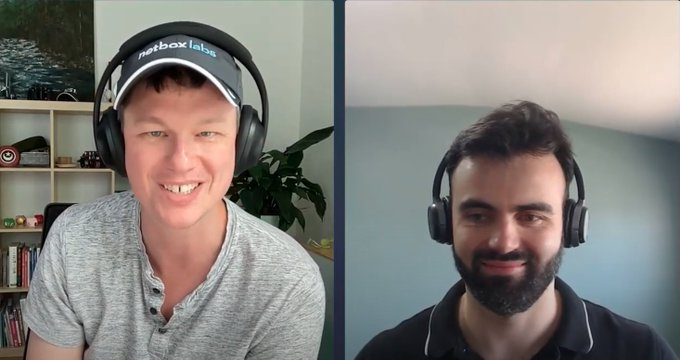

+++
author = "Kaon Thana"
title = "My First Podcast Interview"
date = "2023-06-05"
description = "I was a guest on the Netbox Heroes Podcast hosted by Kristopher Beevers"
categories = [
    "netbox",
    "netdevops",
]

aliases = ["netbox-heroes-podcast"]
image = "images/cover.jpg"
+++

## My First Podcast Interview

A few weeks ago I was contacted by [Kris Beevers](https://twitter.com/beevek) to be a guest on the Netbox Heroes podcast. He discovered my blog and noticed I was posting some Netbox related content and thought I could give some useful insight. I happily agreed and had a great time doing it.

Here is the link to the [Netbox Labs Blog Post](https://netboxlabs.com/blog/what-network-engineers-and-magicians-have-in-common) recapping the interview.

You can listen/watch the [full video on youtube here](https://youtu.be/FU0X8ku_XMk)

Thanks!