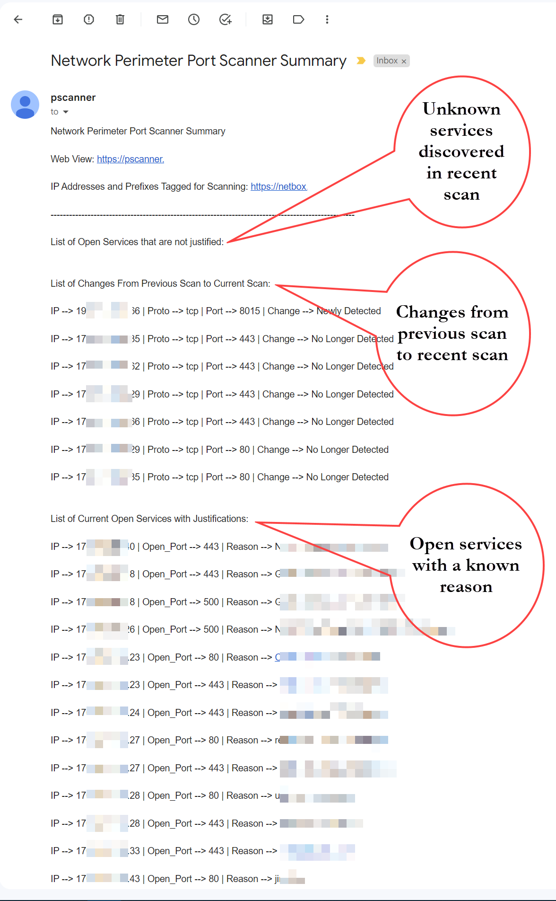
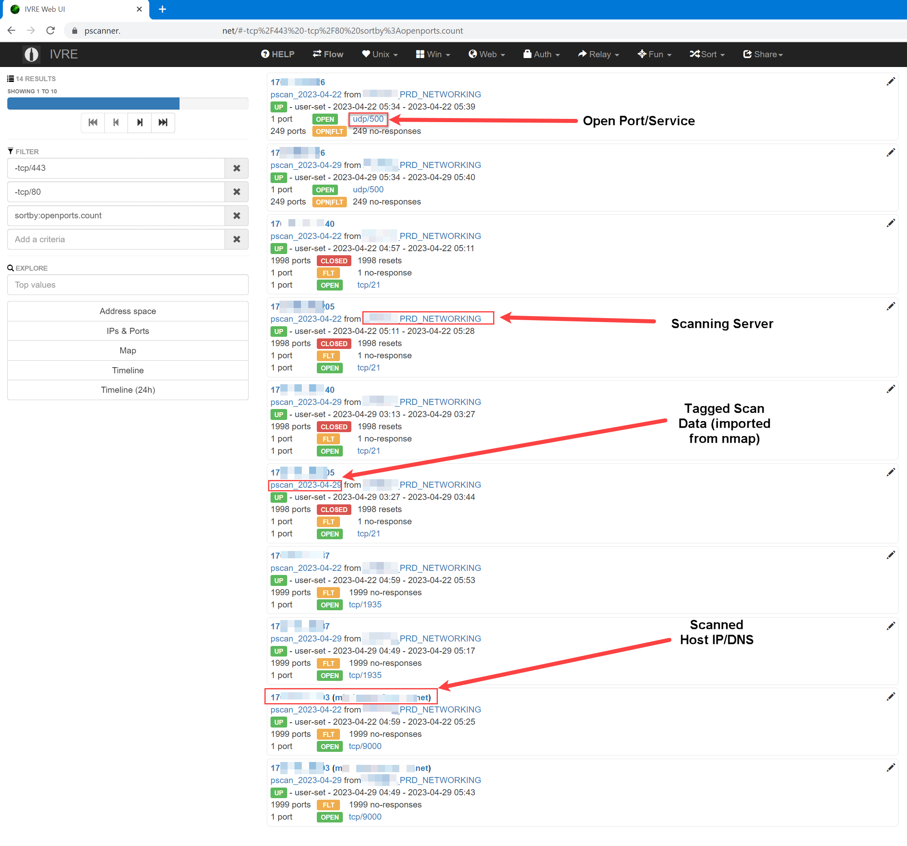
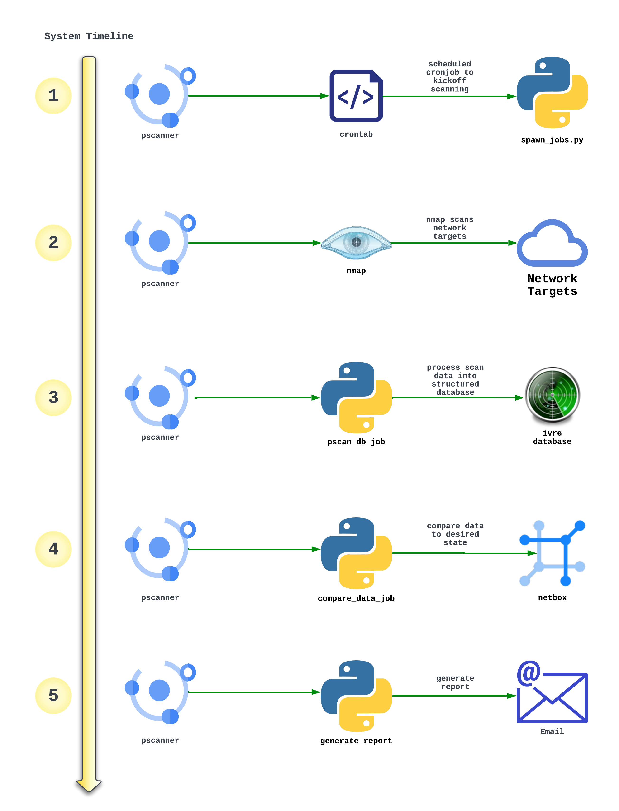
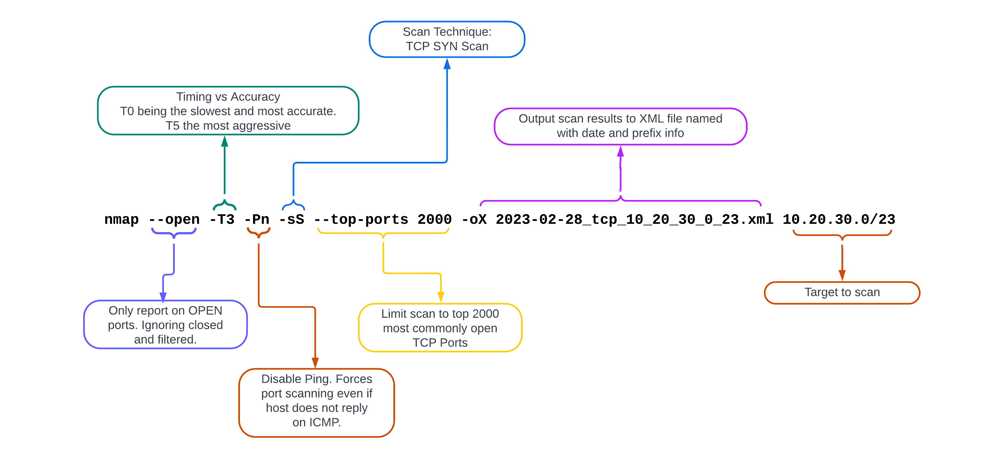
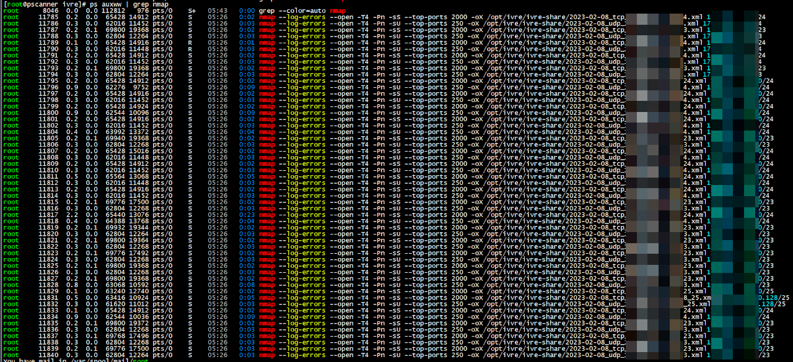
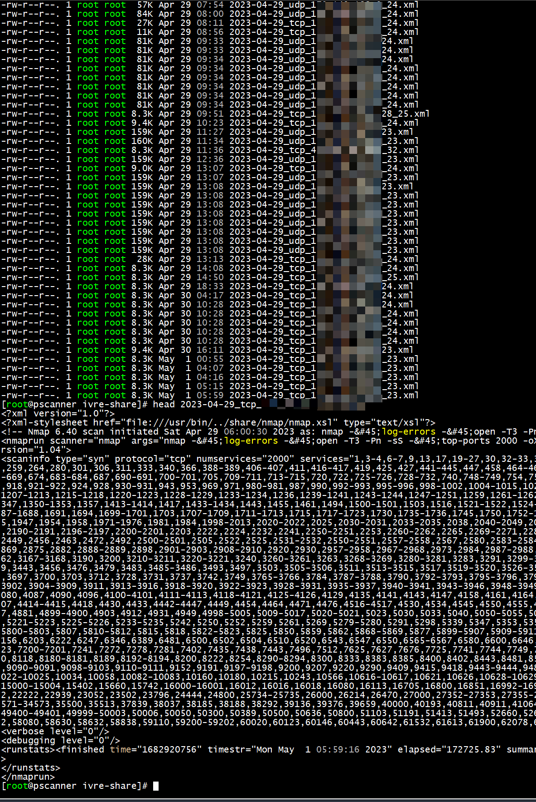
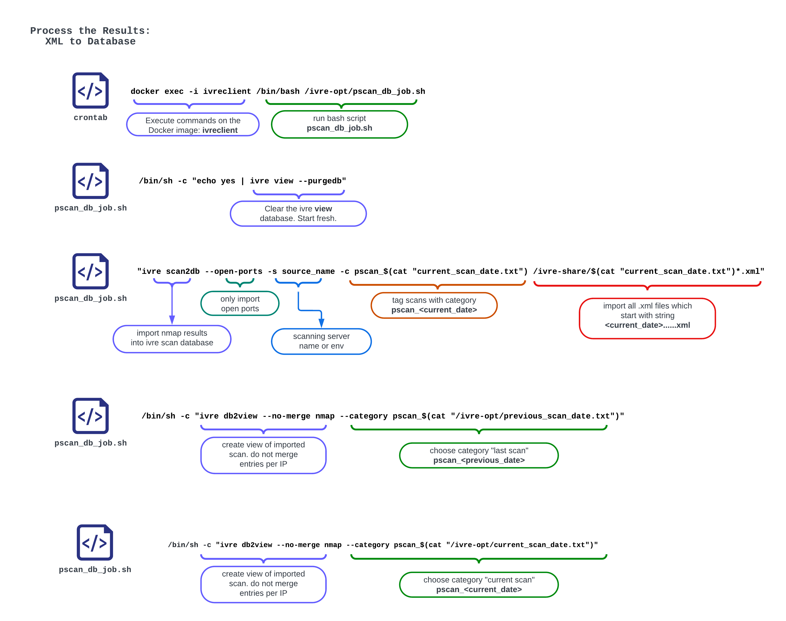
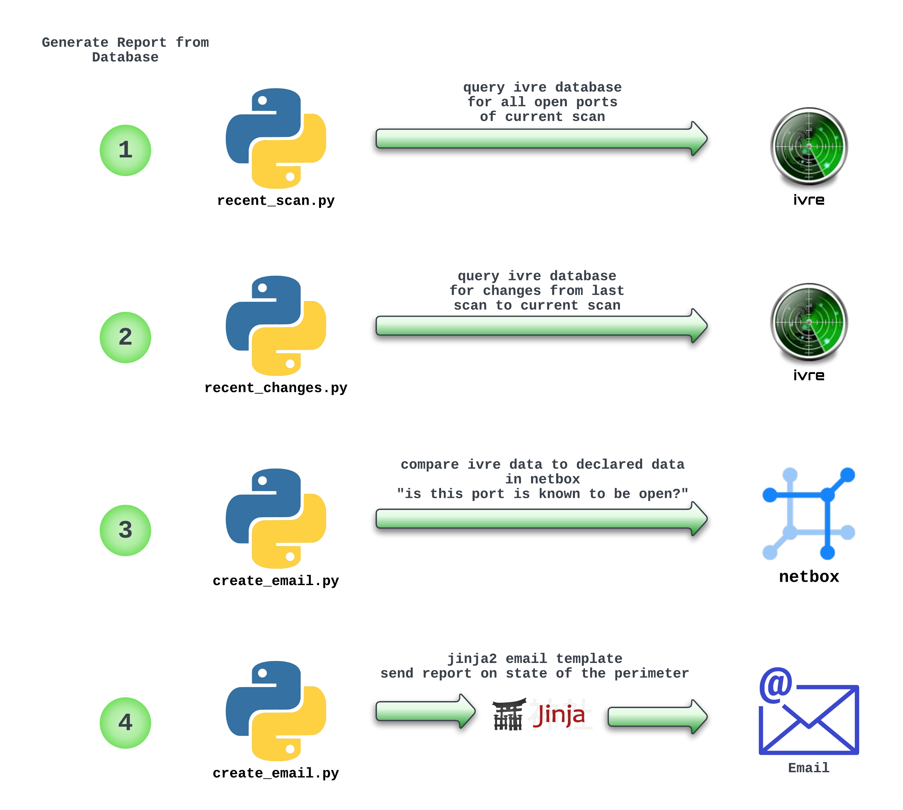
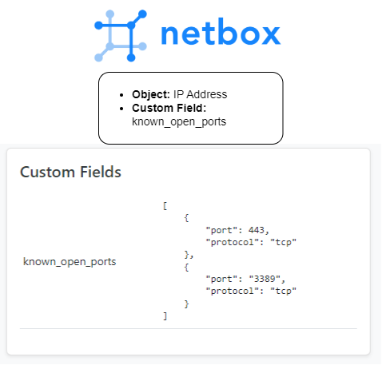

+++
author = "Kaon Thana"
title = "Perimeter Scanner"
date = "2023-05-05"
description = "Building an Automated Perimeter Scanning System with Open Source Tools - NMAP, IVRE and Netbox"
categories = [
    "security",
    "automation",
    "netbox",
    "netdevops"
]

aliases = ["perimeter-scanner"]
image = "images/perimeter-scanner-front.png"
+++

## About

I put together a system of components to perform **automated perimeter scanning** using readily available open source tools. Here is a guide on how you can do the same thing. 

The system can accomplish the following:
- Actively **port scan** your IP address space (please do not scan IP space that you do not control!)
- Store results in a **structured database** which can provide a snapshot of the state of the perimeter.
- Perform programmatic checks comparing **current state vs desired state** and report on discrepancies. 

### Why Port Scan?

As network admins, we manage large pools of address space which host various services and expose ports for internal and external connections. In general, these available services are documented, firewalled and compliant to standards.

However, human error, misconfigurations, or vendor patches may cause **undesired services** to be exposed on the network. Port scanning (or port knocking) is one way to determine if these unintended services exist. 

Port scanning is just one tool we can use to mitigate vulnerabilities. If we follow the [swiss cheese model](https://en.wikipedia.org/wiki/Swiss_cheese_model) of layered security, adding this check is beneficial in overall network security posture. 

### The Tools

- Scanning Engine --- Nmap
  - [Nmap](https://nmap.org/) is a free and open source utility for network discovery and security auditing.

- Framework --- IVRE
  - [IVRE](https://github.com/ivre/ivre) provides the framework to store, view and manipulate the scan results from nmap

- Source of Truth --- Netbox
  - [Netbox](https://github.com/netbox-community/netbox) is used to ingest targets to be scanned and as a reference for desired state

## The End Result

### Generated Report


### IVRE View Database


### Project Code
Github Repo of the code can be [found here](https://github.com/kaon1/perimeter-scanner)

## System Implementation

### Execution Timeline


- Scheduled [cronjob](https://github.com/kaon1/perimeter-scanner/blob/main/pscanner/crontab.txt) starts [pscan_spawn_jobs.py](https://github.com/kaon1/perimeter-scanner/blob/main/pscanner/pscan_spawn_jobs.py) and does the following:
  - Makes an API call to netbox to grab all prefixes and IP addresses tagged for scanning
  - Spawns two nmap jobs per result (one TCP scan and one UDP scan)
- NMAP Scans run in the background on Network Targets and output the data as .XML files saved locally
- [pscan_db_job.sh](https://github.com/kaon1/perimeter-scanner/blob/main/pscanner/pscan_db_job.sh) is kicked off which does the following:
  - Initializes the IVRE Web View
  - Imports the newest scans into the IVRE Database
  - Creates two new web views in IVRE - Last Week's Scans and This Week's Scans
- [export_recent_changes.py](https://github.com/kaon1/perimeter-scanner/blob/main/pscanner/export_recent_changes.py) and [print_recent_scan.py](https://github.com/kaon1/perimeter-scanner/blob/main/pscanner/print_recent_scan.py) kickoff which compare the scan data vs the desired data in netbox
- [create_email_report.py](https://github.com/kaon1/perimeter-scanner/blob/main/pscanner/create_email_report.py) ingests the data and generates an email report to be sent

### Nmap Options Explained


### pscan_spawn_jobs.py
```python
import ipaddress
import requests
import subprocess
import time
from datetime import datetime, timedelta
from netutils.ip import netmask_to_cidr

### start by killing all nmap processes (if they are running)
subprocess.Popen(['killall', '-9', 'nmap'])

## this is the tag used in netbox to classify prefixes and ips to scan
nmap_tag = "nmap_scanning"

netbox_url = 'https://netbox'
netbox_token = 'token'
netbox_headers = {'Authorization': "Token {}".format(netbox_token)}

# writing date files
date_parser = datetime.now()
date_stamp = date_parser.strftime("%Y-%m-%d")
prev_date_parser = datetime.now() + timedelta(days=-7)
prev_date_stamp = prev_date_parser.strftime("%Y-%m-%d")
current_scan_fh = open("/opt/ivre/ivre-opt/current_scan_date.txt", "w")
previous_scan_fh = open("/opt/ivre/ivre-opt/previous_scan_date.txt", "w")
current_scan_fh.write(date_stamp)
current_scan_fh.close()
previous_scan_fh.write(prev_date_stamp)
previous_scan_fh.close()
# end writing date files

# nmap args to use for TCP Scans
nmap_base_args = "nohup nmap --log-errors --open -T3 -Pn -sS --top-ports 2000 -oX /opt/ivre/ivre-share/"+date_stamp+"_tcp_"

# nmap args to use for UDP Scans
nmap_base_args_udp = "nohup nmap --log-errors --open -T3 -Pn -sU --top-ports 250 -oX /opt/ivre/ivre-share/"+date_stamp+"_udp_"

# netbox api calls to grab all ip addresses and prefixes tagged with nmap_scanning tag
netbox_api_ip_addr = requests.get(netbox_url+"/api/ipam/ip-addresses/?limit=0&tag="+nmap_tag, headers=netbox_headers, verify=False).json()
netbox_api_ip_prefix = requests.get(netbox_url+"/api/ipam/prefixes/?limit=0&tag="+nmap_tag, headers=netbox_headers, verify=False).json()

# function to take in address like 172.3.3.0/25 and return 172_3_3_0 and netmask 25
def explode_address_elements(address_to_scan):
    exploded_elements_dict = {}
    exploded_elements_dict['address_to_scan_exploded'] = str(
        ipaddress.IPv4Interface(address_to_scan).ip).replace('.', '_')
    exploded_elements_dict['address_to_scan_mask'] = str(
        netmask_to_cidr((ipaddress.IPv4Interface(address_to_scan).netmask)))
    return exploded_elements_dict

# function to spawn one nmap job per ingested prefix or ip address
def spawn_nmap_jobs(address_to_scan, address_to_scan_exploded, address_to_scan_mask, is_prefix):
    if is_prefix:
        ## spawn tcp scans
        nmap_raw_cmd = nmap_base_args+address_to_scan_exploded+"_" + address_to_scan_mask+".xml "+address_to_scan
        subprocess.Popen(nmap_raw_cmd.split())

        ##spawn udp scans
        nmap_raw_cmd = nmap_base_args_udp+address_to_scan_exploded+"_" + address_to_scan_mask+".xml "+address_to_scan
        subprocess.Popen(nmap_raw_cmd.split())

    else:
        ## spawn tcp scans
        nmap_raw_cmd = nmap_base_args+address_to_scan_exploded+"_" + address_to_scan_mask+".xml "+address_to_scan.split("/")[0]
        subprocess.Popen(nmap_raw_cmd.split())

        ## spawn udp scans
        nmap_raw_cmd = nmap_base_args_udp+address_to_scan_exploded+"_" + address_to_scan_mask+".xml "+address_to_scan.split("/")[0]
        subprocess.Popen(nmap_raw_cmd.split())

# iterate through netbox ip address query results and start the nmap job
for ip_addr in netbox_api_ip_addr['results']:
    ip_elements = explode_address_elements(ip_addr['address'])
    spawn_nmap_jobs(ip_addr['address'], ip_elements['address_to_scan_exploded'], ip_elements['address_to_scan_mask'], is_prefix=False)
    time.sleep(.3)

# iterate through netbox prefix query results and start the nmap job
for prefix in netbox_api_ip_prefix['results']:
    ip_elements = explode_address_elements(prefix['prefix'])
    spawn_nmap_jobs(prefix['prefix'], ip_elements['address_to_scan_exploded'], ip_elements['address_to_scan_mask'], is_prefix=True)
    time.sleep(.3)

# all jobs should be started now and script exits. With current params the jobs will complete in 24 hours
# example output of psaux www
###
## nmap --log-errors --open -T4 -Pn -sS --top-ports 2000 -oX /opt/ivre/ivre-share/2023-02-08_tcp_172_1_1_0_23.xml 172.1.1.0/23
## nmap --log-errors --open -T4 -Pn -sU --top-ports 250 -oX /opt/ivre/ivre-share/2023-02-08_udp_172_2_2_0_23.xml 172.2.2.0/23
```

#### ps auxww
Example list of spawned nmap processes during the scanning window.



#### xml results file


### Processing the Results


#### Import Scan Results into IVRE DB
```sh
#!/bin/bash

# Bash file to run on ivre-client container with command
# docker exec -i ivreclient /bin/bash /ivre-opt/pscan_db_job.sh
# 1. Purge the view database (web gui view) to start fresh
# 2. Import the latest scan into scan database
# 3. Create two new views -- 1. View of previous scan 2. View of Newest Current Scan

/bin/sh -c "echo yes | ivre view --purgedb"
/bin/sh -c "ivre scan2db --open-ports -s SCAN_SERVER -c pscan_$(cat "/ivre-opt/current_scan_date.txt") /ivre-share/$(cat "/ivre-opt/current_scan_date.txt")*.xml"

/bin/sh -c "ivre db2view --no-merge nmap --category pscan_$(cat "/ivre-opt/previous_scan_date.txt")"
/bin/sh -c "ivre db2view --no-merge nmap --category pscan_$(cat "/ivre-opt/current_scan_date.txt")"
```

#### Show most recent scan results from DB
```python
### Script run on ivre client container to print out latest scan results from mongo DB
### Calls the mongo query: list(db.view.get_ips_ports(flt=db.view.searchcategory("pscan_"+current_date))[0])
### Converts results to a json dict exported to recent_scan_results.json so future script can read it for email generation

from ivre.db import db
import json

file1 = open("/ivre-opt/current_scan_date.txt", "r")
current_date = file1.readline()
file1.close

result_list = []

# Data to be written
scan_export = list(db.view.get_ips_ports(flt=db.view.searchcategory("pscan_"+current_date))[0])

for result in scan_export:
    result_list.append({"ip_address": result['addr'], "ports": result['ports']})

json_obj = json.dumps(result_list, indent=4)

with open("/ivre-opt/recent_scan_result.json", "w") as outfile:
    outfile.write(json_obj)
```

#### Show what's changed from last scan
```python
### Script run on ivre client container to print out latest diff of changes from previous scan to current scan
### Calls the mongo query: list(db.view.diff_categories(category1="1",category2="2",include_both_open=False))
### Converts results to a json dict exported to whats_changed.json so future script can read it for email generation

from ivre.db import db
import json

file1 = open("/ivre-opt/current_scan_date.txt", "r")
current_date = file1.readline().strip()
file1.close

file2 = open("/ivre-opt/previous_scan_date.txt", "r")
previous_date = file2.readline().strip()
file2.close

result_list = []

value_map = {"-1": "No Longer Detected", "0": "Still Open: Open in previous scan "+previous_date+" and open in current scan "+current_date, "1": "Newly Detected"}

# Data to be written
scan_export = list(db.view.diff_categories(category1="pscan_"+previous_date,category2="pscan_"+current_date,include_both_open=False))

for result in scan_export:
    result_list.append({"ip_address": result['addr'], "protocol": result['proto'], "port": result['port'], "status": value_map[str(result['value'])]})

sorted_result_list = sorted(result_list, key=lambda d: d['status']) 

json_obj = json.dumps(sorted_result_list, indent=2)

with open("/ivre-opt/whats_changed.json", "w") as outfile:
    outfile.write(json_obj)
```

### Generating Report Data


#### Comparing Results to Desired State

We can create a custom field in **Netbox** to declare the known open ports per IP Address.
Example:


#### Creating the report
```python
import requests
import json
import datetime
from jinja2 import Template
import smtplib

### global vars
netbox_url = 'https://netbox'
netbox_token = 'token'
netbox_headers = {'Authorization': "Token {}".format(netbox_token)}
date_parser = datetime.datetime.now() 
date_stamp = date_parser.strftime("%Y-%m-%d")
recent_scan_filename = "/opt/ivre/ivre-opt/recent_scan_result.json"
whats_changed_filename = "/opt/ivre/ivre-opt/whats_changed.json"
output_list_no_reason = []
output_list_all = []

### functions

### Search if IP + Port Combo exists in netbox custom field called 'known open ports
### example 172.1.1.5-->443 see if exists in data structure:
# {'known_open_ports': [
#        {'port': 443, 'reason': 'web server', 'protocol': 'tcp'
#        }
#    ]
# }
def get_netbox_known_ports_justification(ip_address,port):
    ipam_api_call = requests.get(netbox_url+"/api/ipam/ip-addresses/?address="+ip_address, headers=netbox_headers, verify=False).json()
    if len(ipam_api_call['results']) > 0:
        known_ports_list = ipam_api_call['results'][0].get('custom_fields')
        if known_ports_list['known_open_ports'] is not None:
            for known_port in known_ports_list['known_open_ports']:
                if known_port.get('port') == port:
                    return known_port.get('reason')
        else:
            return "No Justification"
    else:
        return "No Justification"
    return "No Justification"

def get_recent_scan(filename):
    f = open(filename)
    return json.load(f)


### Gather Data
recent_scan_results_dict = get_recent_scan(recent_scan_filename)
whats_changed_dict = get_recent_scan(whats_changed_filename)

### Iterate through every entry of most recent scan and compare each entry to netbox "known open port" field
for entry in recent_scan_results_dict:
     for discovered_port in entry['ports']:
        ## ignore udp open/filtered state as its not truly open
        if discovered_port['state_state'] == 'open':
            reason = get_netbox_known_ports_justification(entry['ip_address'],discovered_port['port'])
        else:
            continue
        if reason == "No Justification":
            output_list_no_reason.append({"IP Address": entry['ip_address'],"Open Port": discovered_port['port'], "Reason": reason})
        else:
            output_list_all.append({"IP Address": entry['ip_address'],"Open Port": discovered_port['port'], "Reason": reason})

### Build Email Template
with open('/opt/ivre/ivre-opt/email_template.j2') as f:
    rendered = Template(f.read()).render(date_stamp=date_stamp,output_list_no_reason=output_list_no_reason,output_list_all=output_list_all,whats_changed_dict=whats_changed_dict)

message = 'Subject: {}\n\n{}'.format("Network Perimeter Port Scanner Summary", rendered)

s = smtplib.SMTP('smtp-server')
s.sendmail('pscanner@domain', ['notify@domain'], message)
s.sendmail()
s.quit()
```
#### Email Template - Jinja2
```python
Network Perimeter Port Scanner Summary

Web View: https://pscanner/

IP Addresses and Prefixes Tagged for Scanning: https://netbox/

---------------------------------------------------------------------------------------------------

List of Open Services that are not justified:

IP --> {{ item['IP Address'] }} | Open_Port --> {{ item['Open Port'] }} | Reason --> {{ item['Reason'] }}


List of Changes From Previous Scan to Current Scan:

IP --> {{ item['ip_address'] }} | Proto --> {{ item['protocol'] }} | Port --> {{ item['port'] }} | Change --> {{ item['status'] }}


List of Current Open Services with Justifications:

IP --> {{ item['IP Address'] }} | Open_Port --> {{ item['Open Port'] }} | Reason --> {{ item['Reason'] }}


---------------------------------------------------------------------------------------------------

Date: "{{ date_stamp }}"
```

## End

I never know how to end these posts, so for the small percentage of readers who stuck it out til the end, heres a gif of a robot dancing. Thanks for reading!

