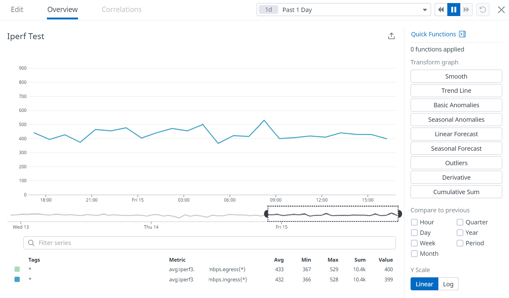
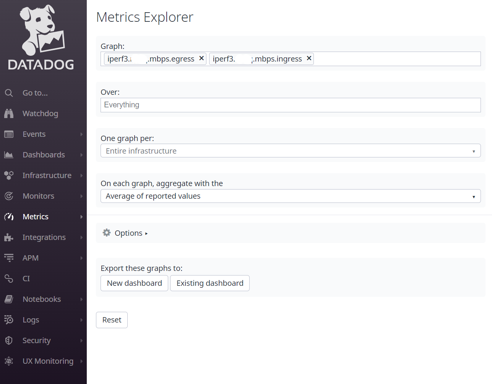
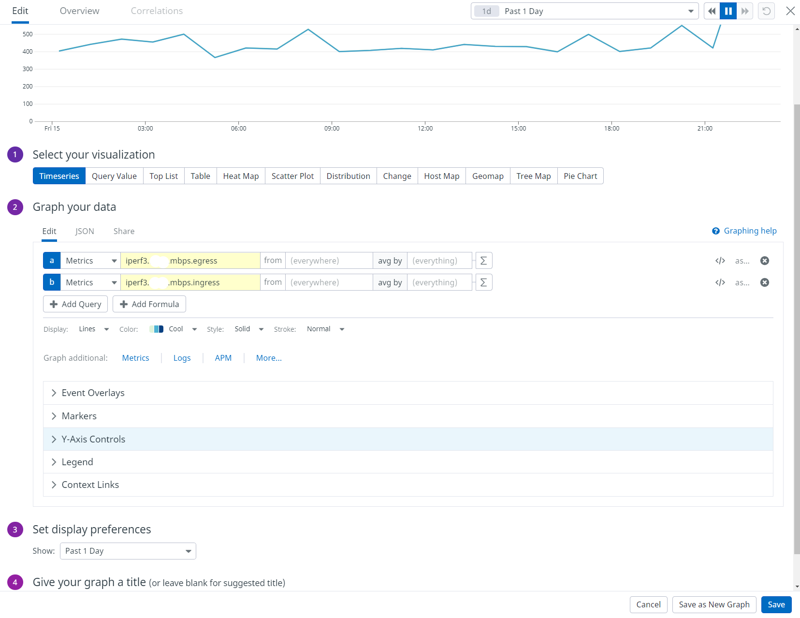

+++
author = "Kaon Thana"
title = "Automate Network Bandwidth Testing"
date = "2022-04-14"
description = "Use python to run iperf3 testing between network sites periodically and graph the metrics to Datadog"
tags = [
    "python",
    "network-automation",
    "datadog",
    "observability",
    "iperf",
]

aliases = ["python-iperf-datadog"]
image = "python-iperf-datadog-mini.png"
+++

**The best way for a Network Engineer to grasp automation** is to begin by coding a simple real problem that they 
encounter. We often use [IPERF](https://iperf.fr/) to measure the bandwidth performance of a network path. 
With a few lines of [python code](https://iperf3-python.readthedocs.io/en/latest/), we can 
automate this task and graph the data via [DataDog](https://www.datadoghq.com/) for historical reference.

## The End Result
Nobody likes to read through pages of text and images to get to the money shot. So here it is...
### DataDog Graph
Graph of hourly iperf3 tests:



### Python Code
[iperf-dd-metrics.py](https://github.com/kaon1/python-misc/blob/master/observability-metrics/iperf-dd-metrics.py)
```python
# Script to run iperf3 test to measure bandwidth to remote site.
# Runs in reverse mode to measure both ingress and egress bandwidth
# Sends avg bandwidth metric to Datadog as a custom gauge metric
# Its suggested you run this script as a cron job on a regular hourly interval

from datadog import initialize, statsd
import time
import iperf3
import os

# Set vars
# Remote iperf server IP
remote_site = '<enter remote host IP here>'
# Datadog API Key
api_key = '<enter dd api key here>'
# How long to run iperf3 test in seconds
test_duration = 20

# Set DD options for statsd init
options = {
    'statsd_host': '127.0.0.1',
    'statsd_port': 8125,
    'api_key': api_key
}
initialize(**options)

# Set Iperf Client Options
# Run 10 parallel streams on port 5201 for duration w/ reverse
client = iperf3.Client()
client.server_hostname = remote_site
client.zerocopy = True
client.verbose = False
client.reverse = True
client.port = 5201
client.num_streams = 10
client.duration = int(test_duration)
client.bandwidth = 1000000000

# Run iperf3 test
result = client.run()

# extract relevant data
sent_mbps = int(result.sent_Mbps)
received_mbps = int(result.received_Mbps)

# send Metrics to DD and add some tags for classification in DD GUI
# send bandwidth metric - egress mbps
statsd.gauge('iperf3.test.mbps.egress', sent_mbps, tags=["team_name:your_team", "team_app:iperf"])
# send bandwidth metric - ingress mbps
statsd.gauge('iperf3.test.mbps.ingress', received_mbps, tags=["team_name:your_team", "team_app:iperf"])
```

## The Process
If you're still here, let's get into the details...
### Setup
* Spin up two Linux Hosts (HostA and HostB)
  * Install [Python3](https://docs.python-guide.org/starting/install3/linux/) --> `yum install python3`
  * Install [IPERF3](https://iperf.fr/iperf-download.php) --> `yum install iperf3`
  * Install [iPerf3 Python Wrapper](https://iperf3-python.readthedocs.io/en/latest/installation.html) --> `pip install iperf3`
* Setup a DataDog Account and [API Key](https://docs.datadoghq.com/account_management/api-app-keys/)
  * Graphing the metrics is optional. Alternatively, we can save results to local disk.

### iperf3 Server
Choose one of your hosts to be your **always-on** iperf3 server and setup an iperf3 service in systemd
* For Centos Linux:
    * cd `/etc/systemd/system/` 
    * Create a file called [iperf3.service](https://github.com/kaon1/python-misc/blob/master/observability-metrics/iperf3.service)
    * Contents:
```    
# Centos Server file to run iperf3 service on startup.
# This server acts as the iperf 'receiver' for speed testing.
# /etc/systemd/system/iperf3.service
# User service: $HOME/.config/systemd/user/iperf3.service

[Unit]
Description=iperf3 server
After=syslog.target network.target auditd.service

[Service]
ExecStart=/usr/bin/iperf3 -s

[Install]
WantedBy=multi-user.target
```    
* enable the service to run at startup: `systemctl enable iperf3.service`
* start the iperf3 service: `systemctl start iperf3.service`
* verify the service is running: `systemctl status iperf3.service` or `ps aux | grep iperf`

### iperf3 Client
Begin testing the iperf3 service by creating a simple python script on the Client HostA
* Create `iperf-dd-metrics-test.py`:
```python
import iperf3

# Set vars
# Remote iperf server IP
remote_site = 'ip of server goes here'
# How long to run iperf3 test in seconds
test_duration = 10

# Set Iperf Client Options
# Run 10 parallel streams on port 5201 for duration w/ reverse
client = iperf3.Client()
client.server_hostname = remote_site
client.zerocopy = True
client.verbose = False
client.reverse = True
client.port = 5201
client.num_streams = 10
client.duration = int(test_duration)
client.bandwidth = 1000000000

# Run iperf3 test
result = client.run()

# extract relevant data
sent_mbps = int(result.sent_Mbps)
received_mbps = int(result.received_Mbps)

print('sent_mbps: ')
print(sent_mbps)
print('received_mbps: ')
print(received_mbps)
```
* run the file: `# python3 iperf-dd-metrics-test.py`:
    * results:
    ```
    sent_mbps: 
    966
    received_mbps: 
    959
    ```
Now we have a fully functioning iperf3 client and server setup.
### Sending Metrics to DataDog
DataDog has a [python library](https://github.com/DataDog/datadogpy) to allow us to send the speed test results up to DD
* Import the library and initialize options:
```python
from datadog import initialize, statsd

# Datadog API Key
api_key = os.getenv('DD_API_KEY')

# Set DD options for statsd init
options = {
    'statsd_host': '127.0.0.1',
    'statsd_port': 8125,
    'api_key': api_key
}
initialize(**options)

# send Metrics to DD and add some tags for classification in DD GUI
# send bandwidth metric - egress mbps
statsd.gauge('iperf3.test.mbps.egress', sent_mbps, tags=["team_name:your_team", "team_app:iperf"])
# send bandwidth metric - ingress mbps
statsd.gauge('iperf3.test.mbps.ingress', received_mbps, tags=["team_name:your_team", "team_app:iperf"])
```
### Full Script and Crontab
Put the two pieces of the script together and you get the end result 
--- [iperf-dd-metrics.py](https://github.com/kaon1/python-misc/blob/master/observability-metrics/iperf-dd-metrics.py)

Use crontab to continuously run the script in periodic intervals. 
```plain
# Example of job definition:
# .---------------- minute (0 - 59)
# |  .------------- hour (0 - 23)
# |  |  .---------- day of month (1 - 31)
# |  |  |  .------- month (1 - 12) OR jan,feb,mar,apr ...
# |  |  |  |  .---- day of week (0 - 6) (Sunday=0 or 7) OR sun,mon,tue,wed,thu,fri,sat
# |  |  |  |  |
# *  *  *  *  * user-name  command to be executed
20 * * * * root /usr/bin/python3 /home/iperf-python/iperf-dd-metrics.py 
```
The above job will run every hour on the 20th minute of the hour forever

### Visualizing the Data
The metrics that are being sent to DataDog need to be graphed on a dashboard
* Logon to DataDog and go to **Metrics --> Explorer**
 * Search `iperf3`
 * Find you metrics
 


* Create a **timeseries graph**
* Graph both Egress and Ingress **Metrics** as A and B respectively
* Set your **Y-Axis** to desired MAX setting (999 in my case)
* Give your graph a **title**


## Final Thoughts